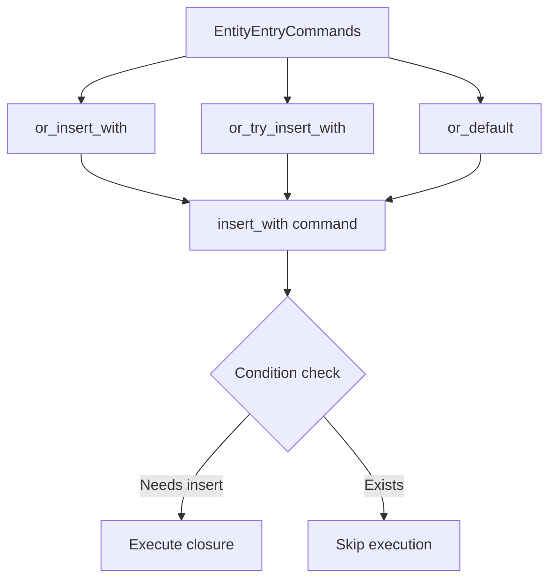

+++
title = "#19978 Avoid early function invocation in `EntityEntryCommands`"
date = "2025-07-07T00:00:00"
draft = false
template = "pull_request_page.html"
in_search_index = false

[extra]
current_language = "zh-cn"
available_languages = {"en" = { name = "English", url = "/pull_request/bevy/2025-07/pr-19978-en-20250707" }, "zh-cn" = { name = "中文", url = "/pull_request/bevy/2025-07/pr-19978-zh-cn-20250707" }}
labels = ["C-Bug", "A-ECS", "C-Performance", "D-Straightforward"]
+++

# Avoid early function invocation in `EntityEntryCommands`

## Basic Information
- **Title**: Avoid early function invocation in `EntityEntryCommands`
- **PR Link**: https://github.com/bevyengine/bevy/pull/19978
- **Author**: JaySpruce
- **Status**: MERGED
- **Labels**: C-Bug, A-ECS, C-Performance, S-Ready-For-Final-Review, D-Straightforward
- **Created**: 2025-07-06T13:36:16Z
- **Merged**: 2025-07-07T20:33:55Z
- **Merged By**: alice-i-cecile

## Description Translation
### 目标

修复 #19884。

### 解决方案

- 添加一个内部实体命令 `insert_with`，该命令接受一个返回组件的函数，并在调用函数前检查组件是否会被实际插入。
- 对 `insert_from_world` 添加相同的检查，因为它是类似的情况。
- 更新 `EntityEntryCommands` 上的 `or_insert_with`、`or_try_insert_with` 和 `or_default` 方法以使用新命令。

由于返回组件的函数/闭包现在需要发送到命令中（而不是在命令创建前调用），该函数现在需要 `Send + 'static` 约束。这在命令处理中很常见，但我不确定它是否会影响现有用户。

## The Story of This Pull Request

### 问题和背景
`EntityEntryCommands` API 中的 `or_insert_with` 和相关方法存在一个问题：它们会在命令创建时立即执行传入的函数或闭包，而不是在命令实际应用时执行。这导致两个主要问题：
1. 即使组件已经存在（不需要插入），闭包也会被执行，造成不必要的计算开销
2. 闭包中的副作用（如资源修改）会在命令队列时发生，而不是在命令应用时发生，违反开发者预期

具体表现是当使用 `or_insert_with` 时，闭包总是立即执行：
```rust
commands.entity(e).entry::<Comp>().or_insert_with(|| {
    // 这个闭包总是立即执行，即使Comp已存在
    expensive_computation() 
});
```

### 解决方案
核心解决思路是延迟闭包的执行时机，直到确认组件需要被插入时再执行。具体实现包括：
1. 创建新的 `insert_with` 命令，封装延迟执行逻辑
2. 修改现有方法使用新命令
3. 为闭包添加必要的 `Send + 'static` 约束以安全跨线程

关键改进点在于增加条件检查：
```rust
if !(mode == InsertMode::Keep && entity.contains::<T>()) {
    let value = component_fn(); // 仅在此处执行闭包
    // 插入组件...
}
```

### 实现细节
#### 1. 新增 `insert_with` 命令
在 `entity_command.rs` 中添加新命令，仅在需要插入时才执行闭包：
```rust
pub fn insert_with<T: Component, F>(component_fn: F, mode: InsertMode) -> impl EntityCommand
where
    F: FnOnce() -> T + Send + 'static,
{
    move |mut entity: EntityWorldMut| {
        if !(mode == InsertMode::Keep && entity.contains::<T>()) {
            let value = component_fn(); // 延迟执行
            entity.insert_with_caller(...);
        }
    }
}
```

#### 2. 修改 `insert_from_world`
对 `FromWorld` 的初始化添加相同检查：
```rust
pub fn insert_from_world<T: Component + FromWorld>(mode: InsertMode) -> impl EntityCommand {
    move |mut entity: EntityWorldMut| {
        if !(mode == InsertMode::Keep && entity.contains::<T>()) {
            let value = entity.world_scope(|world| T::from_world(world));
            // ...
        }
    }
}
```

#### 3. 更新 EntityEntryCommands 方法
修改调用点使用新命令：
```rust
// Before:
pub fn or_insert_with(&mut self, default: impl Fn() -> T) -> &mut Self {
    self.or_insert(default()) // 立即执行
}

// After:
pub fn or_insert_with<F>(&mut self, default: F) -> &mut Self
where
    F: FnOnce() -> T + Send + 'static,
{
    self.entity_commands
        .queue(entity_command::insert_with(default, InsertMode::Keep));
    self
}
```

### 性能影响
1. 避免不必要的闭包执行，特别当闭包包含昂贵计算时
2. 减少无效的 `FromWorld` 初始化调用
3. 副作用操作在预期时间点发生

### 约束变化
闭包现在需要满足 `Send + 'static` 约束：
```rust
F: FnOnce() -> T + Send + 'static
```
这是命令系统的常见要求，但可能影响某些现有闭包（需添加 `move` 或调整捕获）。

### 测试验证
添加测试确保闭包只在需要时执行：
```rust
commands.entity(entity)
    .entry::<W<u8>>()
    .or_insert_with(|| W(5))      // 首次插入，执行闭包
    .or_insert_with(|| unreachable!())  // 已存在，跳过
    .or_try_insert_with(|| unreachable!())
    .or_default()                  // 跳过
    .or_from_world();              // 跳过
```

## Visual Representation



## Key Files Changed

### 1. crates/bevy_ecs/src/system/commands/entity_command.rs
**修改原因**：实现延迟执行的命令逻辑  
**关键变更**：
```rust
// Before:
pub fn insert_from_world<T: Component + FromWorld>(...) -> ... {
    let value = entity.world_scope(|world| T::from_world(world)); // 立即执行
    ...
}

// After:
pub fn insert_from_world<T: Component + FromWorld>(...) -> ... {
    if !(mode == InsertMode::Keep && entity.contains::<T>()) {
        let value = entity.world_scope(|world| T::from_world(world)); // 条件执行
        ...
    }
}

// 新增命令:
pub fn insert_with<T: Component, F>(component_fn: F, mode: InsertMode) -> ... {
    if !(mode == InsertMode::Keep && entity.contains::<T>()) {
        let value = component_fn(); // 条件执行
        ...
    }
}
```

### 2. crates/bevy_ecs/src/system/commands/mod.rs
**修改原因**：更新公共API使用新命令  
**关键变更**：
```rust
// Before:
pub fn or_insert_with(&mut self, default: impl Fn() -> T) -> &mut Self {
    self.or_insert(default()) // 立即执行闭包
}

// After:
pub fn or_insert_with<F>(&mut self, default: F) -> &mut Self
where
    F: FnOnce() -> T + Send + 'static,
{
    self.entity_commands
        .queue(entity_command::insert_with(default, InsertMode::Keep));
    self
}

// 测试用例验证:
commands.entity(entity)
    .entry::<W<u8>>()
    .or_insert_with(|| W(5)) // 实际执行
    .or_insert_with(|| unreachable!()); // 跳过
```

### 3. crates/bevy_ecs/src/relationship/mod.rs
**修改原因**：适配闭包捕获语义变化  
**关键变更**：
```rust
// Before:
.or_insert_with(|| { ... })

// After:
.or_insert_with(move || { ... }) // 添加move关键字
```

## Further Reading
1. [Bevy Commands System](https://bevyengine.org/learn/book/getting-started/ecs/#commands)
2. [Rust Closure Traits](https://doc.rust-lang.org/book/ch13-01-closures.html)
3. [Entity Component System Pattern](https://en.wikipedia.org/wiki/Entity_component_system)