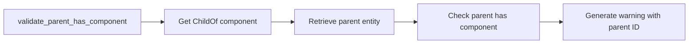

+++
title = "#19980 Add parent ID to the `B0004` log message"
date = "2025-07-07T00:00:00"
draft = false
template = "pull_request_page.html"
in_search_index = true

[taxonomies]
list_display = ["show"]

[extra]
current_language = "en"
available_languages = {"en" = { name = "English", url = "/pull_request/bevy/2025-07/pr-19980-en-20250707" }, "zh-cn" = { name = "中文", url = "/pull_request/bevy/2025-07/pr-19980-zh-cn-20250707" }}
labels = ["A-ECS", "C-Usability"]
+++

## Technical Analysis: Adding Parent Entity ID to B0004 Warning Message

### Basic Information
- **Title**: Add parent ID to the `B0004` log message
- **PR Link**: https://github.com/bevyengine/bevy/pull/19980
- **Author**: Zeenobit
- **Status**: MERGED
- **Labels**: A-ECS, C-Usability, S-Ready-For-Final-Review
- **Created**: 2025-07-06T16:32:13Z
- **Merged**: 2025-07-07T20:38:42Z
- **Merged By**: alice-i-cecile

### Description Translation
# Objective

Minor CL to add parent entity ID to the B0004 error message to improve debugging.

### The Story of This Pull Request

#### The Problem and Context
The existing B0004 warning message indicated when an entity with a specific component had a parent missing that same component, but it didn't identify the problematic parent entity. This made debugging hierarchy issues difficult, especially in complex scenes with multiple entities. Developers needed to manually trace parent-child relationships through debuggers or additional logging to locate the root cause.

#### The Solution Approach
The solution focuses on adding the parent entity ID directly to the warning message. The implementation follows these steps:
1. Capture the parent entity ID early in the validation logic
2. Modify the warning format string to include the parent entity reference
3. Maintain all existing functionality while adding this debugging enhancement

No alternatives were necessary since this approach directly addresses the debugging gap with minimal code changes.

#### The Implementation
The key modification occurs in the `validate_parent_has_component` system. The parent entity is now stored in a variable and included in the warning message:

```rust
let parent = child_of.parent();
if !world.get_entity(parent).is_ok_and(|e| e.contains::<C>()) {
    warn!(
        "warning[B0004]: {}{name} with the {ty_name} component has a parent ({parent}) without {ty_name}.\n\
        "This will cause inconsistent behaviors! See: https://bevy.org/learn/errors/b0004",
        caller.map(|c| format!("{c}: ")).unwrap_or_default(),
        ty_name = debug_name.shortname(),
```

This change:
1. Extracts `child_of.parent()` into a `parent` variable
2. Includes `{parent}` in the warning message template
3. Preserves all existing functionality and documentation links

#### Technical Insights
The implementation efficiently reuses the existing `parent()` call that was previously embedded in the condition check. By capturing the result first, we:
- Avoid duplicate calls to `child_of.parent()`
- Maintain the same validation logic
- Add minimal overhead (one extra variable assignment)

The `{parent}` insertion uses Rust's formatting capabilities to display the Entity value, which implements the Display trait to show the entity ID in a human-readable format.

#### The Impact
This change provides immediate debugging benefits:
- Developers can now identify problematic parent entities directly from logs
- Reduces time spent tracing entity hierarchies
- Maintains backward compatibility with existing error codes
- Preserves all existing documentation references

The change is minimally invasive, affecting only the warning message content while maintaining identical validation behavior.

### Visual Representation



### Key Files Changed

**File**: `crates/bevy_ecs/src/hierarchy.rs`

**Changes**: Added parent entity ID to B0004 warning message

**Code Comparison**:
```rust
// Before:
if !world
    .get_entity(child_of.parent())
    .is_ok_and(|e| e.contains::<C>())
{
    warn!(
        "warning[B0004]: {}{name} with the {ty_name} component has a parent without {ty_name}.\n\
        "This will cause inconsistent behaviors! See: https://bevy.org/learn/errors/b0004",
        caller.map(|c| format!("{c}: ")).unwrap_or_default(),
        ty_name = debug_name.shortname(),

// After:
let parent = child_of.parent();
if !world.get_entity(parent).is_ok_and(|e| e.contains::<C>()) {
    warn!(
        "warning[B0004]: {}{name} with the {ty_name} component has a parent ({parent}) without {ty_name}.\n\
        "This will cause inconsistent behaviors! See: https://bevy.org/learn/errors/b0004",
        caller.map(|c| format!("{c}: ")).unwrap_or_default(),
        ty_name = debug_name.shortname(),
```

**Relationship to PR Purpose**: This is the core change that implements the PR's objective by including the parent entity ID in the warning message.

### Further Reading
1. [Bevy Engine Official Documentation](https://bevyengine.org/learn/)
2. [Bevy Error Codes Reference](https://bevyengine.org/learn/errors/)
3. [ECS Hierarchy Design in Bevy](https://bevyengine.org/learn/book/getting-started/ecs/#hierarchy)