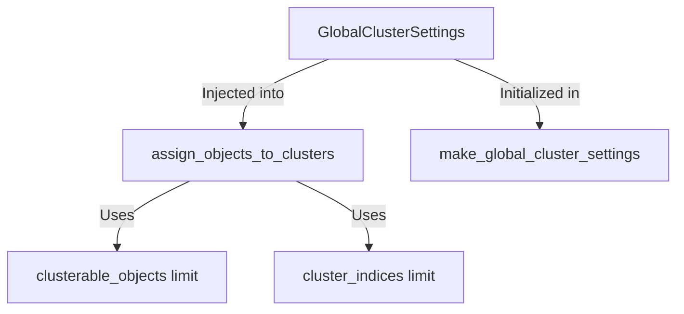

+++
title = "#19985 dont hard code clustering limits on cpu side so they can be informed by Limits later"
date = "2025-07-06T00:00:00"
draft = false
template = "pull_request_page.html"
in_search_index = true

[taxonomies]
list_display = ["show"]

[extra]
current_language = "en"
available_languages = {"en" = { name = "English", url = "/pull_request/bevy/2025-07/pr-19985-en-20250706" }, "zh-cn" = { name = "中文", url = "/pull_request/bevy/2025-07/pr-19985-zh-cn-20250706" }}
labels = ["A-Rendering", "C-Code-Quality", "C-Usability", "D-Straightforward"]
+++

## Analysis of PR #19985: "dont hard code clustering limits on cpu side so they can be informed by Limits later"

### Basic Information
- **Title**: dont hard code clustering limits on cpu side so they can be informed by Limits later  
- **PR Link**: https://github.com/bevyengine/bevy/pull/19985  
- **Author**: atlv24  
- **Status**: MERGED  
- **Labels**: A-Rendering, C-Code-Quality, C-Usability, D-Straightforward, S-Needs-Review  
- **Created**: 2025-07-06T18:08:46Z  
- **Merged**: 2025-07-06T19:56:11Z  
- **Merged By**: alice-i-cecile  

### Description Translation
# Objective  
- prepare bevy_light for split  
- make limits more dynamically configurable  

## Solution  
- use settings struct  

## Testing  
- 3d_scene, lighting  

---

### The Story of This Pull Request

#### The Problem and Context
Bevy's clustered forward rendering system had hard-coded constants for clusterable object limits (`MAX_UNIFORM_BUFFER_CLUSTERABLE_OBJECTS` and `ViewClusterBindings::MAX_INDICES`) scattered throughout the CPU-side clustering logic. This created two key issues:  
1. **Inflexible configuration**: Limits couldn't be adjusted dynamically based on hardware capabilities or scene requirements  
2. **Maintenance challenges**: Constants were duplicated across files, making future changes to clustering limits error-prone  

The rigid implementation was particularly problematic for the planned `bevy_light` crate split, where configurable limits would be essential for different rendering scenarios.

#### The Solution Approach
The author introduced a centralized configuration approach by extending the existing `GlobalClusterSettings` struct to include the clustering limits. This achieved:  
- **Runtime configurability**: Limits moved from compile-time constants to struct fields  
- **Architectural consistency**: Leveraged an existing settings struct already passed through the clustering pipeline  
- **Preserved behavior**: Initialized with original constant values to maintain backward compatibility  

No alternatives were seriously considered since this approach required minimal changes while solving both immediate and future needs.

#### The Implementation
The solution modified three files in the clustering system:  

1. **`mod.rs`** extended `GlobalClusterSettings` with new fields:  
```rust  
pub struct GlobalClusterSettings {
    pub supports_storage_buffers: bool,
    pub clustered_decals_are_usable: bool,
    pub max_uniform_buffer_clusterable_objects: usize,
    pub view_cluster_bindings_max_indices: usize,
}
```  
This created a single source of truth for clustering limits.

2. **`extract_and_prepare.rs`** initialized the new fields with original constant values:  
```rust  
GlobalClusterSettings {
    supports_storage_buffers,
    clustered_decals_are_usable,
    max_uniform_buffer_clusterable_objects: MAX_UNIFORM_BUFFER_CLUSTERABLE_OBJECTS,
    view_cluster_bindings_max_indices: ViewClusterBindings::MAX_INDICES,
}
```  
Maintaining identical default behavior.

3. **`assign.rs`** replaced all hard-coded limit checks with struct references:  
```rust  
// Before
if clusterable_objects.len() > MAX_UNIFORM_BUFFER_CLUSTERABLE_OBJECTS

// After
if clusterable_objects.len() > global_cluster_settings.max_uniform_buffer_clusterable_objects
```  
Critical changes included:  
- Object count validation  
- Warning thresholds  
- Cluster index estimation  
- Object list truncation  

The diff shows consistent pattern replacement across 10 locations with no logic alterations.

#### Technical Insights
Key technical considerations:  
1. **Zero-cost abstraction**: Using existing struct avoids new system parameters  
2. **Gradual migration path**: Default values preserve behavior until future PRs implement dynamic configuration  
3. **Validation safety**: Maintained overflow checks via runtime comparisons  
4. **Clustering implications**: Preserved spatial partitioning math while making bounds configurable  

The changes intentionally avoided modifying the:  
- Cluster tile calculation algorithms  
- GPU-side shader logic  
- Entity sorting mechanisms  

#### The Impact
This change:  
1. **Enables future work**: Foundation for hardware-aware limit adjustments  
2. **Reduces technical debt**: Eliminates magic numbers in clustering logic  
3. **Simplifies maintenance**: Single configuration point for clustering limits  
4. **Preserves performance**: No runtime overhead from indirection  

Testing confirmed identical behavior in lighting scenarios while enabling the architectural changes needed for `bevy_light` separation.

---

### Visual Representation


---

### Key Files Changed

1. **`crates/bevy_pbr/src/cluster/mod.rs`**  
   - Added configuration fields to settings struct  
```rust
// After:
pub struct GlobalClusterSettings {
    pub supports_storage_buffers: bool,
    pub clustered_decals_are_usable: bool,
    pub max_uniform_buffer_clusterable_objects: usize,
    pub view_cluster_bindings_max_indices: usize,
}
```

2. **`crates/bevy_pbr/src/cluster/extract_and_prepare.rs`**  
   - Initialized new settings fields  
```rust
// After:
GlobalClusterSettings {
    supports_storage_buffers,
    clustered_decals_are_usable,
    max_uniform_buffer_clusterable_objects: MAX_UNIFORM_BUFFER_CLUSTERABLE_OBJECTS,
    view_cluster_bindings_max_indices: ViewClusterBindings::MAX_INDICES,
}
```

3. **`crates/bevy_pbr/src/cluster/assign.rs`**  
   - Replaced hard-coded limits with settings references  
```rust
// Before:
if clusterable_objects.len() > MAX_UNIFORM_BUFFER_CLUSTERABLE_OBJECTS
clusterable_objects.truncate(MAX_UNIFORM_BUFFER_CLUSTERABLE_OBJECTS);

// After:
if clusterable_objects.len() > global_cluster_settings.max_uniform_buffer_clusterable_objects
clusterable_objects.truncate(global_cluster_settings.max_uniform_buffer_clusterable_objects)
```

---

### Further Reading
1. [Clustered Forward Rendering](https://www.diva-portal.org/smash/get/diva2:1381794/FULLTEXT01.pdf) - Fundamentals of clustered shading  
2. [Bevy Render Architecture](https://bevyengine.org/learn/book/next/pbr/) - Official PBR documentation  
3. [GPU-Driven Rendering Pipelines](https://developer.nvidia.com/blog/rendering-in-real-time-with-sparse-gpu-resources/) - Advanced resource management techniques