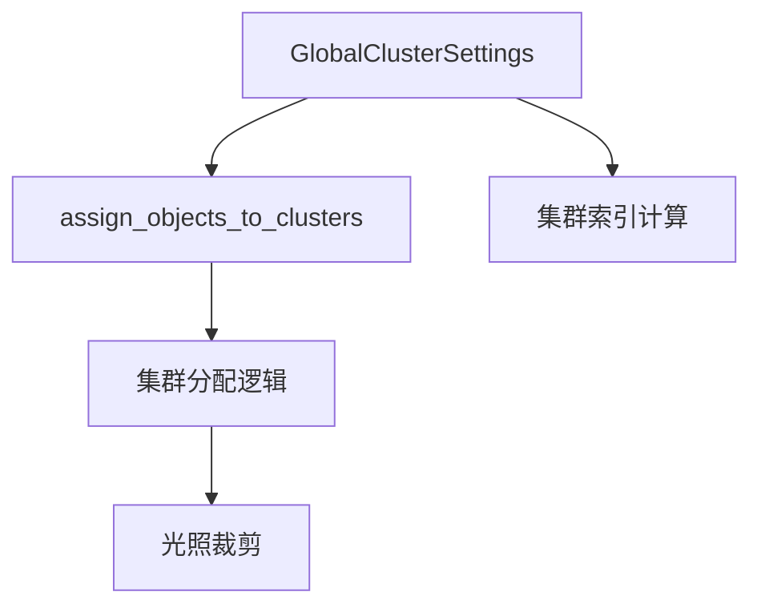

+++
title = "#19985 dont hard code clustering limits on cpu side so they can be informed by Limits later"
date = "2025-07-06T00:00:00"
draft = false
template = "pull_request_page.html"
in_search_index = false

[extra]
current_language = "zh-cn"
available_languages = {"en" = { name = "English", url = "/pull_request/bevy/2025-07/pr-19985-en-20250706" }, "zh-cn" = { name = "中文", url = "/pull_request/bevy/2025-07/pr-19985-zh-cn-20250706" }}
+++

# 分析报告：PR #19985 - dont hard code clustering limits on cpu side so they can be informed by Limits later

## 基本信息
- **标题**: dont hard code clustering limits on cpu side so they can be informed by Limits later
- **PR链接**: https://github.com/bevyengine/bevy/pull/19985
- **作者**: atlv24
- **状态**: 已合并
- **标签**: A-Rendering, C-Code-Quality, C-Usability, D-Straightforward, S-Needs-Review
- **创建时间**: 2025-07-06T18:08:46Z
- **合并时间**: 2025-07-06T19:56:11Z
- **合并人**: alice-i-cecile

## 描述翻译
### Objective
- 为 bevy_light 的拆分做准备
- 使限制(limits)更动态可配置

### Solution
- 使用设置结构体(settings struct)

### Testing
- 3d_scene, lighting

## PR技术分析

### 问题背景
在Bevy的渲染系统中，光照集群(clustering)算法负责将点光源、聚光灯等可集群对象分配到3D空间网格中。原始实现存在两个关键限制：
1. `MAX_UNIFORM_BUFFER_CLUSTERABLE_OBJECTS` - 定义每个视图(view)可处理的硬编码集群对象上限
2. `ViewClusterBindings::MAX_INDICES` - 集群索引缓冲区的硬编码大小限制

这些硬编码常量阻碍了：
1. 未来将光照系统拆分为独立模块(bevy_light)的计划
2. 根据运行时条件(如硬件能力)动态调整限制的能力
3. 通过引擎的`Limits`资源实现用户可配置性

### 解决方案
核心思路是将硬编码的限制迁移到`GlobalClusterSettings`结构体中，使其成为可配置参数而非编译时常量。具体实现分为三个步骤：

1. **扩展设置结构体**  
   在`GlobalClusterSettings`中添加两个新字段：
   ```rust
   pub struct GlobalClusterSettings {
       pub supports_storage_buffers: bool,
       pub clustered_decals_are_usable: bool,
       // 新增字段
       pub max_uniform_buffer_clusterable_objects: usize,
       pub view_cluster_bindings_max_indices: usize,
   }
   ```

2. **初始化默认值**  
   在设置创建时赋予与原硬编码值相同的默认值：
   ```rust
   GlobalClusterSettings {
       supports_storage_buffers,
       clustered_decals_are_usable,
       max_uniform_buffer_clusterable_objects: MAX_UNIFORM_BUFFER_CLUSTERABLE_OBJECTS,
       view_cluster_bindings_max_indices: ViewClusterBindings::MAX_INDICES,
   }
   ```

3. **替换硬编码引用**  
   在集群分配逻辑中使用动态设置替代硬编码常量：
   ```rust
   // 替换前
   if clusterable_objects.len() > MAX_UNIFORM_BUFFER_CLUSTERABLE_OBJECTS { ... }
   clusterable_objects.truncate(MAX_UNIFORM_BUFFER_CLUSTERABLE_OBJECTS);
   
   // 替换后
   if clusterable_objects.len() > global_cluster_settings.max_uniform_buffer_clusterable_objects { ... }
   clusterable_objects.truncate(global_cluster_settings.max_uniform_buffer_clusterable_objects);
   ```

### 技术影响
1. **向后兼容性**：保持原有默认值，确保行为不变
2. **配置灵活性**：为后续通过`Limits`资源动态调整铺平道路
3. **模块解耦**：消除bevy_light模块拆分的障碍
4. **错误处理**：警告消息现在使用动态值，提高可读性：
   ```rust
   warn!("max_uniform_buffer_clusterable_objects ({}) exceeded", 
         global_cluster_settings.max_uniform_buffer_clusterable_objects);
   ```

### 性能考量
1. 无运行时开销：设置值在视图准备阶段确定
2. 无额外内存占用：结构体新增字段大小可忽略
3. 算法逻辑不变：仅替换常量引用，不改变核心算法

## 组件关系图



## 关键文件变更

### 1. `crates/bevy_pbr/src/cluster/assign.rs` (+16/-10)
**变更原因**：将硬编码限制替换为动态设置  
关键代码片段：
```rust
// 集群对象数量检查
if clusterable_objects.len() > global_cluster_settings.max_uniform_buffer_clusterable_objects {
    // 裁剪逻辑...
}

// 集群索引估算
if cluster_index_estimate > global_cluster_settings.view_cluster_bindings_max_indices as f32 {
    // 动态调整集群维度...
}
```

### 2. `crates/bevy_pbr/src/cluster/extract_and_prepare.rs` (+2/-0)
**变更原因**：初始化设置结构体的新字段  
关键代码片段：
```rust
GlobalClusterSettings {
    // ...原有字段
    max_uniform_buffer_clusterable_objects: MAX_UNIFORM_BUFFER_CLUSTERABLE_OBJECTS,
    view_cluster_bindings_max_indices: ViewClusterBindings::MAX_INDICES,
}
```

### 3. `crates/bevy_pbr/src/cluster/mod.rs` (+2/-0)
**变更原因**：扩展设置结构体定义  
关键代码片段：
```rust
pub struct GlobalClusterSettings {
    // ...原有字段
    pub max_uniform_buffer_clusterable_objects: usize,
    pub view_cluster_bindings_max_indices: usize,
}
```

## 延伸阅读
1. [Bevy渲染架构概览](https://bevyengine.org/learn/book/getting-started/rendering/)
2. [Forward+渲染技术解析](https://www.gamedeveloper.com/programming/forward-rendering-vs-deferred-rendering)
3. [WGSL存储缓冲区规范](https://www.w3.org/TR/WGSL/#storage-buffers)