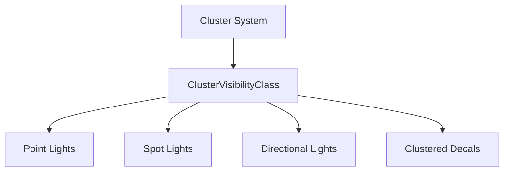

+++
title = "#19986 Rename light visibility class"
date = "2025-07-06T00:00:00"
draft = false
template = "pull_request_page.html"
in_search_index = true

[taxonomies]
list_display = ["show"]

[extra]
current_language = "en"
available_languages = {"en" = { name = "English", url = "/pull_request/bevy/2025-07/pr-19986-en-20250706" }, "zh-cn" = { name = "中文", url = "/pull_request/bevy/2025-07/pr-19986-zh-cn-20250706" }}
labels = ["A-Rendering", "C-Code-Quality"]
+++

# Rename light visibility class

## Basic Information
- **Title**: Rename light visibility class
- **PR Link**: https://github.com/bevyengine/bevy/pull/19986
- **Author**: atlv24
- **Status**: MERGED
- **Labels**: A-Rendering, C-Code-Quality, S-Ready-For-Final-Review
- **Created**: 2025-07-06T18:08:49Z
- **Merged**: 2025-07-06T19:23:40Z
- **Merged By**: alice-i-cecile

## Description Translation
# Objective

- prepare bevy_light for split
- make struct named better
- put it where it belongs

## Solution

- do those things

## Testing

- 3d_scene, lighting

## The Story of This Pull Request

This PR addresses a naming inconsistency in Bevy's rendering code related to visibility classification for clustered objects. The `LightVisibilityClass` struct was originally created to manage visibility for light sources within the clustering system. However, when clustered decals were added to the engine, they reused this same visibility class since they also needed to participate in the clustering process. This revealed that the name `LightVisibilityClass` was misleading because it wasn't exclusively used for lights anymore.

The core problem was that a visibility class designed specifically for lights was being used for other clusterable objects like decals. This naming mismatch created confusion about the actual purpose of the class and made the code less maintainable. The class needed a more accurate name reflecting its actual function in the clustering system.

The solution involved renaming `LightVisibilityClass` to `ClusterVisibilityClass` and relocating it to the clustering module where it logically belongs. This change required updating all references to the old name across multiple files. The new name clearly indicates that this visibility class is for any object that participates in clustering, not just lights.

In the implementation, we first removed the original `LightVisibilityClass` definition from `light/mod.rs` and created a new `ClusterVisibilityClass` in `cluster/mod.rs`. This new location makes more sense since clustering logic is centralized in this module. We then updated all components that previously used `LightVisibilityClass` to reference `ClusterVisibilityClass` instead.

```rust
// Before in cluster/mod.rs
use crate::LightVisibilityClass;

// After in cluster/mod.rs
pub struct ClusterVisibilityClass;
```

The components affected included:
- `ClusteredDecal`
- `DirectionalLight`
- `PointLight`
- `SpotLight`

For each, we updated the `on_add` visibility class handler:

```rust
// Before for PointLight
#[component(on_add = visibility::add_visibility_class::<LightVisibilityClass>)]

// After for PointLight
#[component(on_add = visibility::add_visibility_class::<ClusterVisibilityClass>)]
```

Additionally, we improved module organization by:
1. Moving cluster-related imports (`ClusterableObjectCounts`, `Clusters`, `GlobalClusterSettings`) out of light modules
2. Adjusting visibility modifiers to properly expose the new `ClusterVisibilityClass`
3. Adding documentation comments to clarify the purpose of the visibility class

These changes don't modify runtime behavior but significantly improve code clarity. The new name accurately reflects that this visibility class is for any clusterable object (lights and decals), not just lights. This makes the codebase more maintainable and reduces cognitive load when working with the clustering system.

Finally, we added a migration guide (`LightVisibilityClass_rename.md`) to document this change for users who might be referencing the old name in their projects. The guide explains that clustered decals revealed the misnamed visibility class and clarifies its new purpose.

## Visual Representation



## Key Files Changed

1. **crates/bevy_pbr/src/cluster/mod.rs** (+6/-2)  
   Added new `ClusterVisibilityClass` and removed old import  
   Key changes:
   ```rust
   // Before:
   use crate::LightVisibilityClass;
   
   // After:
   pub struct ClusterVisibilityClass;
   ```

2. **crates/bevy_pbr/src/light/mod.rs** (+9/-13)  
   Removed `LightVisibilityClass` and reorganized module structure  
   Key changes:
   ```rust
   // Before:
   pub struct LightVisibilityClass;
   
   // After:
   // (struct removed entirely)
   ```

3. **crates/bevy_pbr/src/light/point_light.rs** (+2/-2)  
   Updated visibility class reference  
   Key changes:
   ```rust
   // Before:
   #[component(on_add = visibility::add_visibility_class::<LightVisibilityClass>)]
   
   // After:
   #[component(on_add = visibility::add_visibility_class::<ClusterVisibilityClass>)]
   ```

4. **release-content/migration-guides/LightVisibilityClass_rename.md** (+8/-0)  
   Added migration documentation  
   Key content:
   ```markdown
   When clustered decals were added, they used `LightVisibilityClass` to share the clustering infrastructure.
   This revealed that this visibility class wasn't really about lights, but about clustering.
   It has been renamed to `ClusterVisibilityClass` and moved to live alongside clustering-specific types.
   ```

## Further Reading
- [Bevy Visibility System Documentation](https://docs.rs/bevy/latest/bevy/render/view/visibility/index.html)
- [Entity Component System Pattern](https://en.wikipedia.org/wiki/Entity_component_system)
- [Rendering Cluster Techniques](https://www.gamedeveloper.com/rendering/clustered-shading)