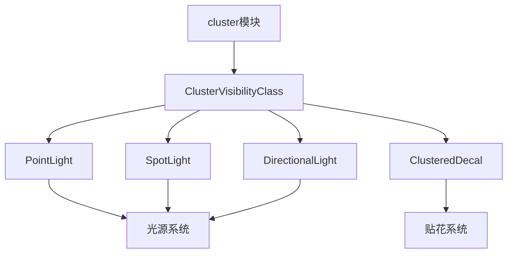

+++
title = "#19986 Rename light visibility class"
date = "2025-07-06T00:00:00"
draft = false
template = "pull_request_page.html"
in_search_index = false

[extra]
current_language = "zh-cn"
available_languages = {"en" = { name = "English", url = "/pull_request/bevy/2025-07/pr-19986-en-20250706" }, "zh-cn" = { name = "中文", url = "/pull_request/bevy/2025-07/pr-19986-zh-cn-20250706" }}
+++

# PR #19986: Rename light visibility class

## Basic Information
- **标题**: Rename light visibility class
- **PR链接**: https://github.com/bevyengine/bevy/pull/19986
- **作者**: atlv24
- **状态**: 已合并
- **标签**: A-Rendering, C-Code-Quality, S-Ready-For-Final-Review
- **创建时间**: 2025-07-06T18:08:49Z
- **合并时间**: 2025-07-06T19:23:40Z
- **合并者**: alice-i-cecile

## 描述翻译
### Objective
- 为拆分 bevy_light 做准备
- 优化结构体命名
- 将代码放置到更合适的位置

### Solution
- 执行上述变更

### Testing
- 测试场景：3d_scene, lighting

## PR变更分析

### 问题背景
在Bevy渲染系统中，`LightVisibilityClass`被用于管理光源(点光源/方向光/聚光灯)的可见性计算。随着集群化渲染(clustered rendering)功能的扩展，特别是贴花(decal)功能的引入，该可见性类被复用到了非光源的集群化对象上。这导致了命名上的歧义，因为：
1. 类名`LightVisibilityClass`暗示其仅适用于光源，但实际上也用于贴花
2. 类定义位于`bevy_pbr/src/light/mod.rs`中，与集群化渲染的核心逻辑分离
3. 命名未能准确反映其实际功能——管理所有集群化对象(包括光源和贴花)的可见性

### 解决方案
1. 将`LightVisibilityClass`重命名为`ClusterVisibilityClass`以准确反映其用途
2. 将新类移至集群化渲染模块(`bevy_pbr/src/cluster/mod.rs`)
3. 更新所有相关引用点（光源组件和贴花组件）
4. 添加迁移指南文档说明此次变更

### 关键实现细节
#### 1. 可见性类重命名与迁移
原`LightVisibilityClass`从光源模块移动到集群模块，并更名为`ClusterVisibilityClass`：

```rust
// Before (crates/bevy_pbr/src/light/mod.rs)
pub struct LightVisibilityClass;

// After (crates/bevy_pbr/src/cluster/mod.rs)
pub struct ClusterVisibilityClass;
```

#### 2. 组件可见性类引用更新
所有光源组件和贴花组件的`on_add`回调更新为新类名：

```rust
// Point light component
#[component(on_add = visibility::add_visibility_class::<ClusterVisibilityClass>)]
pub struct PointLight { /* ... */ }

// Spot light component
#[component(on_add = visibility::add_visibility_class::<ClusterVisibilityClass>)]
pub struct SpotLight { /* ... */ }

// Directional light component
#[component(on_add = visibility::add_visibility_class::<ClusterVisibilityClass>)]
pub struct DirectionalLight { /* ... */ }

// Clustered decal component
#[component(on_add = visibility::add_visibility_class::<ClusterVisibilityClass>)]
pub struct ClusteredDecal { /* ... */ }
```

#### 3. 模块结构调整
清理了light模块的导入依赖关系，将集群化渲染的相关类型集中管理：

```rust
// Before
use crate::{
    cascade::{build_directional_light_cascades, clear_directional_light_cascades},
    CascadeShadowConfig, Cascades, VisibleClusterableObjects,
};

// After
use crate::cluster::{add_clusters, assign_objects_to_clusters, VisibleClusterableObjects};
```

### 技术影响
1. **命名准确性**：新名称`ClusterVisibilityClass`准确描述了该类用于集群化渲染的可见性管理
2. **代码组织优化**：相关类型集中到cluster模块，符合单一职责原则
3. **扩展性提升**：为未来添加更多集群化对象类型（如体积光/探针）奠定基础
4. **迁移成本**：变更涉及多个文件，但通过一次性重构降低了后续维护成本

### 测试验证
通过现有测试场景验证重构后功能完整性：
- `3d_scene`：基础渲染场景验证
- `lighting`：光源渲染专项验证
测试确保所有光源和贴花仍能正确参与集群化渲染流程

## 组件关系图



## 关键文件变更

### `crates/bevy_pbr/src/cluster/mod.rs` (+6/-2)
- 新增`ClusterVisibilityClass`定义
- 移除对旧`LightVisibilityClass`的引用

```rust
// 新增
pub struct ClusterVisibilityClass;

// 移除
use crate::LightVisibilityClass;
```

### `crates/bevy_pbr/src/light/mod.rs` (+9/-13)
- 移除`LightVisibilityClass`定义
- 重构模块导入结构

```rust
// 移除
pub struct LightVisibilityClass;

// 导入结构调整
use crate::cluster::{add_clusters, assign_objects_to_clusters, VisibleClusterableObjects};
```

### `release-content/migration-guides/LightVisibilityClass_rename.md` (+8/-0)
新增迁移指南文档：

```markdown
---
title: `LightVisibilityClass` renamed to `ClusterVisibilityClass`
pull_requests: [19986]
---

当添加集群贴花功能时，它们复用了`LightVisibilityClass`来共享集群基础设施。
这揭示出该可见性类实际上并非专属于光源，而是服务于集群化渲染。
现已重命名为`ClusterVisibilityClass`并移至集群化类型相关模块。
```

### `crates/bevy_pbr/src/light/directional_light.rs` (+3/-2)
更新方向光组件引用：

```rust
// 导入更新
use crate::cluster::ClusterVisibilityClass;

// 组件定义更新
#[component(on_add = visibility::add_visibility_class::<ClusterVisibilityClass>)]
```

### `crates/bevy_pbr/src/light/point_light.rs` (+2/-2)
更新点光源组件引用：

```rust
// 导入更新
use crate::cluster::{ClusterVisibilityClass, GlobalVisibleClusterableObjects};

// 组件定义更新
#[component(on_add = visibility::add_visibility_class::<ClusterVisibilityClass>)]
```

## 延伸阅读
1. [Bevy集群化渲染架构](https://bevyengine.org/learn/book/features/rendering/clustered-rendering)
2. [可见性系统设计文档](https://github.com/bevyengine/bevy/blob/main/docs/architecture/visibility.md)
3. [ECS组件继承最佳实践](https://github.com/bevyengine/bevy/blob/main/docs/architecture/ecs.md#component-inheritance)