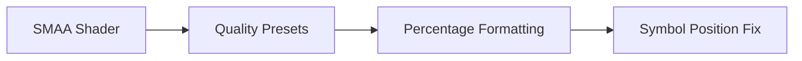

+++
title = "#19987 fix percentage signs in SMAA"
date = "2025-07-06T00:00:00"
draft = false
template = "pull_request_page.html"
in_search_index = true

[taxonomies]
list_display = ["show"]

[extra]
current_language = "en"
available_languages = {"en" = { name = "English", url = "/pull_request/bevy/2025-07/pr-19987-en-20250706" }, "zh-cn" = { name = "中文", url = "/pull_request/bevy/2025-07/pr-19987-zh-cn-20250706" }}
labels = ["C-Docs", "D-Trivial", "A-Rendering", "S-Needs-Design", "X-Contentious"]
+++

# Title: fix percentage signs in SMAA

## Basic Information
- **Title**: fix percentage signs in SMAA
- **PR Link**: https://github.com/bevyengine/bevy/pull/19987
- **Author**: atlv24
- **Status**: MERGED
- **Labels**: C-Docs, D-Trivial, A-Rendering, S-Needs-Design, X-Contentious
- **Created**: 2025-07-06T18:55:06Z
- **Merged**: 2025-07-06T22:43:05Z
- **Merged By**: superdump

## Description Translation
# Objective

- fix typo

## The Story of This Pull Request

The problem started with a minor documentation error in Bevy's SMAA (Subpixel Morphological Anti-Aliasing) implementation. In the shader comments describing quality presets, percentage values were incorrectly formatted with the percent sign preceding the numerical value (e.g., `%60` instead of `60%`). While this didn't affect runtime behavior, it created inconsistent documentation that could confuse developers referencing these comments.

The solution approach was straightforward: correct the formatting of percentage values in the preset documentation comments. This required minimal changes - just repositioning the percent symbol in four lines of comments within the shader file. No functional code changes were needed since this was purely a documentation fix.

The implementation modified the shader source file `smaa.wgsl`, specifically the comments describing the SMAA quality presets. The changes corrected the percentage formatting to follow standard numerical conventions. This aligns the documentation with common mathematical notation and improves readability for developers working with the anti-aliasing system.

The impact of these changes is primarily on code maintainability and developer experience. Correct documentation formatting reduces cognitive load when reading the source code, especially for developers new to the SMAA implementation. The changes also maintain consistency with percentage notation used elsewhere in the codebase.

## Visual Representation



## Key Files Changed

### `crates/bevy_anti_aliasing/src/smaa/smaa.wgsl`
This file contains the WebGPU Shading Language (WGSL) implementation of the SMAA anti-aliasing algorithm. The changes correct percentage formatting in documentation comments for quality presets.

**Key Modifications:**
```wgsl
// Before:
 *         SMAA_PRESET_LOW          (%60 of the quality)
 *         SMAA_PRESET_MEDIUM       (%80 of the quality)
 *         SMAA_PRESET_HIGH         (%95 of the quality)
 *         SMAA_PRESET_ULTRA        (%99 of the quality)

// After:
 *         SMAA_PRESET_LOW          (60% of the quality)
 *         SMAA_PRESET_MEDIUM       (80% of the quality)
 *         SMAA_PRESET_HIGH         (95% of the quality)
 *         SMAA_PRESET_ULTRA        (99% of the quality)
```

These changes fix the position of the percentage symbol in documentation comments while preserving all functional shader code. The modifications maintain the existing technical descriptions but present them using standard percentage notation.

## Further Reading
1. [SMAA: Enhanced Subpixel Morphological Antialiasing](https://www.iryoku.com/smaa/) - Original research paper
2. [Bevy Anti-Aliasing Documentation](https://docs.rs/bevy_anti_aliasing/latest/bevy_anti_aliasing/)
3. [WGSL Shading Language Specification](https://www.w3.org/TR/WGSL/)

## Full Code Diff
```diff
diff --git a/crates/bevy_anti_aliasing/src/smaa/smaa.wgsl b/crates/bevy_anti_aliasing/src/smaa/smaa.wgsl
index 08723254483c6..24dc6baa25902 100644
--- a/crates/bevy_anti_aliasing/src/smaa/smaa.wgsl
+++ b/crates/bevy_anti_aliasing/src/smaa/smaa.wgsl
@@ -146,10 +146,10 @@
  *         * (See SMAA_INCLUDE_VS and SMAA_INCLUDE_PS below).
  *
  *     And four presets:
- *         SMAA_PRESET_LOW          (%60 of the quality)
- *         SMAA_PRESET_MEDIUM       (%80 of the quality)
- *         SMAA_PRESET_HIGH         (%95 of the quality)
- *         SMAA_PRESET_ULTRA        (%99 of the quality)
+ *         SMAA_PRESET_LOW          (60% of the quality)
+ *         SMAA_PRESET_MEDIUM       (80% of the quality)
+ *         SMAA_PRESET_HIGH         (95% of the quality)
+ *         SMAA_PRESET_ULTRA        (99% of the quality)
  *
  *     For example:
  *         #define SMAA_RT_METRICS float4(1.0 / 1280.0, 1.0 / 720.0, 1280.0, 720.0)
```