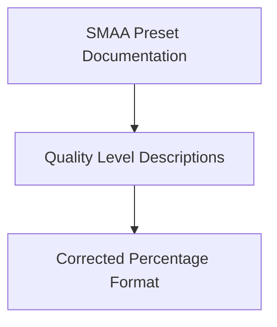

+++
title = "#19987 fix percentage signs in SMAA"
date = "2025-07-06T00:00:00"
draft = false
template = "pull_request_page.html"
in_search_index = false

[extra]
current_language = "zh-cn"
available_languages = {"en" = { name = "English", url = "/pull_request/bevy/2025-07/pr-19987-en-20250706" }, "zh-cn" = { name = "中文", url = "/pull_request/bevy/2025-07/pr-19987-zh-cn-20250706" }}
labels = ["C-Docs", "D-Trivial", "A-Rendering", "S-Needs-Design", "X-Contentious"]
+++

# fix percentage signs in SMAA

## Basic Information
- **Title**: fix percentage signs in SMAA
- **PR Link**: https://github.com/bevyengine/bevy/pull/19987
- **Author**: atlv24
- **Status**: MERGED
- **Labels**: C-Docs, D-Trivial, A-Rendering, S-Needs-Design, X-Contentious
- **Created**: 2025-07-06T18:55:06Z
- **Merged**: 2025-07-06T22:43:05Z
- **Merged By**: superdump

## Description Translation
修复 SMAA 文档中的百分比符号拼写错误

# Objective
- 修复拼写错误

## The Story of This Pull Request

这个 PR 始于一个简单的观察：在 Bevy 的 SMAA（增强型子像素形态学抗锯齿）实现文档中，百分比符号的使用存在拼写错误。问题出现在 `smaa.wgsl` 文件的注释部分，该文件定义了 SMAA 抗锯齿技术的 WebGPU 着色器实现。

在原始代码中，SMAA 预设的质量级别描述使用了错误的百分比表示方式：
```wgsl
SMAA_PRESET_LOW          (%60 of the quality)
SMAA_PRESET_MEDIUM       (%80 of the quality)
SMAA_PRESET_HIGH         (%95 of the quality)
SMAA_PRESET_ULTRA        (%99 of the quality)
```

这里的语法问题在于使用了 `%60`、`%80` 等格式，而非标准的 `60%` 表示法。虽然这个错误不会影响实际的渲染功能，但它造成了文档的不规范，可能对开发者阅读和理解代码产生轻微干扰。

开发者 atlv24 识别出这个问题属于简单的拼写错误类别，并提出了最小化的修复方案：将 `%60` 改为 `60%`，其他预设也做相应修改。这种改动直接明了，不需要考虑备选方案，因为错误本质上是语法性的而非功能性的。

修改后，代码注释符合标准数学表示法：
```wgsl
SMAA_PRESET_LOW          (60% of the quality)
SMAA_PRESET_MEDIUM       (80% of the quality)
SMAA_PRESET_HIGH         (95% of the quality)
SMAA_PRESET_ULTRA        (99% of the quality)
```

这个 PR 展示了即使是最小的文档修正也值得关注。清晰的代码注释对于维护和理解渲染技术至关重要，特别是像 SMAA 这样涉及复杂算法的实现。虽然改动很小，但它提升了代码库的整体质量，保持了 Bevy 项目对细节的关注标准。

## Visual Representation



## Key Files Changed

### `crates/bevy_anti_aliasing/src/smaa/smaa.wgsl`
**修改说明**：修复了 SMAA 预设质量描述的百分比符号拼写错误  
**关联性**：这是本次 PR 唯一修改的文件，直接解决了文档中的拼写问题

**代码修改对比**：
```wgsl
# Before:
SMAA_PRESET_LOW          (%60 of the quality)
SMAA_PRESET_MEDIUM       (%80 of the quality)
SMAA_PRESET_HIGH         (%95 of the quality)
SMAA_PRESET_ULTRA        (%99 of the quality)

# After:
SMAA_PRESET_LOW          (60% of the quality)
SMAA_PRESET_MEDIUM       (80% of the quality)
SMAA_PRESET_HIGH         (95% of the quality)
SMAA_PRESET_ULTRA        (99% of the quality)
```

## Further Reading
1. [SMAA 技术白皮书](http://www.iryoku.com/smaa/)
2. [Bevy 抗锯齿文档](https://bevyengine.org/learn/book/features/anti-aliasing/)
3. [WebGPU 着色语言规范](https://www.w3.org/TR/webgpu/#shader-language)