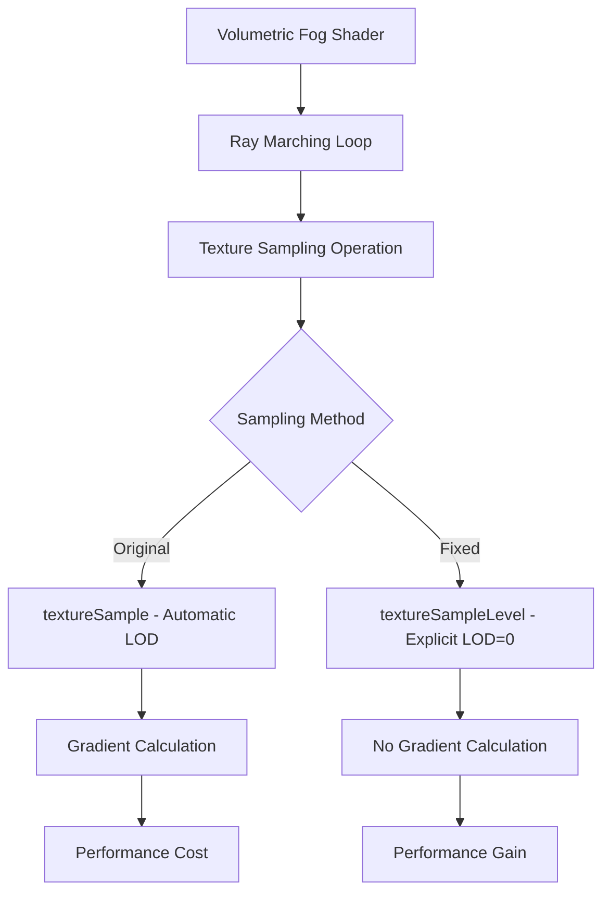

+++
title = "#19988"
date = "2025-07-06T00:00:00"
draft = false
template = "pull_request_page.html"
in_search_index = true

[taxonomies]
list_display = ["show"]

[extra]
current_language = "en"
available_languages = {"en" = { name = "English", url = "/pull_request/bevy/2025-07/pr-19988-en-20250706" }, "zh-cn" = { name = "中文", url = "/pull_request/bevy/2025-07/pr-19988-zh-cn-20250706" }}
+++

## Narrative Analysis of PR #19988: fix variable-termination loop gradients by sampling specific lod

### The Problem and Context
The volumetric fog implementation used a variable-termination loop to sample a 3D density texture during ray marching. The loop condition depended on accumulated density values, which meant different pixels could execute different numbers of iterations. The original implementation used `textureSample`, which automatically calculates gradients for mip level selection. This gradient calculation becomes problematic in non-uniform control flow scenarios like variable-termination loops, where adjacent pixels may execute different code paths. The gradients become undefined or inefficient to compute, potentially causing visual artifacts or performance issues.

### The Solution Approach
The solution replaces the automatic mip selection with explicit Level-of-Detail (LOD) specification. By forcing texture sampling at mip level 0 (the base texture resolution), we eliminate gradient calculations entirely. This approach is valid because:
1. Volumetric fog typically doesn't require mipmapping since it's a homogeneous medium
2. Avoiding gradient calculations improves performance in divergent control flow
3. The base mip level provides sufficient detail for fog density calculations

### The Implementation
The change is concise but impactful, modifying just one line in the volumetric fog shader:

```wgsl
// Before: Automatic mip selection using textureSample
density *= textureSample(density_texture, density_sampler, P_uvw + density_texture_offset).r;

// After: Explicit LOD specification using textureSampleLevel
density *= textureSampleLevel(density_texture, density_sampler, P_uvw + density_texture_offset, 0.0).r;
```

The key modifications are:
1. Replaced `textureSample` with `textureSampleLevel`
2. Added `0.0` as the fourth parameter to specify mip level 0
3. Maintained all other parameters and calculations unchanged

This change fits cleanly into the existing ray marching loop where density samples are accumulated. The rest of the volumetric calculation logic remains unaffected.

### Technical Insights
The solution demonstrates two important shader programming principles:
1. **Explicit LOD specification** (`textureSampleLevel`) is preferable to automatic LOD selection (`textureSample`) in non-uniform control flow
2. **Volumetric effects** often don't benefit from mipmapping since they represent continuous media rather than discrete surface details

Performance-wise, this change:
- Eliminates expensive gradient calculations in divergent control flow
- Reduces register pressure by avoiding gradient operations
- Maintains visual quality since fog doesn't require texture filtering across mip levels

### The Impact
This optimization:
1. Resolves potential visual artifacts from undefined gradients
2. Improves shader execution efficiency in the volumetric fog pass
3. Maintains identical visual output since fog density sampling remains consistent
4. Reduces GPU instruction count by removing implicit gradient calculations

The fix is particularly valuable for scenes with complex fog interactions where the ray marching loop exhibits significant divergence between pixels.

## Visual Representation



## Key Files Changed

### `crates/bevy_pbr/src/volumetric_fog/volumetric_fog.wgsl`
**Change**: Modified texture sampling in volumetric fog calculation  
**Purpose**: Eliminate gradient calculations in variable-termination loop  
**Code Diff**:
```wgsl
// Original implementation with automatic LOD
density *= textureSample(density_texture, density_sampler, P_uvw + density_texture_offset).r;

// Optimized implementation with explicit LOD
density *= textureSampleLevel(density_texture, density_sampler, P_uvw + density_texture_offset, 0.0).r;
```

## Further Reading
1. [WebGPU textureSampleLevel documentation](https://gpuweb.github.io/gpuweb/wgsl/#texturesamplelevel)
2. [GPU Gradient Calculations in Divergent Control Flow](https://www.joshbarczak.com/blog/?p=667)
3. [Volumetric Rendering Techniques](https://developer.nvidia.com/gpugems/gpugems2/part-ii-shading-lighting-and-shadows/chapter-13-volumetric-shadowing)
4. [Bevy Engine Rendering Architecture](https://bevyengine.org/learn/book/features/rendering/)