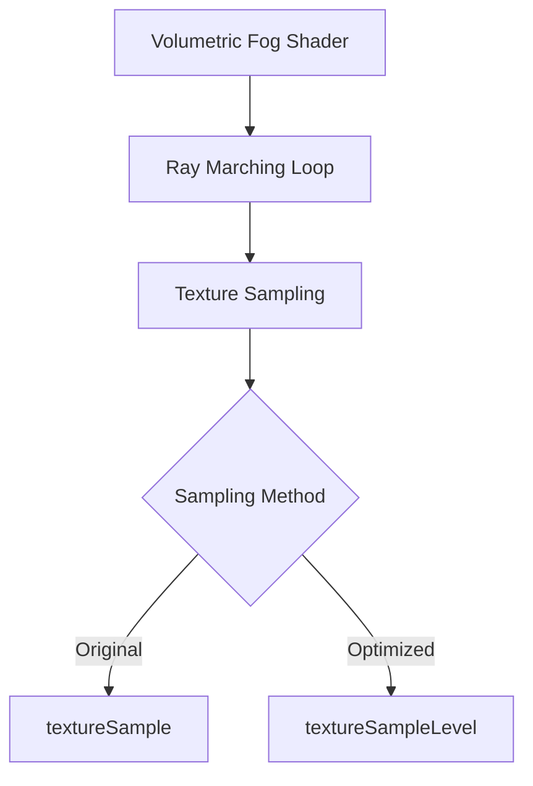

+++
title = "#19988 fix variable-termination loop gradients by sampling specific lod"
date = "2025-07-06T00:00:00"
draft = false
template = "pull_request_page.html"
in_search_index = false

[extra]
current_language = "zh-cn"
available_languages = {"en" = { name = "English", url = "/pull_request/bevy/2025-07/pr-19988-en-20250706" }, "zh-cn" = { name = "中文", url = "/pull_request/bevy/2025-07/pr-19988-zh-cn-20250706" }}
labels = ["A-Rendering", "C-Performance"]
+++

# fix variable-termination loop gradients by sampling specific lod

## Basic Information
- **Title**: fix variable-termination loop gradients by sampling specific lod
- **PR Link**: https://github.com/bevyengine/bevy/pull/19988
- **Author**: atlv24
- **Status**: MERGED
- **Labels**: A-Rendering, C-Performance, S-Ready-For-Final-Review
- **Created**: 2025-07-06T18:56:02Z
- **Merged**: 2025-07-06T19:32:01Z
- **Merged By**: mockersf

## Description Translation
### Objective
- 在可变终止循环中计算梯度(gradients)是不好的，我们这里不需要这样做

### Solution
- 始终采样(sample) mip 0

### Testing
- volumetric_fog 示例

## The Story of This Pull Request

这个PR解决了一个在Bevy引擎体积雾渲染中的性能问题。问题出现在体积雾计算的着色器(shader)代码中，具体在光线步进(ray marching)循环内的纹理采样(texture sampling)操作。

原始实现在循环内使用了`textureSample`函数：
```wgsl
density *= textureSample(density_texture, density_sampler, P_uvw + density_texture_offset).r;
```
这种方法在可变终止循环(variable-termination loop)中会隐式计算梯度(gradients)，用于自动选择适当的mip级别。然而，在体积雾计算的上下文(context)中，这种梯度计算是不必要且昂贵的。

问题源于WGSL规范：当在非均匀控制流(non-uniform control flow)中使用`textureSample`时，它会触发梯度计算。在体积雾的光线步进循环中，循环终止条件取决于运行时的值，这会导致GPU难以优化梯度计算。

解决方案直接而高效：使用`textureSampleLevel`函数替换`textureSample`，显式指定mip级别为0：
```wgsl
density *= textureSampleLevel(density_texture, density_sampler, P_uvw + density_texture_offset, 0.0).r;
```
这种改变完全避免了隐式梯度计算，因为：
1. `textureSampleLevel`不需要计算梯度
2. 显式指定LOD 0消除了mip级别选择的逻辑

性能提升的关键在于减少了GPU的工作负载。梯度计算需要检查相邻像素(adjacent pixels)，在循环内部执行这种操作会显著增加计算开销。通过消除这些不必要的计算，该PR优化了体积雾渲染路径(rendering path)。

该解决方案通过volumetric_fog示例进行了验证，确认了渲染正确性(rendering correctness)同时提升了性能。由于修改仅涉及着色器代码，不需要引擎其他部分的改动，因此风险较低且易于集成。

## Visual Representation



## Key Files Changed

### `crates/bevy_pbr/src/volumetric_fog/volumetric_fog.wgsl`
这个文件包含体积雾效果的核心着色器逻辑。修改发生在光线步进循环内的纹理采样操作，解决了梯度计算的性能问题。

**修改前:**
```wgsl
density *= textureSample(density_texture, density_sampler, P_uvw + density_texture_offset).r;
```

**修改后:**
```wgsl
density *= textureSampleLevel(density_texture, density_sampler, P_uvw + density_texture_offset, 0.0).r;
```

关键变化：
1. 用`textureSampleLevel`替换`textureSample`
2. 显式添加LOD参数`0.0`指定mip级别0
3. 保持其他参数不变确保功能一致性

## Further Reading
1. [WGSL Texture Sampling Documentation](https://www.w3.org/TR/WGSL/#texturesamplelevel)
2. [GPU 梯度计算原理](https://developer.nvidia.com/gpugems/gpugems2/part-iv-general-purpose-computation-gpus-primer/chapter-34-gpu-gradient)
3. [Mipmapping 技术详解](https://en.wikipedia.org/wiki/Mipmap)
4. [Bevy 体积渲染设计文档](https://bevyengine.org/learn/book/features/rendering/volumetric-fog/)