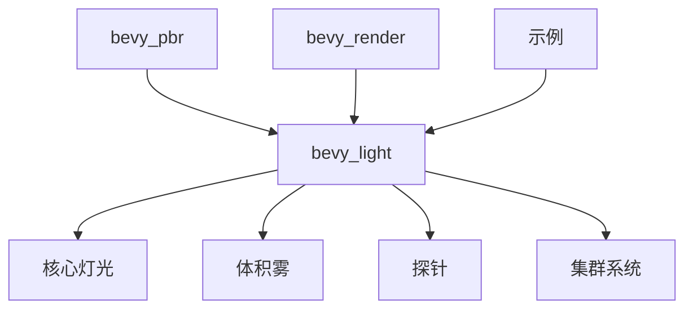

+++
title = "#19991 bevy_light"
date = "2025-07-07T00:00:00"
draft = false
template = "pull_request_page.html"
in_search_index = false

[extra]
current_language = "zh-cn"
available_languages = {"en" = { name = "English", url = "/pull_request/bevy/2025-07/pr-19991-en-20250707" }, "zh-cn" = { name = "中文", url = "/pull_request/bevy/2025-07/pr-19991-zh-cn-20250707" }}
+++

# bevy_light

## 基本资料
- **标题**: bevy_light
- **PR链接**: https://github.com/bevyengine/bevy/pull/19991
- **作者**: atlv24
- **状态**: MERGED
- **标签**: A-Rendering, S-Ready-For-Final-Review, X-Controversial
- **创建时间**: 2025-07-06T21:04:32Z
- **合并时间**: 2025-07-07T00:28:26Z
- **合并者**: alice-i-cecile

## 描述翻译
### 目标
- 使灯光功能不依赖 bevy_render 即可使用

### 解决方案
- 创建新的 crate 存放灯光相关功能

### 测试
- 测试了以下示例：3d_scene, lighting, volumetric_fog, ssr, transmission, pcss, light_textures

注意：由于重新导出(re-exports)没有破坏性变更，除了light textures是这个周期引入的，所以无关紧要

## 这个Pull Request的故事

这个PR解决了灯光系统与渲染核心的耦合问题。在Bevy引擎中，灯光功能原本深度集成在`bevy_pbr`和`bevy_render`中，这导致无法在不需要完整渲染管线的情况下使用灯光功能。PR的目标是将灯光相关代码提取到独立的`bevy_light` crate中，同时保持向后兼容性。

开发者采取了模块化重构的方法：
1. 创建了新的`bevy_light` crate，包含灯光、体积雾、探针等核心功能
2. 将原本在`bevy_pbr`中的灯光模块迁移到新crate
3. 保留了必要的重新导出，确保现有项目不受影响
4. 调整了集群(cluster)系统，使其更通用化

关键实现细节：
- 在`bevy_light`中定义了`AmbientLight`、`PointLight`、`SpotLight`等核心组件
- 集群系统现在处理多种可集群对象：点光源、聚光灯、反射探针等
- 体积雾(`VolumetricFog`)和探针(`LightProbe`)作为独立组件实现

```rust
// 新灯光crate中的聚光灯定义
#[derive(Component, Debug, Clone, Reflect)]
pub struct SpotLight {
    pub color: Color,
    pub intensity: f32,
    pub inner_angle: f32,
    pub outer_angle: f32,
    // ...其他字段
}
```

迁移过程中考虑了性能影响：
- 集群分配算法优化为按类型排序，提高缓存效率
- 保留原有的分块(tiling)和深度切片策略
- 可见性系统与集群系统解耦

```rust
// 集群分配时的排序逻辑
impl ClusterableObjectType {
    pub fn ordering(&self) -> (u8, bool, bool) {
        match *self {
            ClusterableObjectType::PointLight { .. } => (0, ...),
            ClusterableObjectType::SpotLight { .. } => (1, ...),
            // ...其他类型
        }
    }
}
```

最终变更涉及32个文件：
- 新增`bevy_light` crate及其模块
- 修改`bevy_pbr`适配新灯光系统
- 更新`bevy_render`中的提取(extract)实现

这些变更使灯光系统成为独立模块，可以在不启用渲染的情况下使用，同时保持了与现有渲染管线的兼容性。测试覆盖了所有主要灯光类型和效果，确保功能完整性。

## 视觉表示



## 关键文件变更

1. `crates/bevy_light/Cargo.toml` (+176/-0)
   - 新增灯光crate的配置文件
   - 定义依赖和特性
```toml
[package]
name = "bevy_light"
version = "0.17.0-dev"
edition = "2024"

[dependencies]
bevy_app = { path = "../bevy_app", version = "0.17.0-dev" }
bevy_asset = { path = "../bevy_asset", version = "0.17.0-dev" }
# ...其他依赖
```

2. `crates/bevy_light/src/volumetric.rs` (+157/-0)
   - 新增体积雾和体积光实现
```rust
#[derive(Component, Debug, Reflect)]
pub struct VolumetricFog {
    pub ambient_color: Color,
    pub ambient_intensity: f32,
    pub step_count: u32,
    // ...其他字段
}

#[derive(Component, Debug, Reflect)]
pub struct FogVolume {
    pub fog_color: Color,
    pub density_factor: f32,
    // ...其他字段
}
```

3. `crates/bevy_light/src/probe.rs` (+109/-0)
   - 新增光照探针实现
```rust
#[derive(Component, Debug, Reflect)]
pub struct LightProbe;

#[derive(Component, Reflect)]
pub struct EnvironmentMapLight {
    pub diffuse_map: Handle<Image>,
    pub specular_map: Handle<Image>,
    pub intensity: f32,
    // ...其他字段
}
```

4. `crates/bevy_pbr/src/lib.rs` (+7/-165)
   - 调整PBR crate使用新的灯光系统
```rust
// 从bevy_light导入核心类型
pub use bevy_light::{
    AmbientLight, DirectionalLight, PointLight, SpotLight,
    VolumetricFog, VolumetricLight, LightProbe
};
```

5. `crates/bevy_render/src/extract_impls.rs` (新增)
   - 为灯光组件实现提取逻辑
```rust
impl ExtractComponent for AmbientLight {
    type QueryData = &'static Self;
    // ...提取实现
}
```

## 进一步阅读
- [Bevy ECS架构](https://bevyengine.org/learn/book/getting-started/ecs/)
- [前向渲染与延迟渲染](https://learnopengl.com/Advanced-Lighting/Deferred-Shading)
- [光照探针技术](https://developer.nvidia.com/gpugems/gpugems3/part-ii-light-and-shadows/chapter-9-implementing-radiance-transfer-games)