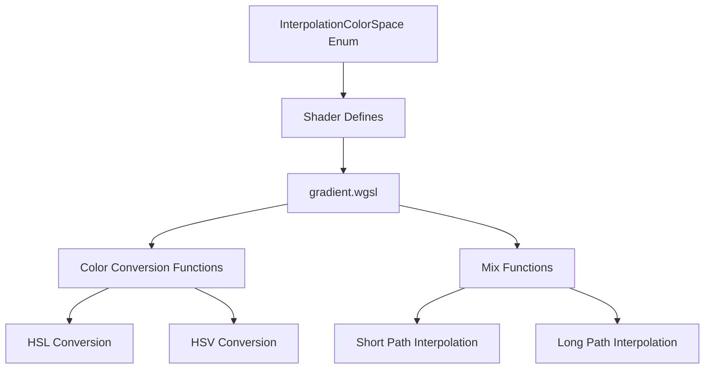

+++
title = "#19992 HSL and HSV interpolation for UI gradients"
date = "2025-07-07T00:00:00"
draft = false
template = "pull_request_page.html"
in_search_index = true

[taxonomies]
list_display = ["show"]

[extra]
current_language = "en"
available_languages = {"en" = { name = "English", url = "/pull_request/bevy/2025-07/pr-19992-en-20250707" }, "zh-cn" = { name = "中文", url = "/pull_request/bevy/2025-07/pr-19992-zh-cn-20250707" }}
labels = ["C-Feature", "A-Rendering", "A-UI", "D-Shaders", "A-Color"]
+++

# Technical Analysis: HSL and HSV Interpolation for UI Gradients

## Basic Information
- **Title**: HSL and HSV interpolation for UI gradients
- **PR Link**: https://github.com/bevyengine/bevy/pull/19992
- **Author**: ickshonpe
- **Status**: MERGED
- **Labels**: C-Feature, A-Rendering, A-UI, S-Ready-For-Final-Review, D-Shaders, A-Color
- **Created**: 2025-07-06T21:16:33Z
- **Merged**: 2025-07-07T20:44:31Z
- **Merged By**: alice-i-cecile

## Description Translation
### Objective
Add interpolation in HSL and HSV colour spaces for UI gradients.

### Solution
Added new variants to `InterpolationColorSpace`: `Hsl`, `HslLong`, `Hsv`, and `HsvLong`, along with mix functions to the `gradients` shader for each of them.

#### Limitations
* Didn't include increasing and decreasing path support, it's not essential and can be done in a follow up if someone feels like it.

* The colour conversions should really be performed before the colours are sent to the shader but it would need more changes and performance is good enough for now.

### Testing
```cargo run --example gradients```

## The Story of This Pull Request

The PR addresses a need for more flexible color interpolation options in Bevy's UI gradients. Previously, gradients supported interpolation in sRGB, linear RGB, OKLab, and OKLCH color spaces. While these options work well for many cases, designers often prefer working with HSL (Hue-Saturation-Lightness) and HSV (Hue-Saturation-Value) color models for their perceptual uniformity and intuitive parameters.

The implementation adds four new interpolation variants to the `InterpolationColorSpace` enum: 
- `Hsl` and `HslLong` for HSL space with short/long hue paths
- `Hsv` and `HsvLong` for HSV space with short/long hue paths

The core work happens in the shader (`gradient.wgsl`), where new conversion functions were implemented:
- `linear_rgba_to_hsla()` and `hsla_to_linear_rgba()` for HSL conversions
- `linear_rgba_to_hsva()` and `hsva_to_linear_rgba()` for HSV conversions

For hue interpolation, the implementation provides both short and long path options. The short path (`lerp_hue()`) takes the most direct route between hues, while the long path (`lerp_hue_long()`) goes the long way around the color wheel:

```rust
fn lerp_hue(a: f32, b: f32, t: f32) -> f32 {
    let diff = ((b - a) % TAU + TAU) % TAU;
    return a + select(diff, diff - TAU, diff > PI) * t;
}

fn lerp_hue_long(a: f32, b: f32, t: f32) -> f32 {
    let diff = rem_euclid(b - a, TAU);
    return rem_euclid(a + select(diff - TAU, diff + TAU, 0. < diff) * t, TAU);
}
```

The new mixing functions handle the complete interpolation process:
1. Convert both colors to the target color space (HSL or HSV)
2. Interpolate components with special handling for hue
3. Convert back to linear RGB

```rust
fn mix_linear_rgba_in_hsva_space(a: vec4<f32>, b: vec4<f32>, t: f32) -> vec4<f32> {
    let ha = linear_rgba_to_hsva(a);
    let hb = linear_rgba_to_hsva(b);
    var h: f32;
    if ha.y == 0. {
        h = hb.x;
    } else if hb.y == 0. {
        h = ha.x;
    } else {
        h = lerp_hue(ha.x * TAU, hb.x * TAU, t) / TAU;
    }
    let s = mix(ha.y, hb.y, t);
    let v = mix(ha.z, hb.z, t);
    let a_alpha = mix(ha.a, hb.a, t);
    return hsva_to_linear_rgba(vec4<f32>(h, s, v, a_alpha));
}
```

The `interpolate_gradient` function was extended with new conditional branches to handle the new color spaces:

```rust
#ifdef IN_HSV
    return mix_linear_rgba_in_hsva_space(start_color, end_color, t);
#else ifdef IN_HSV_LONG
    return mix_linear_rgba_in_hsva_space_long(start_color, end_color, t);
#else ifdef IN_HSL
    return mix_linear_rgba_in_hsla_space(start_color, end_color, t);
#else ifdef IN_HSL_LONG
    return mix_linear_rgba_in_hsla_space_long(start_color, end_color, t);
#endif
```

The example code was updated to cycle through the new color spaces when clicking gradients, providing immediate visual verification of the new functionality. The release notes were also updated to reflect the expanded color space support.

## Visual Representation



## Key Files Changed

### `crates/bevy_ui_render/src/gradient.wgsl` (+183/-27)
Added HSL/HSV conversion functions and interpolation logic. Key changes include:
```rust
// New conversion functions
fn linear_rgba_to_hsla(c: vec4<f32>) -> vec4<f32> {
    // Implementation details
}

fn hsla_to_linear_rgba(hsl: vec4<f32>) -> vec4<f32> {
    // Implementation details
}

// New mix functions
fn mix_linear_rgba_in_hsva_space(a: vec4<f32>, b: vec4<f32>, t: f32) -> vec4<f32> {
    // Implementation details
}

// Updated interpolation logic
#ifdef IN_HSV
    return mix_linear_rgba_in_hsva_space(start_color, end_color, t);
#endif
```

### `examples/ui/gradients.rs` (+12/-0)
Extended the gradient example to cycle through new color spaces:
```rust
InterpolationColorSpace::LinearRgb => {
    InterpolationColorSpace::Hsl
}
InterpolationColorSpace::Hsl => {
    InterpolationColorSpace::HslLong
}
// Additional cases for Hsv and HsvLong
```

### `crates/bevy_ui/src/gradients.rs` (+8/-0)
Added new enum variants for HSL/HSV interpolation:
```rust
pub enum InterpolationColorSpace {
    // ...
    Hsl,
    HslLong,
    Hsv,
    HsvLong,
}
```

### `crates/bevy_ui_render/src/gradient.rs` (+4/-0)
Mapped new enum variants to shader defines:
```rust
InterpolationColorSpace::Hsl => "IN_HSL",
InterpolationColorSpace::HslLong => "IN_HSL_LONG",
InterpolationColorSpace::Hsv => "IN_HSV",
InterpolationColorSpace::HsvLong => "IN_HSV_LONG",
```

### `release-content/release-notes/ui_gradients.md` (+3/-3)
Updated documentation to mention new color spaces:
```markdown
-Colors can be interpolated between the stops in OKLab, OKLCH, SRGB and linear RGB color spaces.
+Colors can be interpolated between the stops in OKLab, OKLCH, SRGB, HSL, HSV and linear RGB color spaces.
```

## Further Reading
1. [HSL and HSV color models](https://en.wikipedia.org/wiki/HSL_and_HSV)
2. [Color Interpolation Techniques](https://www.vis4.net/blog/posts/mastering-multi-hued-color-scales/)
3. [Bevy Gradient Documentation](https://docs.rs/bevy_ui/latest/bevy_ui/gradients/index.html)