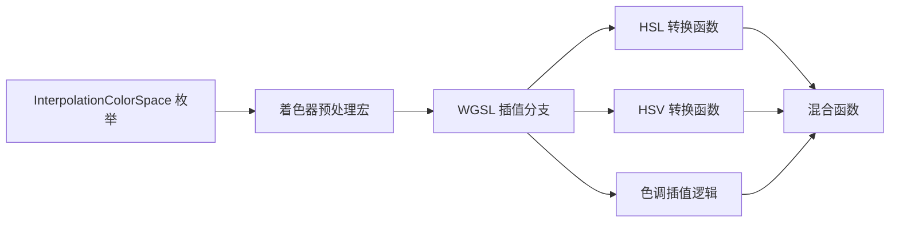

+++
title = "#19992 HSL and HSV interpolation for UI gradients"
date = "2025-07-07T00:00:00"
draft = false
template = "pull_request_page.html"
in_search_index = false

[extra]
current_language = "zh-cn"
available_languages = {"en" = { name = "English", url = "/pull_request/bevy/2025-07/pr-19992-en-20250707" }, "zh-cn" = { name = "中文", url = "/pull_request/bevy/2025-07/pr-19992-zh-cn-20250707" }}
+++

## HSL 和 HSV 插值在 UI 渐变中的应用

### 基础信息
- **标题**: HSL and HSV interpolation for UI gradients
- **PR 链接**: https://github.com/bevyengine/bevy/pull/19992
- **作者**: ickshonpe
- **状态**: 已合并
- **标签**: C-Feature, A-Rendering, A-UI, S-Ready-For-Final-Review, D-Shaders, A-Color
- **创建时间**: 2025-07-06T21:16:33Z
- **合并时间**: 2025-07-07T20:44:31Z
- **合并者**: alice-i-cecile

### 描述
为 UI 渐变添加 HSL 和 HSV 色彩空间的插值功能。

#### 解决方案
在 `InterpolationColorSpace` 中新增变体: `Hsl`, `HslLong`, `Hsv`, 和 `HsvLong`，并为每个变体在 `gradients` 着色器中添加混合函数。

#### 限制
* 未包含增减路径支持，如有需要可在后续 PR 中实现
* 色彩转换应在发送到着色器前执行，但当前性能已足够

#### 测试
```cargo run --example gradients```

---

### 技术实现分析

#### 问题背景
Bevy 的 UI 渐变系统之前支持 RGB 和 OKLab/OKLCH 色彩空间插值，但缺少设计师常用的 HSL 和 HSV 色彩空间。这两种色彩空间在创建平滑的色调过渡效果时更加直观，尤其当需要控制色相(Hue)变化时。

#### 解决方案
核心思路是在现有色彩空间插值系统上扩展 HSL 和 HSV 支持：
1. 在 Rust 端扩展 `InterpolationColorSpace` 枚举
2. 在 WGSL 着色器中实现 HSL/HSV 转换逻辑
3. 添加对应色彩空间的混合函数
4. 更新示例展示新功能

#### 关键代码实现
1. **色彩空间枚举扩展 (Rust)**  
   新增四种 HSL/HSV 插值模式：
   ```rust
   // crates/bevy_ui/src/gradients.rs
   pub enum InterpolationColorSpace {
       // ...现有变体...
       Hsl,        // HSL 空间，最短色调路径
       HslLong,    // HSL 空间，最长色调路径
       Hsv,        // HSV 空间，最短色调路径
       HsvLong,    // HSV 空间，最长色调路径
   }
   ```

2. **着色器预处理定义 (Rust)**  
   添加对应的着色器预处理宏：
   ```rust
   // crates/bevy_ui_render/src/gradient.rs
   match key.color_space {
       // ...现有匹配...
       InterpolationColorSpace::Hsl => "IN_HSL",
       InterpolationColorSpace::HslLong => "IN_HSL_LONG",
       InterpolationColorSpace::Hsv => "IN_HSV",
       InterpolationColorSpace::HsvLong => "IN_HSV_LONG",
   }
   ```

3. **HSL/HSV 转换函数 (WGSL)**  
   实现线性 RGB 与 HSL/HSV 的相互转换：
   ```wgsl
   // crates/bevy_ui_render/src/gradient.wgsl
   fn linear_rgba_to_hsla(c: vec4<f32>) -> vec4<f32> {
       // 计算最大值/最小值/差值
       let maxc = max(max(c.r, c.g), c.b);
       let minc = min(min(c.r, c.g), c.b);
       let delta = maxc - minc;
       
       // 计算亮度(L)和饱和度(S)
       let l = (maxc + minc) * 0.5;
       var s: f32 = 0.0;
       if delta != 0.0 {
           s = delta / (1.0 - abs(2.0 * l - 1.0));
       }
       
       // 计算色相(H)
       var h: f32 = 0.0;
       if delta != 0.0 {
           if maxc == c.r {
               h = ((c.g - c.b) / delta) % 6.0;
           } else if maxc == c.g {
               h = ((c.b - c.r) / delta) + 2.0;
           } else {
               h = ((c.r - c.g) / delta) + 4.0;
           }
           h = h / 6.0;
       }
       return vec4<f32>(h, s, l, c.a);
   }
   ```

4. **混合函数实现 (WGSL)**  
   添加 HSL/HSV 空间的插值函数：
   ```wgsl
   fn mix_linear_rgba_in_hsva_space(a: vec4<f32>, b: vec4<f32>, t: f32) -> vec4<f32> {
       let ha = linear_rgba_to_hsva(a);
       let hb = linear_rgba_to_hsva(b);
       
       // 特殊处理饱和度为零的情况
       var h: f32;
       if ha.y == 0. {
           h = hb.x;
       } else if hb.y == 0. {
           h = ha.x;
       } else {
           h = lerp_hue(ha.x * TAU, hb.x * TAU, t) / TAU;
       }
       
       // 混合其他分量
       let s = mix(ha.y, hb.y, t);
       let v = mix(ha.z, hb.z, t);
       let a_alpha = mix(ha.a, hb.a, t);
       return hsva_to_linear_rgba(vec4<f32>(h, s, v, a_alpha));
   }
   ```

5. **插值选择逻辑 (WGSL)**  
   扩展插值分发逻辑：
   ```wgsl
   #ifdef IN_HSV
       return mix_linear_rgba_in_hsva_space(start_color, end_color, t);
   #else ifdef IN_HSV_LONG
       return mix_linear_rgba_in_hsva_space_long(...);
   #else ifdef IN_HSL
       return mix_linear_rgba_in_hsla_space(...);
   #else ifdef IN_HSL_LONG
       return mix_linear_rgba_in_hsla_space_long(...);
   #endif
   ```

#### 技术考量
1. **色调插值路径**  
   通过 `lerp_hue` 和 `lerp_hue_long` 实现两种色调过渡路径：
   - 最短路径：默认方式，色相变化角度最小
   - 最长路径：绕色相环另一方向过渡

2. **边缘情况处理**  
   当颜色饱和度为 0（灰度）时，直接使用目标色相值：
   ```wgsl
   if ha.y == 0. {
       h = hb.x;
   } else if hb.y == 0. {
       h = ha.x;
   }
   ```

3. **性能权衡**  
   当前实现选择在 GPU 进行色彩空间转换而非 CPU，虽然理论上 CPU 预处理更高效，但实测性能可接受

#### 影响与改进
1. **新增功能**：
   - 支持设计师友好的 HSL/HSV 渐变效果
   - 提供长短两种色相过渡路径选择
   
2. **使用示例**  
   更新渐变示例支持循环切换新模式：
   ```rust
   // examples/ui/gradients.rs
   InterpolationColorSpace::HsvLong => {
       InterpolationColorSpace::OkLab
   }
   ```

3. **文档更新**  
   在发布说明中补充新特性：
   ```markdown
   -release-content/release-notes/ui_gradients.md
   +Colors can be interpolated in HSL, HSV... with short/long hue paths.
   ```

---

### 关键文件变更
1. **`crates/bevy_ui_render/src/gradient.wgsl` (+183/-27)**  
   添加 HSL/HSV 转换和插值函数，扩展插值选择逻辑

2. **`examples/ui/gradients.rs` (+12/-0)**  
   扩展示例支持循环切换新增色彩空间

3. **`crates/bevy_ui/src/gradients.rs` (+8/-0)**  
   扩展 `InterpolationColorSpace` 枚举

4. **`release-content/release-notes/ui_gradients.md` (+3/-3)**  
   更新文档说明新增色彩空间支持

5. **`crates/bevy_ui_render/src/gradient.rs` (+4/-0)**  
   添加着色器预处理宏定义

---

### 技术关系图


---

### 延伸阅读
1. [HSL 和 HSV 色彩空间详解](https://en.wikipedia.org/wiki/HSL_and_HSV)
2. [WebGPU 着色语言规范](https://www.w3.org/TR/WGSL/)
3. [色彩空间转换算法参考](https://www.easyrgb.com/en/math.php)