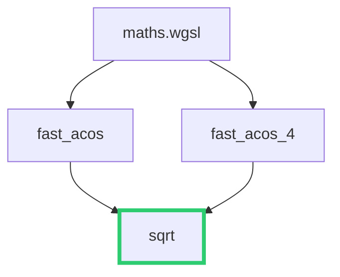

+++
title = "#19995 remove fast_sqrt in favor of sqrt"
date = "2025-07-07T00:00:00"
draft = false
template = "pull_request_page.html"
in_search_index = true

[taxonomies]
list_display = ["show"]

[extra]
current_language = "en"
available_languages = {"en" = { name = "English", url = "/pull_request/bevy/2025-07/pr-19995-en-20250707" }, "zh-cn" = { name = "中文", url = "/pull_request/bevy/2025-07/pr-19995-zh-cn-20250707" }}
labels = ["A-Rendering", "C-Performance", "C-Code-Quality"]
+++

# Removing Obsolete Square Root Approximation in Bevy's Shaders

## Basic Information
- **Title**: remove fast_sqrt in favor of sqrt
- **PR Link**: https://github.com/bevyengine/bevy/pull/19995
- **Author**: atlv24
- **Status**: MERGED
- **Labels**: A-Rendering, C-Performance, C-Code-Quality, S-Ready-For-Final-Review
- **Created**: 2025-07-07T00:53:19Z
- **Merged**: 2025-07-07T01:33:04Z
- **Merged By**: alice-i-cecile

## Description Translation
# Objective

- the fast inverse sqrt trick hasnt been useful on modern hardware for over a decade now

## Solution

- just use sqrt, modern hardware has a dedicated instruction which will outperform approximations both in efficiency and accuracy

## Testing

- ran `atmosphere`

## The Story of This Pull Request

### Problem Identification
The Bevy rendering engine contained an optimized `fast_sqrt` function in its WGSL shader math utilities. This function implemented the classic [fast inverse square root](https://en.wikipedia.org/wiki/Fast_inverse_square_root) approximation technique, popularized by Quake III Arena in 1999. The implementation included one Newton-Raphson iteration to improve accuracy:

```wgsl
fn fast_sqrt(x: f32) -> f32 {
    let n = bitcast<f32>(0x1fbd1df5 + (bitcast<i32>(x) >> 1u));
    // One Newton's method iteration for better precision
    return 0.5 * (n + x / n);
}
```

This approximation was historically valuable when square root operations were computationally expensive. However, modern GPU hardware (including all WebGPU-compatible devices) now implements dedicated hardware instructions for square root calculations. These native instructions outperform software approximations in both speed and accuracy.

### Solution Approach
The solution was straightforward: replace all instances of the custom `fast_sqrt` approximation with the built-in `sqrt` function. This approach provides several advantages:

1. **Improved accuracy**: Native hardware implementations provide IEEE-compliant results
2. **Better performance**: Dedicated hardware instructions execute faster than approximation algorithms
3. **Code simplification**: Removes maintenance burden of custom math functions
4. **Consistency**: Aligns with standard WGSL practices

The change required modifying two functions (`fast_acos` and `fast_acos_4`) that previously depended on `fast_sqrt`.

### Implementation Details
The key changes occur in `maths.wgsl`:

1. **Removal of `fast_sqrt`**: The entire custom implementation was deleted
2. **Direct use of `sqrt`**: Both fast_acos functions now directly call the built-in sqrt:

```wgsl
// Before:
res *= fast_sqrt(1.0 - x);

// After:
res *= sqrt(1.0 - x);
```

```wgsl
// Before:
s = fast_sqrt(1.0 - x1) * s;

// After:
s = sqrt(1.0 - x1) * s;
```

### Technical Considerations
The fast inverse square root technique (0x5f3759df) was revolutionary in 1999 when floating-point operations were expensive. Modern GPUs have changed this calculus:

1. **Hardware acceleration**: Modern GPUs implement sqrt as a single instruction
2. **Precision requirements**: Approximations introduce error accumulation
3. **Maintenance cost**: Custom implementations require validation and documentation

The atmosphere example was used for validation since it exercises the modified math functions in a practical rendering context.

### Impact
This change improves both performance and code quality:
- **Performance gain**: Native sqrt instructions typically complete in 1-4 cycles
- **Accuracy improvement**: Reduced error in lighting calculations
- **Code simplification**: 6 lines removed, no functional tradeoffs
- **Modernization**: Aligns with contemporary GPU programming practices

## Visual Representation



Key:
- Green: Native sqrt function
- Black: Modified functions
- Box: File container

## Key Files Changed

### `crates/bevy_render/src/maths.wgsl`
**Purpose**: Central math utilities for Bevy's WGSL shaders  
**Changes**: Removed custom sqrt implementation, simplified dependent functions  

**Code Changes**:
```wgsl
// REMOVED FUNCTION
- fn fast_sqrt(x: f32) -> f32 {
-     let n = bitcast<f32>(0x1fbd1df5 + (bitcast<i32>(x) >> 1u));
-     // One Newton's method iteration for better precision
-     return 0.5 * (n + x / n);
- }

// MODIFIED FUNCTION: fast_acos
fn fast_acos(in_x: f32) -> f32 {
    let x = abs(in_x);
    var res = -0.156583 * x + HALF_PI;
-    res *= fast_sqrt(1.0 - x);
+    res *= sqrt(1.0 - x);
    return select(PI - res, res, in_x >= 0.0);
}

// MODIFIED FUNCTION: fast_acos_4
fn fast_acos_4(x: f32) -> f32 {
    // ... existing code ...
-    s = fast_sqrt(1.0 - x1) * s;
+    s = sqrt(1.0 - x1) * s;
    // ... existing code ...
}
```

## Further Reading
1. [Fast inverse square root - Wikipedia](https://en.wikipedia.org/wiki/Fast_inverse_square_root)
2. [WGSL Built-in Functions Specification](https://www.w3.org/TR/WGSL/#builtin-functions)
3. [Modern GPU Architecture - NVIDIA Whitepaper](https://www.nvidia.com/content/dam/en-zz/Solutions/design-visualization/technologies/turing-architecture/NVIDIA-Turing-Architecture-Whitepaper.pdf)
4. [Floating Point Performance in Shaders - GPUOpen](https://gpuopen.com/learn/optimizing-gpu-occupancy-resource-usage-large-thread-groups/)