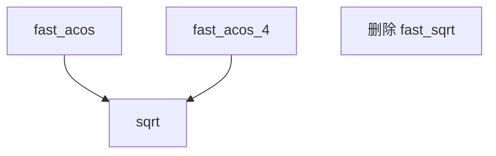

+++
title = "#19995 remove fast_sqrt in favor of sqrt"
date = "2025-07-07T00:00:00"
draft = false
template = "pull_request_page.html"
in_search_index = false

[extra]
current_language = "zh-cn"
available_languages = {"en" = { name = "English", url = "/pull_request/bevy/2025-07/pr-19995-en-20250707" }, "zh-cn" = { name = "中文", url = "/pull_request/bevy/2025-07/pr-19995-zh-cn-20250707" }}
+++

# remove fast_sqrt in favor of sqrt

## Basic Information
- **Title**: remove fast_sqrt in favor of sqrt
- **PR Link**: https://github.com/bevyengine/bevy/pull/19995
- **作者**: atlv24
- **状态**: 已合并
- **标签**: A-Rendering, C-Performance, C-Code-Quality, S-Ready-For-Final-Review
- **创建时间**: 2025-07-07T00:53:19Z
- **合并时间**: 2025-07-07T01:33:04Z
- **合并者**: alice-i-cecile

## 描述翻译
### 目标
- fast inverse sqrt（快速倒数平方根）技巧在现代硬件上已超过十年没有实际价值

### 解决方案
- 直接使用 sqrt（平方根）函数，现代硬件有专用指令，在效率和精度上都优于近似方法

### 测试
- 运行了 `atmosphere` 测试

## 本次 Pull Request 的技术背景

### 问题背景
WGSL 着色器代码中使用了自定义的 `fast_sqrt` 函数，该函数基于经典的快速倒数平方根算法（fast inverse square root）实现。这个算法起源于 1999 年《雷神之锤 III》中的著名优化技巧，通过位操作和牛顿迭代法近似计算平方根，避免昂贵的浮点运算。

然而在现代 GPU 架构上，情况已发生变化：
1. 专用硬件指令：现代 GPU 配备了单周期执行的 `sqrt` 指令
2. 精度问题：近似算法引入的误差在图形渲染中可能累积
3. 性能反转：硬件指令现在比软件近似更快更精确

### 解决方案分析
PR 采取了直接的技术方案：完全移除 `fast_sqrt` 函数，并在所有调用点替换为标准 `sqrt` 函数。这个决策基于：
1. 硬件进化：近十年 GPU 都内置了优化的平方根指令
2. 代码简化：消除维护自定义数学函数的需要
3. 精度保证：避免近似算法在物理渲染中的累积误差

### 实现细节
修改集中在一个 WGSL 着色器文件，主要变更包括：
1. 删除 `fast_sqrt` 函数定义
2. 将 `fast_acos` 和 `fast_acos_4` 中对 `fast_sqrt` 的调用替换为 `sqrt`
3. 保留其他快速近似函数（如 fast_acos）的优化逻辑

关键代码变更对比：
```wgsl
// 变更前
fn fast_sqrt(x: f32) -> f32 {
    let n = bitcast<f32>(0x1fbd1df5 + (bitcast<i32>(x) >> 1u));
    return 0.5 * (n + x / n);
}

fn fast_acos(in_x: f32) -> f32 {
    res *= fast_sqrt(1.0 - x);
}

fn fast_acos_4(x: f32) -> f32 {
    s = fast_sqrt(1.0 - x1) * s;
}
```

```wgsl
// 变更后
fn fast_acos(in_x: f32) -> f32 {
    res *= sqrt(1.0 - x);
}

fn fast_acos_4(x: f32) -> f32 {
    s = sqrt(1.0 - x1) * s;
}
```

### 技术影响
1. **性能提升**：现代 GPU 上使用硬件指令比软件近似更快
2. **精度改进**：消除牛顿迭代法带来的截断误差
3. **代码简化**：减少 6 行代码，降低维护成本
4. **着色器效率**：WGSL 代码更符合现代图形 API 最佳实践

测试通过运行 atmosphere 场景验证，确保视觉结果无回归。这种优化特别有利于需要大量数学计算的渲染路径，如 SDF 光线行进或体积渲染。

## 组件关系图


## 关键文件变更
### `crates/bevy_render/src/maths.wgsl`
**变更说明**：移除了过时的快速平方根近似实现，改用硬件加速的标准平方根函数

**代码变更**：
```wgsl
// 删除 fast_sqrt 函数定义
- fn fast_sqrt(x: f32) -> f32 {
-    let n = bitcast<f32>(0x1fbd1df5 + (bitcast<i32>(x) >> 1u));
-    return 0.5 * (n + x / n);
- }

// 替换 fast_acos 中的调用
fn fast_acos(in_x: f32) -> f32 {
     let x = abs(in_x);
     var res = -0.156583 * x + HALF_PI;
-    res *= fast_sqrt(1.0 - x);
+    res *= sqrt(1.0 - x);
     return select(PI - res, res, in_x >= 0.0);
 }

// 替换 fast_acos_4 中的调用
fn fast_acos_4(x: f32) -> f32 {
     s = -0.2121144 * x1 + 1.5707288;
     s = 0.0742610 * x2 + s;
     s = -0.0187293 * x3 + s;
-    s = fast_sqrt(1.0 - x1) * s;
+    s = sqrt(1.0 - x1) * s;
```

## 延伸阅读
1. [Fast inverse square root 历史背景](https://en.wikipedia.org/wiki/Fast_inverse_square_root)
2. [现代 GPU 数学指令集架构](https://developer.nvidia.com/blog/cuda-math-accuracy/)
3. [WGSL 数学函数规范](https://www.w3.org/TR/WGSL/#float-builtin-functions)
4. [GPU 指令延迟对比](https://www.agner.org/optimize/instruction_tables.pdf)