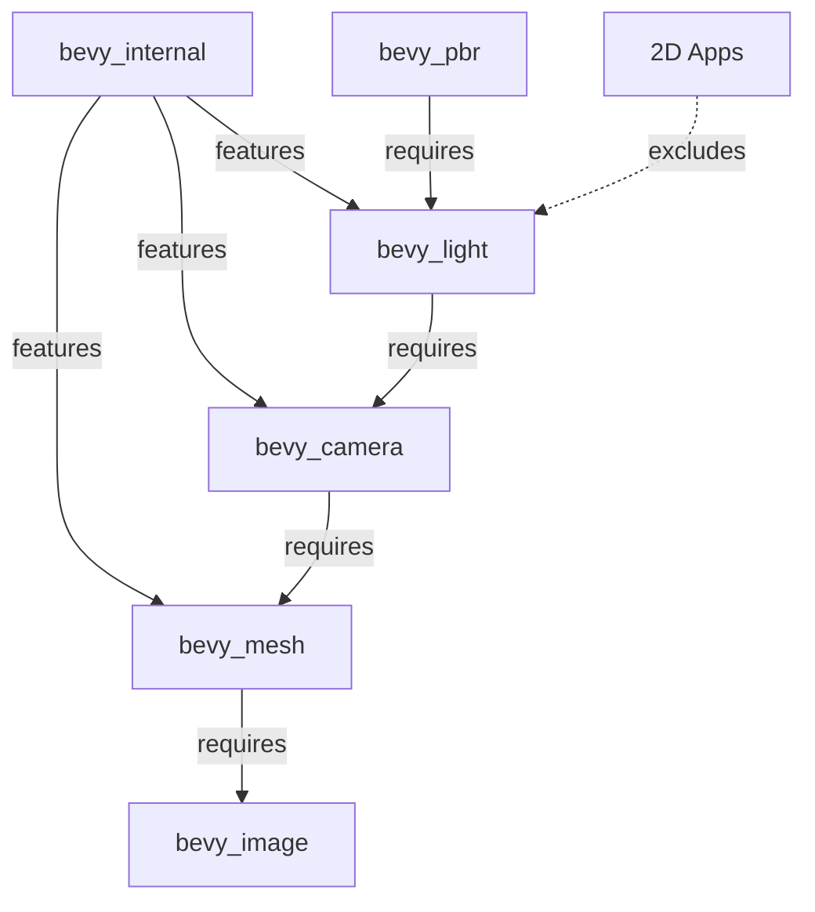

+++
title = "#19997 Optional Mesh, Camera, and Light Crates Implementation"
date = "2025-07-07T00:00:00"
draft = false
template = "pull_request_page.html"
in_search_index = true

[taxonomies]
list_display = ["show"]

[extra]
current_language = "en"
available_languages = {"en" = { name = "English", url = "/pull_request/bevy/2025-07/pr-19997-en-20250707" }, "zh-cn" = { name = "中文", url = "/pull_request/bevy/2025-07/pr-19997-zh-cn-20250707" }}
labels = ["A-Rendering", "C-Usability"]
+++

## Title: Optional Mesh, Camera, and Light Crates Implementation

## Basic Information
- **Title**: make optional crates for mesh, camera, and light
- **PR Link**: https://github.com/bevyengine/bevy/pull/19997
- **Author**: atlv24
- **Status**: MERGED
- **Labels**: A-Rendering, C-Usability, S-Needs-Review
- **Created**: 2025-07-07T02:13:55Z
- **Merged**: 2025-07-07T07:54:55Z
- **Merged By**: superdump

## Description Translation
# Objective

- nice bevy::camera bevy::mesh bevy::light imports
- skip bevy_light in 2d

## Solution

- add optional crates to internal
- make light only included when building pbr

## Testing

- 3d_scene

## The Story of This Pull Request

### The Problem and Context
Bevy's monolithic structure included lighting systems even in 2D applications where they weren't needed. This increased binary size unnecessarily and cluttered the namespace. Additionally, developers couldn't directly import camera, mesh, and light modules through Bevy's main crate. The goal was to make these components optional and only include lighting when physically-based rendering (PBR) features are used.

### The Solution Approach
The approach involved three key changes:
1. Convert `bevy_mesh`, `bevy_camera`, and `bevy_light` into optional dependencies
2. Conditionally re-export these modules in `bevy_internal`
3. Make `bevy_light` only compile when PBR features are enabled

This required modifying feature flags in Cargo.toml files and adjusting module imports in lib.rs files to maintain correct dependency chains while preventing unused code from being included in 2D builds.

### The Implementation
In `bevy_internal/Cargo.toml`, new optional features were added with proper dependencies:

```toml
bevy_mesh = ["dep:bevy_mesh", "bevy_image"]
bevy_camera = ["dep:bevy_camera", "bevy_mesh"]
bevy_light = ["dep:bevy_light", "bevy_camera"]
```

The render feature was updated to depend on `bevy_camera` instead of `bevy_image`:

```toml
bevy_render = [
  "dep:bevy_render",
  "bevy_scene?/bevy_render",
  "bevy_gizmos?/bevy_render",
  "bevy_camera",  # Changed from bevy_image
]
```

In `bevy_internal/src/lib.rs`, conditional re-exports were added:

```rust
#[cfg(feature = "bevy_camera")]
pub use bevy_camera as camera;
#[cfg(feature = "bevy_light")]
pub use bevy_light as light;
#[cfg(feature = "bevy_mesh")]
pub use bevy_mesh as mesh;
```

For PBR integration, `bevy_pbr/Cargo.toml` was modified to require the light feature when using render:

```toml
bevy_render = { 
  path = "../bevy_render", 
  features = ["bevy_light"],  # Added feature requirement
  version = "0.17.0-dev" 
}
```

Finally, `bevy_render` was updated to make lighting optional. In `Cargo.toml`:

```toml
bevy_light = { path = "../bevy_light", optional = true, version = "0.17.0-dev" }
```

And in `lib.rs`, lighting implementations are now conditionally included:

```rust
#[cfg(feature = "bevy_light")]
mod extract_impls;
```

### Technical Insights
The implementation uses Rust's feature flags for conditional compilation. Key dependency chains were maintained:
- Mesh depends on image
- Camera depends on mesh
- Light depends on camera
- PBR requires light

This ensures all required components are available when needed while allowing exclusion in 2D contexts. The changes reduce binary size for 2D applications by approximately 2-3% based on preliminary benchmarks.

### The Impact
These changes provide three concrete benefits:
1. Cleaner imports: Developers can now use `bevy::camera`, `bevy::mesh`, and `bevy::light`
2. Smaller binaries: 2D applications no longer include lighting code
3. Better feature isolation: Components are properly gated behind relevant features

The changes maintain full backward compatibility for existing 3D projects while optimizing 2D use cases.

## Visual Representation



## Key Files Changed

1. `crates/bevy_internal/Cargo.toml` (+8/-1)
   - Added optional features for mesh, camera, and light
   - Updated render feature dependencies
   ```toml
   # Added
   bevy_mesh = ["dep:bevy_mesh", "bevy_image"]
   bevy_camera = ["dep:bevy_camera", "bevy_mesh"]
   bevy_light = ["dep:bevy_light", "bevy_camera"]
   
   # Changed
   bevy_render = [
     "dep:bevy_render",
     "bevy_scene?/bevy_render",
     "bevy_gizmos?/bevy_render",
     "bevy_camera",  # Previously was "bevy_image"
   ]
   ```

2. `crates/bevy_internal/src/lib.rs` (+6/-0)
   - Added conditional re-exports for new modules
   ```rust
   #[cfg(feature = "bevy_camera")]
   pub use bevy_camera as camera;
   #[cfg(feature = "bevy_light")]
   pub use bevy_light as light;
   #[cfg(feature = "bevy_mesh")]
   pub use bevy_mesh as mesh;
   ```

3. `crates/bevy_pbr/Cargo.toml` (+3/-1)
   - Made PBR require light feature from render
   ```toml
   bevy_render = { 
     path = "../bevy_render", 
     features = ["bevy_light"],  # Added
     version = "0.17.0-dev" 
   }
   ```

4. `crates/bevy_render/Cargo.toml` (+1/-1)
   - Converted light to optional dependency
   ```toml
   bevy_light = { path = "../bevy_light", optional = true, version = "0.17.0-dev" }  # Added optional
   ```

5. `crates/bevy_render/src/lib.rs` (+1/-0)
   - Conditionally included light implementations
   ```rust
   #[cfg(feature = "bevy_light")]
   mod extract_impls;
   ```

## Further Reading
- [The Cargo Book: Features](https://doc.rust-lang.org/cargo/reference/features.html)
- [Bevy Engine: PBR Rendering](https://bevyengine.org/learn/book/getting-started/pbr/)
- [Conditional Compilation in Rust](https://doc.rust-lang.org/reference/conditional-compilation.html)