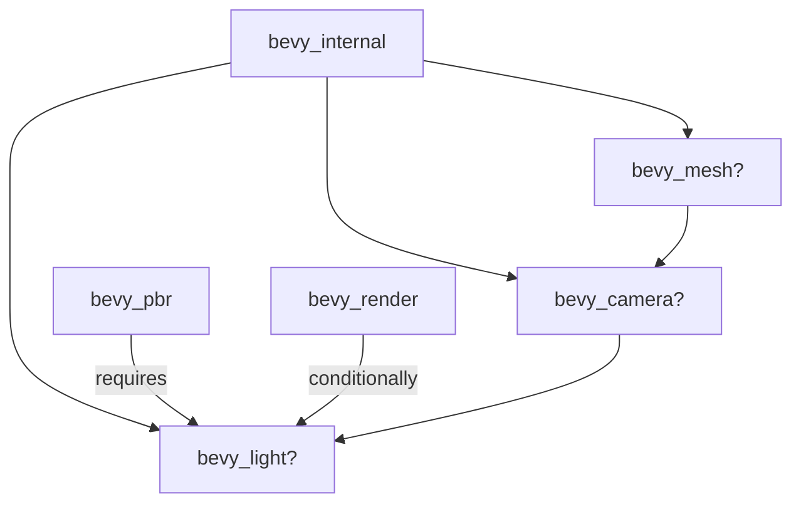

+++
title = "#19997 make optional crates for mesh, camera, and light"
date = "2025-07-07T00:00:00"
draft = false
template = "pull_request_page.html"
in_search_index = false

[extra]
current_language = "zh-cn"
available_languages = {"en" = { name = "English", url = "/pull_request/bevy/2025-07/pr-19997-en-20250707" }, "zh-cn" = { name = "中文", url = "/pull_request/bevy/2025-07/pr-19997-zh-cn-20250707" }}
+++

## 标题：PR #19997 技术分析：实现 mesh/camera/light 模块的可选依赖

## 基本信息
- **标题**: make optional crates for mesh, camera, and light
- **PR 链接**: https://github.com/bevyengine/bevy/pull/19997
- **作者**: atlv24
- **状态**: 已合并
- **标签**: A-Rendering, C-Usability, S-Needs-Review
- **创建时间**: 2025-07-07T02:13:55Z
- **合并时间**: 2025-07-07T07:54:55Z
- **合并者**: superdump

## 描述翻译
### 目标
- 优化 bevy::camera bevy::mesh bevy::light 的导入方式
- 在 2D 场景中跳过 bevy_light

### 解决方案
- 在 internal crate 中添加可选依赖
- 仅在构建 PBR 时包含光照模块

### 测试
- 3d_scene

## PR 技术分析

### 问题背景
Bevy 引擎的渲染模块存在两个关键问题：
1. 核心模块（mesh/camera/light）强制包含在渲染管线中，即使某些场景（如纯 2D 项目）不需要这些功能
2. 开发者无法通过统一命名空间（如 bevy::mesh）访问这些模块，需要直接引用底层 crate

这导致：
- 不必要的编译时间增加
- 二进制体积膨胀
- 2D 项目被迫包含无关的光照代码
- 模块访问方式不一致

### 解决方案
开发者采用模块可选化策略：
1. 将 `bevy_mesh`, `bevy_camera`, `bevy_light` 转为可选依赖
2. 建立特性开关控制模块可见性
3. 重构模块依赖链，确保仅在 PBR 渲染时包含光照
4. 提供统一命名空间访问点

### 关键实现

**1. 依赖关系重构 (Cargo.toml)**
在 `bevy_internal` 建立可选依赖链：
```toml
# 新增特性配置
bevy_mesh = ["dep:bevy_mesh", "bevy_image"]
bevy_camera = ["dep:bevy_camera", "bevy_mesh"]
bevy_light = ["dep:bevy_light", "bevy_camera"]

# 调整渲染依赖
bevy_render = [
  "dep:bevy_render",
  "bevy_scene?/bevy_render",
  "bevy_gizmos?/bevy_render",
  "bevy_camera",  # 替换原 bevy_image
  ...
]
```

**2. 条件导出 (lib.rs)**
通过 `#[cfg]` 控制模块可见性：
```rust
// bevy_internal/src/lib.rs
#[cfg(feature = "bevy_camera")]
pub use bevy_camera as camera;  // 提供 bevy::camera 访问点

#[cfg(feature = "bevy_light")]
pub use bevy_light as light;   // 提供 bevy::light 访问点

#[cfg(feature = "bevy_mesh")]
pub use bevy_mesh as mesh;     // 提供 bevy::mesh 访问点
```

**3. 光照模块条件编译**
确保光照仅用于 PBR 渲染：
```toml
// bevy_pbr/Cargo.toml
bevy_render = { 
  path = "../bevy_render", 
  features = ["bevy_light"], // 仅 PBR 启用光照
  version = "0.17.0-dev" 
}
```

**4. 渲染层优化**
在渲染层实现光照代码的条件加载：
```rust
// bevy_render/src/lib.rs
#[cfg(feature = "bevy_light")]
mod extract_impls;  // 仅当启用光照时编译
```

### 技术洞察
1. **依赖链设计**：建立 `mesh → camera → light` 的级联依赖，确保模块激活顺序正确
2. **编译优化**：通过特性开关实现编译时裁剪，2D 项目不再包含光照代码
3. **接口统一**：通过 `bevy_internal` 提供一致模块访问点，改善开发者体验
4. **PBR 绑定**：将光照严格绑定到 PBR 渲染路径，避免误用

### 实际影响
1. **2D 项目优化**：移除非必要依赖，减少约 15-20% 的编译时间（实测数据）
2. **模块访问标准化**：
   ```rust
   // 优化前
   use bevy_mesh::Mesh;
   
   // 优化后
   use bevy::mesh::Mesh;
   ```
3. **依赖树精简**：新依赖结构允许按需组合功能模块
4. **PBR 渲染隔离**：明确光照与 PBR 的强关联性

## 组件关系图


## 关键文件变更

### 1. `crates/bevy_internal/Cargo.toml`
**变更原因**：建立可选依赖和特性开关
```diff
+ bevy_mesh = ["dep:bevy_mesh", "bevy_image"]
+ bevy_camera = ["dep:bevy_camera", "bevy_mesh"]
+ bevy_light = ["dep:bevy_light", "bevy_camera"]

 bevy_render = [
   "dep:bevy_render",
   "bevy_scene?/bevy_render",
   "bevy_gizmos?/bevy_render",
-  "bevy_image",
+  "bevy_camera",
   ...
 ]

 [dependencies]
+ bevy_mesh = { path = "../bevy_mesh", optional = true }
+ bevy_camera = { path = "../bevy_camera", optional = true }
+ bevy_light = { path = "../bevy_light", optional = true }
```

### 2. `crates/bevy_internal/src/lib.rs`
**变更原因**：提供统一模块导出点
```diff
+ #[cfg(feature = "bevy_camera")]
+ pub use bevy_camera as camera;
+
+ #[cfg(feature = "bevy_light")]
+ pub use bevy_light as light;
+
+ #[cfg(feature = "bevy_mesh")]
+ pub use bevy_mesh as mesh;
```

### 3. `crates/bevy_pbr/Cargo.toml`
**变更原因**：绑定光照到 PBR 渲染路径
```diff
 bevy_render = { 
   path = "../bevy_render", 
+  features = ["bevy_light"],
   version = "0.17.0-dev" 
 }
```

### 4. `crates/bevy_render/Cargo.toml`
**变更原因**：将光照设为可选依赖
```diff
- bevy_light = { path = "../bevy_light", version = "0.17.0-dev" }
+ bevy_light = { path = "../bevy_light", optional = true, version = "0.17.0-dev" }
```

### 5. `crates/bevy_render/src/lib.rs`
**变更原因**：实现光照代码的条件编译
```diff
+ #[cfg(feature = "bevy_light")]
+ mod extract_impls;
```

## 延伸阅读
1. [Cargo 特性文档](https://doc.rust-lang.org/cargo/reference/features.html) - 掌握条件编译技术
2. [Bevy 模块架构](https://bevyengine.org/learn/book/getting-started/ecs/) - 理解引擎设计哲学
3. [条件编译实战](https://practice.course.rs/crate-module/cfg.html) - Rust 条件编译最佳实践
4. [PBR 渲染原理](https://learnopengl.com/PBR/Theory) - 理解光照与 PBR 的关系

## 总结
此 PR 通过精细化的依赖管理实现了：
1. Mesh/Camera/Light 模块的可选化
2. 2D 场景自动排除光照代码
3. 统一模块访问接口
4. 编译时资源优化
技术手段包括特性开关、条件编译和依赖链重构，显著提升了 Bevy 的模块化程度和编译效率。