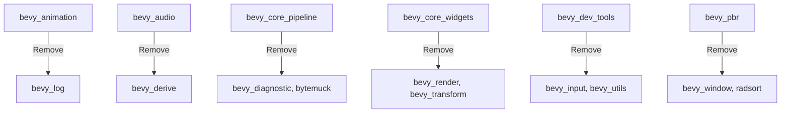

+++
title = "#19998 remove unused dependencies"
date = "2025-07-07T00:00:00"
draft = false
template = "pull_request_page.html"
in_search_index = true

[taxonomies]
list_display = ["show"]

[extra]
current_language = "en"
available_languages = {"en" = { name = "English", url = "/pull_request/bevy/2025-07/pr-19998-en-20250707" }, "zh-cn" = { name = "中文", url = "/pull_request/bevy/2025-07/pr-19998-zh-cn-20250707" }}
labels = ["D-Trivial", "C-Dependencies", "A-Cross-Cutting"]
+++

# Analysis of PR #19998: Remove Unused Dependencies

## Basic Information
- **Title**: remove unused dependencies
- **PR Link**: https://github.com/bevyengine/bevy/pull/19998
- **Author**: atlv24
- **Status**: MERGED
- **Labels**: D-Trivial, C-Dependencies, S-Ready-For-Final-Review, A-Cross-Cutting
- **Created**: 2025-07-07T05:40:26Z
- **Merged**: 2025-07-07T20:46:15Z
- **Merged By**: alice-i-cecile

## The Story of This Pull Request

### The Problem and Context
Dependency management is critical in large Rust projects like Bevy. Unused dependencies increase compile times, bloat binary sizes, and complicate dependency graphs. This PR addresses the problem of unnecessary dependencies that accumulated across multiple Bevy crates. These dependencies were likely introduced during development and not removed when they became obsolete. The goal was straightforward: identify and remove any dependency not actively used by a crate.

### The Solution Approach
The developer systematically reviewed each crate's dependencies against its actual imports and usage patterns. For each crate:
1. Identified dependencies listed in Cargo.toml
2. Verified whether the dependency was actually used in the crate's code
3. Removed unused dependencies while ensuring the crate still compiled
4. Verified basic functionality with existing test scenes

This approach required cross-crate analysis since some dependencies might be used indirectly through other crates. The solution focused on direct dependencies only - if a crate could compile without a dependency and didn't use it directly, it was removed.

### The Implementation
The changes exclusively modify Cargo.toml files across 20 crates. Each removal follows the same pattern: deleting dependency lines that are no longer needed. The implementation is comprehensive but targeted:

**Removed dependency categories:**
1. **Internal Bevy crates** like `bevy_derive`, `bevy_utils`, and `bevy_log` where they weren't actually used
2. **External utilities** like `serde`, `bytemuck`, and `nonmax` when unused
3. **Feature-specific dependencies** that weren't required for core functionality
4. **Redundant imports** where functionality was already provided through other dependencies

### Technical Insights
The changes demonstrate several dependency management best practices:
1. **Minimal dependency surfaces**: Each crate should only declare dependencies it directly uses
2. **Feature trimming**: Optional dependencies should be scoped to the features that require them
3. **Build time optimization**: Removing unused dependencies reduces:
   - Compilation units
   - Crate graph complexity
   - Potential version conflicts

The PR also revealed opportunities for future improvements:
1. Some crates had unused features enabled on existing dependencies
2. A few optional dependencies could be moved behind feature flags
3. Better tooling integration (like `cargo-udeps`) could prevent recurrence

### The Impact
These changes provide immediate benefits:
1. **Reduced compile times**: Fewer dependencies mean less code to compile
2. **Smaller disk footprint**: Fewer crates to download and store
3. **Simpler dependency graphs**: Easier to audit and maintain
4. **Cleaner separation of concerns**: Each crate only depends on what it actually needs

The minimal testing approach ("3d_scene runs") was appropriate since these are dependency removals rather than functional changes. More comprehensive testing would be needed for code modifications, but here it verified that core functionality remained intact.

## Visual Representation



## Key Files Changed

### `crates/bevy_ui_render/Cargo.toml`
Removed unused dependencies including `bevy_window` and several external crates. Simplified feature flags.

```toml
# Before:
[dependencies]
bevy_window = { path = "../bevy_window", version = "0.17.0-dev" }
serde = { version = "1", features = ["derive"], optional = true }
nonmax = "0.5"

[features]
serialize = [
  "serde",
  "smallvec/serde",
  "bevy_math/serialize",
  "bevy_platform/serialize",
]

# After:
[dependencies]
# bevy_window removed
# serde removed
# nonmax removed

[features]
serialize = ["bevy_math/serialize", "bevy_platform/serialize"]
```

### `crates/bevy_window/Cargo.toml`
Removed unused `smol_str` dependency and simplified feature flags.

```toml
# Before:
[dependencies]
smol_str = { version = "0.2", default-features = false }

[features]
serialize = [
  "serde",
  "smol_str/serde",
  "bevy_ecs/serialize",
  "bevy_input/serialize",
]

# After:
[dependencies]
# smol_str removed

[features]
serialize = ["serde", "bevy_ecs/serialize", "bevy_input/serialize"]
```

### `crates/bevy_pbr/Cargo.toml`
Removed unused dependencies and simplified meshlet feature requirements.

```toml
# Before:
[dependencies]
bevy_window = { path = "../bevy_window", version = "0.17.0-dev" }
radsort = "0.1"

[features]
meshlet = ["dep:lz4_flex", "dep:range-alloc", "dep:half", "dep:bevy_tasks"]

# After:
[dependencies]
# bevy_window removed
# radsort removed

[features]
meshlet = ["dep:lz4_flex", "dep:range-alloc", "dep:bevy_tasks"]
```

### `crates/bevy_core_pipeline/Cargo.toml`
Removed unused diagnostic dependency and external crates.

```toml
# Before:
[dependencies]
bevy_diagnostic = { path = "../bevy_diagnostic", version = "0.17.0-dev" }
bytemuck = { version = "1" }

# After:
[dependencies]
# bevy_diagnostic removed
# bytemuck removed
```

### `crates/bevy_winit/Cargo.toml`
Removed unused serde dependency in feature flags.

```toml
# Before:
[features]
serialize = [
  "serde",
  "bevy_input/serialize",
  "bevy_window/serialize",
  "bevy_platform/serialize",
]

# After:
[features]
serialize = [
  "bevy_input/serialize",
  "bevy_window/serialize",
  "bevy_platform/serialize",
]
```

## Further Reading
1. [Cargo Book: Dependency Management](https://doc.rust-lang.org/cargo/guide/dependencies.html)
2. [Rust Performance: Dependency Optimization](https://nnethercote.github.io/perf-book/compilation.html#minimal-versions)
3. [cargo-udeps tool](https://github.com/est31/cargo-udeps) for finding unused dependencies
4. [Bevy Engine Architecture](https://bevyengine.org/learn/book/introduction/#how-does-bevy-work)