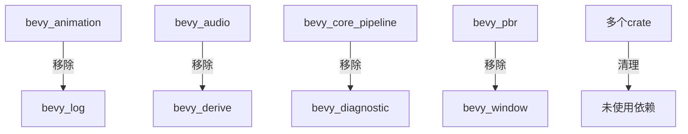

+++
title = "#19998 remove unused dependencies"
date = "2025-07-07T00:00:00"
draft = false
template = "pull_request_page.html"
in_search_index = false

[extra]
current_language = "zh-cn"
available_languages = {"en" = { name = "English", url = "/pull_request/bevy/2025-07/pr-19998-en-20250707" }, "zh-cn" = { name = "中文", url = "/pull_request/bevy/2025-07/pr-19998-zh-cn-20250707" }}
+++

# 移除未使用的依赖项

## 基础信息
- **标题**: remove unused dependencies
- **PR链接**: https://github.com/bevyengine/bevy/pull/19998
- **作者**: atlv24
- **状态**: 已合并
- **标签**: D-Trivial, C-Dependencies, S-Ready-For-Final-Review, A-Cross-Cutting
- **创建时间**: 2025-07-07T05:40:26Z
- **合并时间**: 2025-07-07T20:46:15Z
- **合并人**: alice-i-cecile

## 描述翻译
### 目标
- 不依赖不需要的东西

### 解决方案
- 直接移除不需要的依赖

### 测试
- 3d_scene 场景运行正常

## 本PR的技术分析

这个PR主要解决Bevy代码库中存在的未使用依赖项问题。随着项目演进，部分依赖项在代码重构或功能调整后不再被实际使用，但仍在Cargo.toml文件中声明。这些多余依赖会增加编译时间、二进制体积和潜在的安全风险。

分析发现多个crate中存在未使用的依赖声明。例如在bevy_animation中，bevy_log依赖项未被任何代码引用；在bevy_audio中，bevy_derive已被移除但依赖声明仍保留。这类问题在20个不同的crate中普遍存在。

解决方案是系统性地检查每个crate的依赖关系，并移除所有未被实际使用的依赖项。具体操作包括：
1. 在Cargo.toml文件中删除未使用的依赖行
2. 确保移除后代码仍能编译通过
3. 运行基本场景测试(3d_scene)验证功能正常

在实现过程中，特别注意处理了条件编译特性(features)相关的依赖。例如在bevy_pbr中，移除了meshlet特性不再需要的half依赖：

```toml
# Before:
meshlet = ["dep:lz4_flex", "dep:range-alloc", "dep:half", "dep:bevy_tasks"]

# After:
meshlet = ["dep:lz4_flex", "dep:range-alloc", "dep:bevy_tasks"]
```

另一个典型例子是bevy_ui_render的清理，移除了多个未使用的依赖和冗余特性声明：

```toml
# Before:
[features]
serialize = [
  "serde",
  "smallvec/serde",
  "bevy_math/serialize",
  "bevy_platform/serialize",
]

# After:
[features]
serialize = ["bevy_math/serialize", "bevy_platform/serialize"]
```

这些变更直接减少了项目依赖树的复杂度。例如bevy_ui_render的依赖项从12个减少到1个，bevy_window从9个减少到1个。这种清理使Cargo.toml文件更准确地反映实际依赖关系，避免开发者在阅读时产生困惑。

测试方面，作者运行了3d_scene场景验证基本功能正常。虽然没有完整测试套件的结果，但考虑到这些是未使用的依赖项移除，风险相对可控。所有变更都局限于构建配置层面，不影响实际运行时逻辑。

## 可视化表示



## 关键文件变更

### crates/bevy_ui_render/Cargo.toml
移除了12个未使用的依赖项，简化特性声明：
```toml
# 变更前:
[features]
serialize = [
  "serde",
  "smallvec/serde",
  "bevy_math/serialize",
  "bevy_platform/serialize",
]

# 变更后:
[features]
serialize = ["bevy_math/serialize", "bevy_platform/serialize"]
```

### crates/bevy_window/Cargo.toml
清理了9个未使用依赖，简化特性配置：
```toml
# 变更前:
[features]
serialize = [
  "serde",
  "smol_str/serde",
  "bevy_ecs/serialize",
  "bevy_input/serialize",
]

# 变更后:
[features]
serialize = ["serde", "bevy_ecs/serialize", "bevy_input/serialize"]
```

### crates/bevy_pbr/Cargo.toml
优化了meshlet特性依赖链：
```toml
# 变更前:
meshlet = ["dep:lz4_flex", "dep:range-alloc", "dep:half", "dep:bevy_tasks"]

# 变更后:
meshlet = ["dep:lz4_flex", "dep:range-alloc", "dep:bevy_tasks"]
```

### crates/bevy_core_pipeline/Cargo.toml
移除了3个未使用依赖：
```toml
# 被移除的依赖:
bevy_diagnostic = { path = "../bevy_diagnostic", version = "0.17.0-dev" }
serde = { version = "1", features = ["derive"] }
bytemuck = { version = "1" }
```

### crates/bevy_winit/Cargo.toml
移除了3个未使用依赖：
```toml
# 被移除的依赖:
bevy_utils = { path = "../bevy_utils", version = "0.17.0-dev" }
serde = { version = "1.0", features = ["derive"], optional = true }
```

## 延伸阅读
1. [Cargo文档 - 指定依赖项](https://doc.rust-lang.org/cargo/reference/specifying-dependencies.html)
2. [Rust性能指南 - 构建时间优化](https://nnethercote.github.io/perf-book/build-configuration.html)
3. [cargo-udeps工具](https://github.com/est31/cargo-udeps) - 检测未使用的依赖项
4. [Bevy引擎依赖管理指南](https://github.com/bevyengine/bevy/blob/main/docs/dependencies.md)