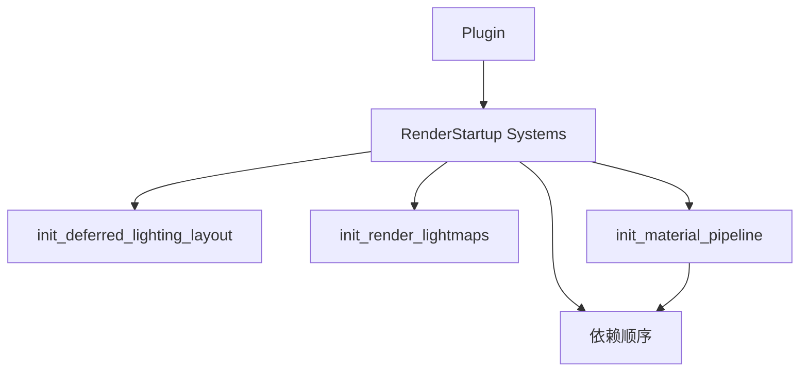

+++
title = "#19999 RenderStartup for bevy_pbr for some basic cases"
date = "2025-07-14T00:00:00"
draft = false
template = "pull_request_page.html"
in_search_index = false

[extra]
current_language = "zh-cn"
available_languages = {"en" = { name = "English", url = "/pull_request/bevy/2025-07/pr-19999-en-20250714" }, "zh-cn" = { name = "中文", url = "/pull_request/bevy/2025-07/pr-19999-zh-cn-20250714" }}
labels = ["A-Rendering", "C-Code-Quality", "D-Straightforward"]
+++

# 使用 RenderStartup 优化 bevy_pbr 基础场景

## Basic Information
- **Title**: RenderStartup for bevy_pbr for some basic cases
- **PR Link**: https://github.com/bevyengine/bevy/pull/19999
- **Author**: andriyDev
- **Status**: MERGED
- **Labels**: A-Rendering, C-Code-Quality, S-Ready-For-Final-Review, D-Straightforward
- **Created**: 2025-07-07T05:45:54Z
- **Merged**: 2025-07-14T20:51:43Z
- **Merged By**: alice-i-cecile

## Description Translation
### 目标
- 推进 #19887 的解决。

### 解决方案
- 对于不需要条件判断添加系统的情况，我们可以直接使用系统替换`FromWorld`实现，然后将这些系统添加到`RenderStartup`中。

### 测试
- 我运行了`lightmaps`、`reflection_probes`、`deferred_rendering`、`volumetric_fog`和`wireframe`示例。

## The Story of This Pull Request

### 问题背景
在 Bevy 渲染系统中，多个 PBR 模块使用`FromWorld` trait 初始化渲染资源。这种方式存在两个主要问题：
1. 初始化逻辑分散在各个`FromWorld`实现中，难以统一管理
2. 缺乏显式的初始化顺序控制，可能导致隐式依赖问题

具体来说，以下资源使用`FromWorld`初始化：
- `DeferredLightingLayout` (延迟光照)
- `RenderLightmaps` (光照贴图)
- `MaterialPipeline` (材质管道)
- `PrepassPipeline` (预处理管道)
- `VolumetricFogPipeline` (体积雾管道)
- `Wireframe3dPipeline` (线框渲染管道)

### 解决方案选择
开发者选择将资源初始化迁移到`RenderStartup`系统：
1. 删除所有相关的`FromWorld`实现
2. 创建显式的初始化函数
3. 在渲染应用的`RenderStartup`阶段添加这些系统
4. 使用`commands.insert_resource()`直接插入资源

这种方案的优势：
- 统一资源初始化路径
- 允许使用`.after()`显式控制初始化顺序
- 保持初始化逻辑在渲染子应用中
- 无需修改资源的使用方式

### 实现细节
核心变更模式是资源初始化从隐式转为显式：
```rust
// 之前: FromWorld 实现
impl FromWorld for DeferredLightingLayout {
    fn from_world(world: &mut World) -> Self {
        let render_device = world.resource::<RenderDevice>();
        // ...初始化逻辑
    }
}

// 之后: RenderStartup 系统
pub fn init_deferred_lighting_layout(
    mut commands: Commands,
    render_device: Res<RenderDevice>,
    mesh_pipeline: Res<MeshPipeline>,
    asset_server: Res<AssetServer>,
) {
    let layout = render_device.create_bind_group_layout(...);
    commands.insert_resource(DeferredLightingLayout {
        mesh_pipeline: mesh_pipeline.clone(),
        // ...其他字段
    });
}
```

在插件中注册系统：
```rust
impl Plugin for DeferredPbrLightingPlugin {
    fn build(&self, app: &mut App) {
        render_app.add_systems(RenderStartup, init_deferred_lighting_layout);
    }
}
```

### 初始化顺序控制
对于有依赖关系的资源，使用`.after()`确保正确顺序：
```rust
// 确保 prepass pipeline 在 material pipeline 之后初始化
.add_systems(
    RenderStartup,
    (
        init_prepass_pipeline.after(init_material_pipeline),
        init_prepass_view_bind_group,
    )
    .chain(),
)
```

### 资源访问模式变更
所有初始化函数都采用ECS系统标准参数模式：
- `Commands`用于插入资源
- `Res`/`ResMut`访问现有资源
- 不再直接访问`World`

例如`PrepassPipeline`初始化：
```rust
pub fn init_prepass_pipeline(
    mut commands: Commands,
    render_device: Res<RenderDevice>,
    render_adapter: Res<RenderAdapter>,
    mesh_pipeline: Res<MeshPipeline>,
    material_pipeline: Res<MaterialPipeline>,
    asset_server: Res<AssetServer>,
) {
    // 创建bind group layouts
    let view_layout_motion_vectors = render_device.create_bind_group_layout(...);
    
    // 插入资源
    commands.insert_resource(PrepassPipeline {
        view_layout_motion_vectors,
        mesh_layouts: mesh_pipeline.mesh_layouts.clone(),
        // ...其他字段
    });
}
```

### 影响与测试
变更影响多个PBR模块，但保持接口不变：
1. 所有测试示例正常运行：
   - lightmaps
   - reflection_probes
   - deferred_rendering
   - volumetric_fog
   - wireframe
2. 迁移指南更新了初始化资源列表
3. 代码更易于维护和扩展

## Visual Representation



## Key Files Changed

### crates/bevy_pbr/src/deferred/mod.rs (+97/-99)
将`DeferredLightingLayout`初始化迁移到`RenderStartup`系统

```rust
// Before:
impl FromWorld for DeferredLightingLayout {
    fn from_world(world: &mut World) -> Self {
        let render_device = world.resource::<RenderDevice>();
        let layout = render_device.create_bind_group_layout(...);
        Self { ... }
    }
}

// After:
pub fn init_deferred_lighting_layout(
    mut commands: Commands,
    render_device: Res<RenderDevice>,
    mesh_pipeline: Res<MeshPipeline>,
    asset_server: Res<AssetServer>,
) {
    let layout = render_device.create_bind_group_layout(...);
    commands.insert_resource(DeferredLightingLayout { ... });
}
```

### crates/bevy_pbr/src/lightmap/mod.rs (+22/-25)
迁移`RenderLightmaps`初始化并添加系统

```rust
// Before:
impl FromWorld for RenderLightmaps {
    fn from_world(world: &mut World) -> Self {
        let render_device = world.resource::<RenderDevice>();
        ...
    }
}

// After:
pub fn init_render_lightmaps(
    mut commands: Commands,
    render_device: Res<RenderDevice>,
    render_adapter: Res<RenderAdapter>,
) {
    let bindless_supported = binding_arrays_are_usable(&render_device, &render_adapter);
    commands.insert_resource(RenderLightmaps { ... });
}
```

### crates/bevy_pbr/src/material.rs (+13/-21)
迁移`MaterialPipeline`并整合初始化

```rust
// Before:
impl FromWorld for MaterialPipeline {
    fn from_world(world: &mut World) -> Self {
        MaterialPipeline {
            mesh_pipeline: world.resource::<MeshPipeline>().clone(),
        }
    }
}

// After:
pub fn init_material_pipeline(mut commands: Commands, mesh_pipeline: Res<MeshPipeline>) {
    commands.insert_resource(MaterialPipeline {
        mesh_pipeline: mesh_pipeline.clone(),
    });
}
```

### crates/bevy_pbr/src/prepass/mod.rs (+97/-99)
迁移`PrepassPipeline`和`PrepassViewBindGroup`

```rust
// PrepassPipeline 初始化
pub fn init_prepass_pipeline(...) {
    // 创建bind group layouts
    let view_layout_motion_vectors = ...;
    // 插入资源
    commands.insert_resource(PrepassPipeline { ... });
}

// PrepassViewBindGroup 初始化
pub fn init_prepass_view_bind_group(...) {
    let empty_bind_group = render_device.create_bind_group(...);
    commands.insert_resource(PrepassViewBindGroup { ... });
}
```

### crates/bevy_pbr/src/volumetric_fog/render.rs (+49/-49)
迁移`VolumetricFogPipeline`初始化

```rust
// Before:
impl FromWorld for VolumetricFogPipeline {
    fn from_world(world: &mut World) -> Self {
        let render_device = world.resource::<RenderDevice>();
        ...
    }
}

// After:
pub fn init_volumetric_fog_pipeline(...) {
    // 创建bind group layouts
    let bind_group_layouts = array::from_fn(|bits| { ... });
    // 插入资源
    commands.insert_resource(VolumetricFogPipeline { ... });
}
```

## Further Reading
1. [Bevy ECS 系统调度文档](https://bevyengine.org/learn/book/getting-started/ecs/#system-scheduling)
2. [RenderStartup 阶段设计说明](https://github.com/bevyengine/bevy/issues/19887)
3. [资源初始化最佳实践](https://bevy-cheatbook.github.io/programming/res.html)
4. [WGSL 着色器语言规范](https://gpuweb.github.io/gpuweb/wgsl/)