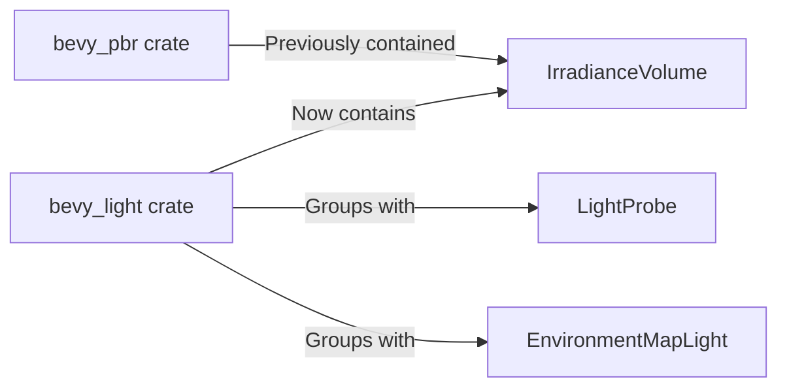

+++
title = "#20000 Move IrradianceVolume to bevy_light"
date = "2025-07-07T00:00:00"
draft = false
template = "pull_request_page.html"
in_search_index = true

[taxonomies]
list_display = ["show"]

[extra]
current_language = "en"
available_languages = {"en" = { name = "English", url = "/pull_request/bevy/2025-07/pr-20000-en-20250707" }, "zh-cn" = { name = "中文", url = "/pull_request/bevy/2025-07/pr-20000-zh-cn-20250707" }}
labels = ["D-Trivial", "A-Rendering"]
+++

## Move IrradianceVolume to bevy_light

### Basic Information
- **Title**: Move IrradianceVolume to bevy_light
- **PR Link**: https://github.com/bevyengine/bevy/pull/20000
- **Author**: atlv24
- **Status**: MERGED
- **Labels**: D-Trivial, A-Rendering, S-Ready-For-Final-Review
- **Created**: 2025-07-07T05:57:57Z
- **Merged**: 2025-07-07T20:52:15Z
- **Merged By**: alice-i-cecile

### Description Translation
# Objective
- Reunite it with its family

## Solution
- Immigration

## Testing
- irradiance_volumes example

### The Story of This Pull Request
The `IrradianceVolume` component was initially implemented in `bevy_pbr`'s light probe module. However, this component logically belongs with other light probe components (`LightProbe`, `EnvironmentMapLight`) which reside in `bevy_light`. The current location caused organizational inconsistency and made it harder to maintain related light probe functionality.

The solution was straightforward: migrate `IrradianceVolume` to `bevy_light` while preserving all functionality. This involved:
1. Moving the component definition to `bevy_light/src/probe.rs`
2. Updating import statements across affected modules
3. Maintaining all functionality and documentation unchanged
4. Ensuring proper reflection registration in the new location

The implementation maintains identical behavior while improving code organization. Since `bevy_light` already contained the `LightProbe` marker component required by `IrradianceVolume`, this move groups related concepts together. No logic changes were needed beyond the relocation.

Performance impact is neutral since this only affects code organization. The `irradiance_volumes` example was used to verify functionality remains unchanged after the relocation.

### Visual Representation


### Key Files Changed

1. **crates/bevy_pbr/src/light_probe/irradiance_volume.rs**
   - Removed `IrradianceVolume` struct definition
   - Removed `Default` implementation for `IrradianceVolume`
   - Preserved internal rendering logic

```diff
- #[derive(Clone, Reflect, Component, Debug)]
- #[reflect(Component, Default, Debug, Clone)]
- #[require(LightProbe)]
- pub struct IrradianceVolume {
-     pub voxels: Handle<Image>,
-     pub intensity: f32,
-     pub affects_lightmapped_meshes: bool,
- }
-
- impl Default for IrradianceVolume {
-     #[inline]
-     fn default() -> Self {
-         IrradianceVolume {
-             voxels: default(),
-             intensity: 0.0,
-             affects_lightmapped_meshes: true,
-         }
-     }
- }
```

2. **crates/bevy_light/src/probe.rs**
   - Added `IrradianceVolume` definition
   - Added identical `Default` implementation
   - Maintained all documentation

```rust
#[derive(Clone, Reflect, Component, Debug)]
#[reflect(Component, Default, Debug, Clone)]
#[require(LightProbe)]
pub struct IrradianceVolume {
    pub voxels: Handle<Image>,
    pub intensity: f32,
    pub affects_lightmapped_meshes: bool,
}

impl Default for IrradianceVolume {
    #[inline]
    fn default() -> Self {
        IrradianceVolume {
            voxels: Handle::default(),
            intensity: 0.0,
            affects_lightmapped_meshes: true,
        }
    }
}
```

3. **crates/bevy_pbr/src/lib.rs**
   - Updated import to reference `IrradianceVolume` from `bevy_light`
   - Maintained public API compatibility

```diff
 pub use bevy_light::{
-    light_consts, AmbientLight, CascadeShadowConfig, CascadeShadowConfigBuilder, Cascades,
-    ClusteredDecal, DirectionalLight, DirectionalLightShadowMap, DirectionalLightTexture,
-    FogVolume, LightPlugin, LightProbe, NotShadowCaster, NotShadowReceiver, PointLight,
-    PointLightShadowMap, PointLightTexture, ShadowFilteringMethod, SpotLight, SpotLightTexture,
-    TransmittedShadowReceiver, VolumetricFog, VolumetricLight,
+    light_consts, AmbientLight, CascadeShadowConfig, CascadeShadowConfigBuilder, Cascades,
+    ClusteredDecal, DirectionalLight, DirectionalLightShadowMap, DirectionalLightTexture,
+    FogVolume, IrradianceVolume, LightPlugin, LightProbe, NotShadowCaster, NotShadowReceiver,
+    PointLight, PointLightShadowMap, PointLightTexture, ShadowFilteringMethod, SpotLight,
+    SpotLightTexture, TransmittedShadowReceiver, VolumetricFog, VolumetricLight,
 };
```

4. **crates/bevy_light/src/lib.rs**
   - Added `IrradianceVolume` to public exports
   - Added reflection registration

```diff
 pub use ambient_light::AmbientLight;
 mod probe;
-pub use probe::{EnvironmentMapLight, LightProbe};
+pub use probe::{EnvironmentMapLight, IrradianceVolume, LightProbe};
 
 ...
 .register_type::<LightProbe>()
 .register_type::<EnvironmentMapLight>()
+.register_type::<IrradianceVolume>()
```

5. **crates/bevy_pbr/src/light_probe/mod.rs**
   - Removed reflection registration
   - Maintained plugin functionality

```diff
-        app.register_type::<IrradianceVolume>()
-            .add_plugins(ExtractInstancesPlugin::<EnvironmentMapIds>::new());
+        app.add_plugins(ExtractInstancesPlugin::<EnvironmentMapIds>::new());
```

### Further Reading
- [Bevy Light Probes Documentation](https://docs.rs/bevy/latest/bevy/light/probe/index.html)
- [Global Illumination Techniques](https://google.github.io/filament/Filament.html#lighting/imagebasedlights)
- [Bevy Component System](https://bevyengine.org/learn/book/next/ecs/components/)