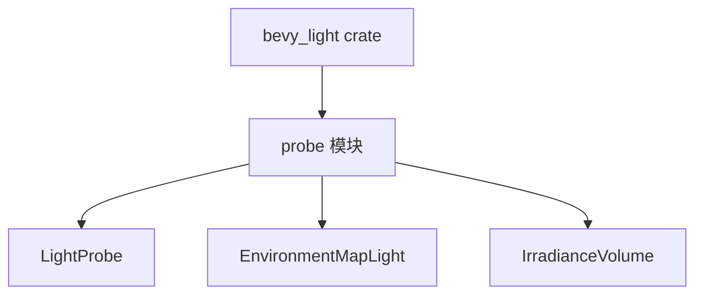

+++
title = "#20000 Move IrradianceVolume to bevy_light"
date = "2025-07-07T00:00:00"
draft = false
template = "pull_request_page.html"
in_search_index = false

[extra]
current_language = "zh-cn"
available_languages = {"en" = { name = "English", url = "/pull_request/bevy/2025-07/pr-20000-en-20250707" }, "zh-cn" = { name = "中文", url = "/pull_request/bevy/2025-07/pr-20000-zh-cn-20250707" }}
+++

# Move IrradianceVolume to bevy_light

## 基本信息
- **标题**: Move IrradianceVolume to bevy_light
- **PR链接**: https://github.com/bevyengine/bevy/pull/20000
- **作者**: atlv24
- **状态**: MERGED
- **标签**: D-Trivial, A-Rendering, S-Ready-For-Final-Review
- **创建时间**: 2025-07-07T05:57:57Z
- **合并时间**: 2025-07-07T20:52:15Z
- **合并者**: alice-i-cecile

## 描述翻译
# Objective

- 使其与其家族组件重聚

## Solution

- 迁移组件位置

## Testing

- irradiance_volumes 示例

## PR 分析

### 问题背景
在 Bevy 引擎的现有架构中，`IrradianceVolume` 组件定义在 `bevy_pbr` crate 中，而其他光照相关组件如 `EnvironmentMapLight` 和 `LightProbe` 都位于 `bevy_light` crate。这种组织方式导致：
1. 相关组件分散在不同模块
2. 代码发现性降低
3. 架构一致性受损

### 解决方案
PR 的核心操作是将 `IrradianceVolume` 组件从 `bevy_pbr` 迁移到 `bevy_light`：
1. 从 `bevy_pbr` 完全移除原有实现
2. 在 `bevy_light` 的 probe 模块中添加相同实现
3. 调整模块导出和类型注册

### 实现细节
迁移保持了组件定义的完全一致，包括所有字段和方法：

```rust
// File: crates/bevy_light/src/probe.rs
// 新增部分:
#[derive(Clone, Reflect, Component, Debug)]
#[reflect(Component, Default, Debug, Clone)]
#[require(LightProbe)]
pub struct IrradianceVolume {
    pub voxels: Handle<Image>,
    pub intensity: f32,
    pub affects_lightmapped_meshes: bool,
}

impl Default for IrradianceVolume {
    #[inline]
    fn default() -> Self {
        IrradianceVolume {
            voxels: Handle::default(),
            intensity: 0.0,
            affects_lightmapped_meshes: true,
        }
    }
}
```

同时清理了 `bevy_pbr` 中不再需要的注册代码：

```rust
// File: crates/bevy_pbr/src/light_probe/mod.rs
// 移除:
- app.register_type::<IrradianceVolume>()
```

### 架构影响
此修改优化了代码组织：
1. 所有光照探针类型 (`LightProbe`, `EnvironmentMapLight`, `IrradianceVolume`) 现在集中在同一模块
2. 减少了 `bevy_pbr` 的职责范围
3. 使 `bevy_light` 成为光照组件的权威模块

### 测试验证
通过保留 `irradiance_volumes` 示例的完整功能，验证了迁移没有引入回归问题。组件接口保持不变，确保现有项目兼容。

## 组件关系图



## 关键文件变更

### `crates/bevy_light/src/probe.rs` (+47/-0)
将 `IrradianceVolume` 组件完整迁移至此文件：
```rust
#[derive(Clone, Reflect, Component, Debug)]
#[reflect(Component, Default, Debug, Clone)]
#[require(LightProbe)]
pub struct IrradianceVolume {
    pub voxels: Handle<Image>,
    pub intensity: f32,
    pub affects_lightmapped_meshes: bool,
}

impl Default for IrradianceVolume {
    #[inline]
    fn default() -> Self {
        IrradianceVolume {
            voxels: Handle::default(),
            intensity: 0.0,
            affects_lightmapped_meshes: true,
        }
    }
}
```

### `crates/bevy_pbr/src/light_probe/irradiance_volume.rs` (+2/-52)
移除组件定义，改为重新导出：
```rust
// 移除原有定义
- pub struct IrradianceVolume { ... }

// 改为重新导出
+ pub use bevy_light::IrradianceVolume;
```

### `crates/bevy_light/src/lib.rs` (+2/-1)
在模块导出和类型注册中添加 `IrradianceVolume`：
```rust
pub use probe::{EnvironmentMapLight, IrradianceVolume, LightProbe};

// 在Plugin实现中:
.register_type::<IrradianceVolume>()
```

### `crates/bevy_pbr/src/lib.rs` (+3/-3)
调整导入语句以包含新位置的 `IrradianceVolume`：
```rust
pub use bevy_light::{
    ...,
    IrradianceVolume,
    ...
};
```

### `crates/bevy_pbr/src/light_probe/mod.rs` (+1/-2)
清理不再需要的类型注册：
```rust
// 移除
- app.register_type::<IrradianceVolume>()
```

## 延伸阅读
1. [Bevy 光照系统文档](https://bevyengine.org/learn/book/getting-started/lighting/)
2. [辐照度体积技术说明](https://google.github.io/filament/Filament.html#lighting/imagebasedlights/irradiancevolumes)
3. [Bevy 组件架构指南](https://bevyengine.org/learn/book/plugins/)