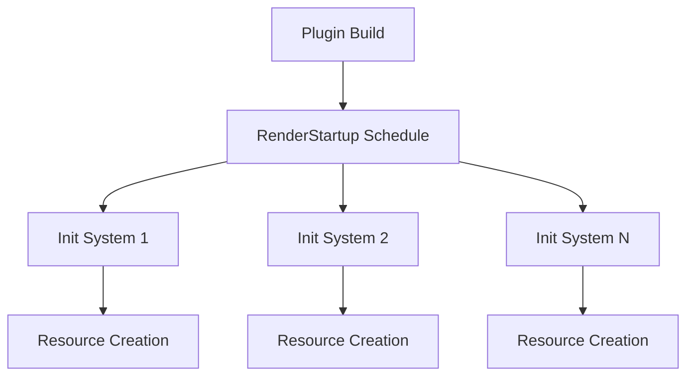

+++
title = "#20002 RenderStartup for all basic cases in bevy_core_pipeline"
date = "2025-07-15T00:00:00"
draft = false
template = "pull_request_page.html"
in_search_index = true

[taxonomies]
list_display = ["show"]

[extra]
current_language = "en"
available_languages = {"en" = { name = "English", url = "/pull_request/bevy/2025-07/pr-20002-en-20250715" }, "zh-cn" = { name = "中文", url = "/pull_request/bevy/2025-07/pr-20002-zh-cn-20250715" }}
labels = ["A-Rendering", "C-Code-Quality", "D-Straightforward"]
+++

# PR Analysis: RenderStartup for all basic cases in bevy_core_pipeline

## Basic Information
- **Title**: RenderStartup for all basic cases in bevy_core_pipeline
- **PR Link**: https://github.com/bevyengine/bevy/pull/20002
- **Author**: andriyDev
- **Status**: MERGED
- **Labels**: A-Rendering, C-Code-Quality, S-Ready-For-Final-Review, D-Straightforward
- **Created**: 2025-07-07T06:46:19Z
- **Merged**: 2025-07-15T07:31:11Z
- **Merged By**: alice-i-cecile

## The Story of This Pull Request

### The Problem and Context
Bevy's rendering system initializes resources using the `FromWorld` trait during the `Plugin::finish` stage. This approach has limitations because it executes before the render app is fully configured. As Bevy evolves toward a more system-driven architecture (#19887), we need to move resource initialization into systems scheduled at appropriate execution points. Specifically, render pipeline resources should be initialized during the `RenderStartup` schedule when the render world is properly set up and all necessary dependencies are available.

### The Solution Approach
The PR converts `FromWorld` implementations into regular systems and schedules them in `RenderStartup`. This approach:
1. Provides explicit control over initialization timing
2. Enables future system ordering and dependency management
3. Simplifies plugin implementation by removing separate `finish` methods
4. Maintains backward compatibility through careful migration

Each affected resource was converted by:
1. Removing the `FromWorld` implementation
2. Creating a new initialization system
3. Registering the system in `RenderStartup`
4. Removing the `Plugin::finish` implementation

### The Implementation
The changes systematically replace `FromWorld` with initialization systems across 14 rendering pipelines. For example, in `auto_exposure/mod.rs`:

```rust
// Before:
impl FromWorld for AutoExposureResources {
    fn from_world(world: &mut World) -> Self {
        Self {
            histogram: world.resource::<RenderDevice>().create_buffer(...)
        }
    }
}

// After:
pub fn init_auto_exposure_resources(mut commands: Commands, render_device: Res<RenderDevice>) {
    commands.insert_resource(AutoExposureResources {
        histogram: render_device.create_buffer(...)
    });
}
```

The plugin registration was updated to use the new system:

```rust
// Before:
fn finish(&self, app: &mut App) {
    let render_app = app.get_sub_app_mut(RenderApp)?;
    render_app.init_resource::<AutoExposurePipeline>();
}

// After:
fn build(&self, app: &mut App) {
    let render_app = app.get_sub_app_mut(RenderApp)?;
    render_app.add_systems(RenderStartup, init_auto_exposure_pipeline);
}
```

This pattern was consistently applied to all modified pipelines including bloom, depth of field, motion blur, OIT, post-processing, tonemapping, and skybox rendering. The changes ensure resource initialization occurs at the optimal point in the render app lifecycle.

### Technical Insights
Key technical aspects of this change:
1. **Resource Initialization Timing**: Resources are now created when the render world is fully operational
2. **Dependency Injection**: Systems can declare precise dependencies via parameters
3. **Code Simplification**: Eliminates dual initialization paths (finish vs build)
4. **Error Reduction**: Removes potential null-handling bugs in finish methods

The PR maintains identical functionality while improving the architecture. All examples were verified to work correctly after the changes.

### The Impact
These changes:
1. Unlock future render scheduling improvements
2. Reduce technical debt by 400+ lines of code
3. Standardize resource initialization patterns
4. Improve maintainability through consistent patterns
5. Prepare for upcoming ECS scheduling features

The migration guide was updated to document which resources moved to `RenderStartup`, ensuring plugin developers can adapt their code.

## Visual Representation



## Key Files Changed

### crates/bevy_core_pipeline/src/auto_exposure/mod.rs
Replaced `FromWorld` with initialization system and removed `finish` method

```rust
// Before:
impl Plugin for AutoExposurePlugin {
    fn finish(&self, app: &mut App) {
        // Resource initialization
    }
}

// After:
impl Plugin for AutoExposurePlugin {
    fn build(&self, app: &mut App) {
        app.add_systems(RenderStartup, init_auto_exposure_resources);
    }
}
```

### crates/bevy_core_pipeline/src/dof/mod.rs
Converted global bind group initialization to system

```rust
// Before:
impl FromWorld for DepthOfFieldGlobalBindGroupLayout {
    fn from_world(world: &mut World) -> Self {
        // Complex initialization
    }
}

// After:
pub fn init_dof_global_bind_group_layout(commands: Commands, render_device: Res<RenderDevice>) {
    commands.insert_resource(DepthOfFieldGlobalBindGroupLayout {
        // Initialization logic
    });
}
```

### crates/bevy_core_pipeline/src/tonemapping/mod.rs
Migrated tonemapping pipeline initialization

```rust
// Before:
impl FromWorld for TonemappingPipeline {
    fn from_world(render_world: &mut World) -> Self {
        // Bind group creation
    }
}

// After:
pub fn init_tonemapping_pipeline(
    mut commands: Commands,
    render_device: Res<RenderDevice>,
    // ...dependencies
) {
    commands.insert_resource(TonemappingPipeline {
        // Initialization logic
    });
}
```

### crates/bevy_core_pipeline/src/post_process/mod.rs
Standardized post-processing pipeline initialization

```rust
// Before:
impl FromWorld for PostProcessingPipeline {
    fn from_world(world: &mut World) -> Self {
        // Bind group layout creation
    }
}

// After:
pub fn init_post_processing_pipeline(
    mut commands: Commands,
    render_device: Res<RenderDevice>,
    // ...dependencies
) {
    commands.insert_resource(PostProcessingPipeline {
        // Initialization logic
    });
}
```

### release-content/migration-guides/render_startup.md
Updated migration guide with new initialization locations

```markdown
- `AutoExposurePipeline`
- `MotionBlurPipeline`
- `SkyboxPrepassPipeline`
- `BlitPipeline`
- `DepthOfFieldGlobalBindGroupLayout`
- `DepthPyramidDummyTexture`
- `OitBuffers`
- `PostProcessingPipeline`
- `TonemappingPipeline`
```

## Further Reading
1. [Bevy Render Stages Documentation](https://bevyengine.org/learn/book/getting-started/rendering/)
2. [ECS System Scheduling](https://bevyengine.org/learn/book/getting-started/ecs/#system-order)
3. [Resource Management in Bevy](https://bevyengine.org/learn/book/getting-started/resources/)
4. [Original Issue #19887](https://github.com/bevyengine/bevy/issues/19887)