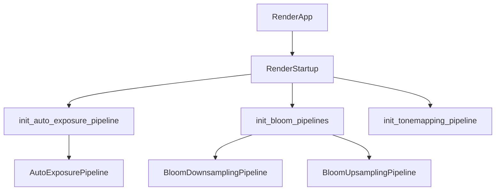

+++
title = "#20002 RenderStartup for all basic cases in `bevy_core_pipeline"
date = "2025-07-15T00:00:00"
draft = false
template = "pull_request_page.html"
in_search_index = false

[extra]
current_language = "zh-cn"
available_languages = {"en" = { name = "English", url = "/pull_request/bevy/2025-07/pr-20002-en-20250715" }, "zh-cn" = { name = "中文", url = "/pull_request/bevy/2025-07/pr-20002-zh-cn-20250715" }}
+++

# 分析报告：PR #20002 - 在 `bevy_core_pipeline` 中统一使用 `RenderStartup` 进行初始化

## 基础信息
- **标题**: RenderStartup for all basic cases in `bevy_core_pipeline`
- **PR 链接**: https://github.com/bevyengine/bevy/pull/20002
- **作者**: andriyDev
- **状态**: 已合并
- **标签**: A-Rendering, C-Code-Quality, S-Ready-For-Final-Review, D-Straightforward
- **创建时间**: 2025-07-07T06:46:19Z
- **合并时间**: 2025-07-15T07:31:11Z
- **合并人**: alice-i-cecile

## 描述翻译
### 目标
- 推进 #19887 的进展

### 解决方案
- 将 `FromWorld` 实现转换为系统
- 在 `RenderStartup` 中运行这些系统

### 测试
- 运行了 `bloom_3d`, `auto_exposure`, `depth_of_field`, `motion_blur`, `skybox`, `post_processing` 和 `tonemapping` 示例，全部工作正常

## 技术实现分析

### 问题背景
在 Bevy 渲染系统中，多个渲染资源（如 pipeline 和 buffer）通过 `FromWorld` trait 进行初始化。这种方式存在两个主要限制：
1. 初始化逻辑与 `Plugin::finish` 生命周期耦合
2. 无法利用 Bevy ECS 系统的依赖注入机制
3. 资源初始化顺序难以控制

这些问题在需要复杂初始化逻辑或资源间依赖的场景中尤为明显，阻碍了代码的模块化和可维护性。

### 解决方案
PR 的核心策略是将所有基于 `FromWorld` 的初始化逻辑转换为标准的 Bevy 系统，并统一调度到新的 `RenderStartup` 阶段：
1. 删除所有 `impl FromWorld for Resource` 实现
2. 创建对应的初始化函数（如 `init_auto_exposure_pipeline`）
3. 通过命令（`Commands`）插入资源
4. 在插件中注册到 `RenderStartup` 调度阶段

```rust
// 转换前
impl FromWorld for AutoExposureResources {
    fn from_world(world: &mut World) -> Self {
        // 直接从 world 获取资源
        let render_device = world.resource::<RenderDevice>();
        // 初始化逻辑...
    }
}

// 转换后
pub fn init_auto_exposure_resources(mut commands: Commands, render_device: Res<RenderDevice>) {
    commands.insert_resource(AutoExposureResources {
        // 通过 Res 注入依赖
        histogram: render_device.create_buffer(...)
    });
}
```

### 关键实现
#### 1. 资源初始化模式统一
所有渲染资源初始化遵循相同模式：
- 创建 `init_xxx` 系统函数
- 通过 `Res` 获取依赖
- 使用 `commands.insert_resource` 插入资源

#### 2. 插件结构调整
所有相关插件的 `build` 和 `finish` 方法被重构：
- 移除 `finish` 方法中的资源初始化
- 在 `build` 中注册 `RenderStartup` 系统

```rust
// 修改前
fn finish(&self, app: &mut App) {
    render_app.init_resource::<Resource>();
}

// 修改后
fn build(&self, app: &mut App) {
    render_app.add_systems(RenderStartup, init_resource_system);
}
```

#### 3. 迁移指南更新
更新 `release-content/migration-guides/render_startup.md` 文档，列出所有迁移到 `RenderStartup` 的资源：
```markdown
- `AutoExposurePipeline`
- `MotionBlurPipeline`
- `SkyboxPrepassPipeline`
- `BlitPipeline`
- `DepthOfFieldGlobalBindGroupLayout`
- `DepthPyramidDummyTexture`
- `OitBuffers`
- `PostProcessingPipeline`
- `TonemappingPipeline`
```

### 技术优势
1. **依赖管理改进**：通过系统参数显式声明依赖关系
2. **生命周期解耦**：资源初始化不再与特定插件生命周期绑定
3. **初始化顺序控制**：利用调度器控制初始化顺序
4. **代码一致性**：统一所有渲染资源的初始化模式
5. **可测试性提升**：初始化逻辑可独立测试

### 影响分析
1. **正向影响**：
   - 解决 #19887 的部分技术债务
   - 提高渲染模块代码可维护性
   - 为未来渲染资源异步初始化铺平道路

2. **迁移影响**：
   - 自定义插件若依赖这些资源需要调整初始化时机
   - 第三方插件需要同步更新初始化方式

## 可视化关系


## 关键文件变更

### 1. `crates/bevy_core_pipeline/src/auto_exposure/mod.rs`
**变更原因**：将 AutoExposure 资源初始化迁移到 `RenderStartup`  
**关键修改**：
```rust
// 删除 FromWorld 实现
-impl FromWorld for AutoExposureResources {
-    fn from_world(world: &mut World) -> Self { ... }
-}

// 新增初始化系统
+pub fn init_auto_exposure_resources(mut commands: Commands, render_device: Res<RenderDevice>) {
+    commands.insert_resource(AutoExposureResources { ... })
+}

// 注册到 RenderStartup
.add_systems(
+    RenderStartup,
+    (init_auto_exposure_pipeline, init_auto_exposure_resources)
+)
```

### 2. `crates/bevy_core_pipeline/src/bloom/downsampling_pipeline.rs`
**变更原因**：Bloom 效果的下采样 pipeline 初始化迁移  
**关键修改**：
```rust
// 替换 FromWorld 为初始化函数
-impl FromWorld for BloomDownsamplingPipeline {
-    fn from_world(world: &mut World) -> Self { ... }
-}

+pub fn init_bloom_downsampling_pipeline(
+    mut commands: Commands,
+    render_device: Res<RenderDevice>,
+    // 显式声明依赖
+    fullscreen_shader: Res<FullscreenShader>,
+    asset_server: Res<AssetServer>,
+) {
+    commands.insert_resource(BloomDownsamplingPipeline { ... })
+}
```

### 3. `crates/bevy_core_pipeline/src/dof/mod.rs`
**变更原因**：景深效果全局绑定组初始化迁移  
**关键修改**：
```rust
// 删除 FromWorld 实现
-impl FromWorld for DepthOfFieldGlobalBindGroupLayout {
-    fn from_world(world: &mut World) -> Self { ... }
-}

// 新增初始化系统
+pub fn init_dof_global_bind_group_layout(mut commands: Commands, render_device: Res<RenderDevice>) {
+    let layout = render_device.create_bind_group_layout(...);
+    let sampler = render_device.create_sampler(...);
+    commands.insert_resource(DepthOfFieldGlobalBindGroupLayout { ... })
+}
```

### 4. `crates/bevy_core_pipeline/src/oit/mod.rs`
**变更原因**：OIT(Order-Independent Transparency) 缓冲区初始化迁移  
**关键修改**：
```rust
// 替换 FromWorld 实现
-impl FromWorld for OitBuffers {
-    fn from_world(world: &mut World) -> Self { ... }
-}

+pub fn init_oit_buffers(
+    mut commands: Commands,
+    render_device: Res<RenderDevice>,
+    render_queue: Res<RenderQueue>,
+) {
+    // 显式初始化缓冲区
+    let mut layers = BufferVec::new(...);
+    layers.reserve(1, &render_device);
+    layers.write_buffer(&render_device, &render_queue);
+    commands.insert_resource(OitBuffers { ... })
+}
```

### 5. `crates/bevy_core_pipeline/src/tonemapping/mod.rs`
**变更原因**：色调映射 pipeline 初始化迁移  
**关键修改**：
```rust
// 删除 FromWorld 实现
-impl FromWorld for TonemappingPipeline {
-    fn from_world(render_world: &mut World) -> Self { ... }
-}

// 新增初始化系统
+pub fn init_tonemapping_pipeline(
+    mut commands: Commands,
+    render_device: Res<RenderDevice>,
+    fullscreen_shader: Res<FullscreenShader>,
+    asset_server: Res<AssetServer>,
+) {
+    // 显式创建绑定组布局
+    let tonemap_texture_bind_group = ...;
+    let sampler = render_device.create_sampler(...);
+    commands.insert_resource(TonemappingPipeline { ... })
+}
```

## 延伸阅读
1. [Bevy ECS 系统调度文档](https://bevyengine.org/learn/book/ecs/schedules/)
2. [渲染资源生命周期管理](https://bevyengine.org/learn/book/render/resource-management/)
3. [PR #19887 - 渲染初始化重构](https://github.com/bevyengine/bevy/pull/19887)
4. [WGSL 着色器规范](https://gpuweb.github.io/gpuweb/wgsl/)