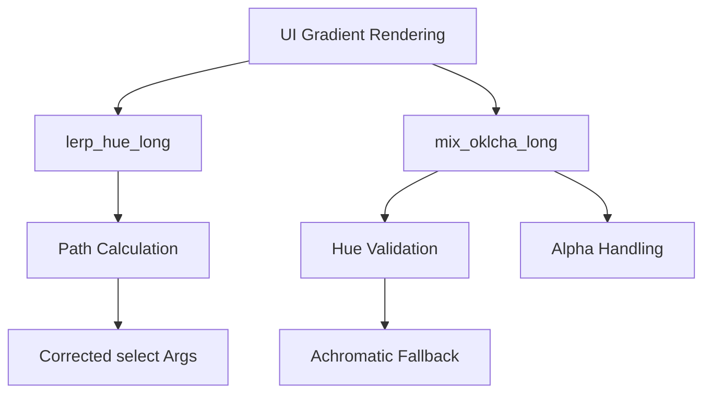

+++
title = "#20010 UI gradients long hue paths fix"
date = "2025-07-07T00:00:00"
draft = false
template = "pull_request_page.html"
in_search_index = true

[taxonomies]
list_display = ["show"]

[extra]
current_language = "en"
available_languages = {"en" = { name = "English", url = "/pull_request/bevy/2025-07/pr-20010-en-20250707" }, "zh-cn" = { name = "中文", url = "/pull_request/bevy/2025-07/pr-20010-zh-cn-20250707" }}
labels = ["C-Bug", "A-Rendering", "A-UI", "D-Straightforward", "D-Shaders", "A-Color", "M-Deliberate-Rendering-Change"]
+++

## UI Gradients Long Hue Paths Fix: Correcting Color Interpolation in Bevy

### Basic Information
- **Title**: UI gradients long hue paths fix
- **PR Link**: https://github.com/bevyengine/bevy/pull/20010
- **Author**: ickshonpe
- **Status**: MERGED
- **Labels**: C-Bug, A-Rendering, A-UI, S-Ready-For-Final-Review, D-Straightforward, D-Shaders, A-Color, M-Deliberate-Rendering-Change
- **Created**: 2025-07-07T11:18:36Z
- **Merged**: 2025-07-07T22:40:26Z
- **Merged By**: alice-i-cecile

### Description Translation
# Objective

The false and true arguments for the select statement in `lerp_hue_long` are misordered, resulting in it taking the wrong hue path:


## Solution

Swap the arguments around.

Also fixed another case I found during testing. The hue was interpolated even when it is undefined for one of the endpoints (for example in a gradient from black to yellow). In those cases it shouldn't interpolate, instead it should return the hue of the other end point.

## Testing

I added a `linear_gradient` module to the testbed `ui` example,  run with:
```
cargo run --example testbed_ui
```

In the linear gradients screen (press space to switch) it shows a column of red to yellow linear gradients. The last gradient in the column uses the OKLCH long path, which should look like this:


matching the same gradient in CSS:

https://jsfiddle.net/fevshkdy/14/

if the correct hue path is chosen.

### The Story of This Pull Request

#### The Problem and Context
The core issue stemmed from incorrect hue interpolation in Bevy's gradient rendering system. When using the OKLCH color space's long hue path, the `lerp_hue_long` function incorrectly ordered arguments in a `select` statement. This caused gradients between colors like red and yellow to take the wrong path around the color wheel, resulting in unexpected color transitions (e.g., passing through blue/purple instead of direct orange transitions).

Additionally, we discovered a secondary issue where hue interpolation occurred even when one endpoint had undefined hue (achromatic colors like black/white). In gradients like black-to-yellow, this caused invalid hue calculations since black has no chroma.

#### The Solution Approach
The fix required two key changes:
1. **Argument Swap in `select`**: Corrected the hue path calculation by swapping true/false arguments in `select`
2. **Hue Fallback Handling**: Added logic to bypass interpolation when one color has zero chroma (undefined hue), using the other color's hue instead

During testing, we also found and fixed an alpha channel access error where `.a` was incorrectly used instead of `.w` for vec4 alpha values.

#### The Implementation
The changes centered around Bevy's shader logic for gradient interpolation. In `gradient.wgsl`, we modified the hue interpolation functions:

```wgsl
// BEFORE: Incorrect argument order
fn lerp_hue_long(a: f32, b: f32, t: f32) -> f32 {
    let diff = rem_euclid(b - a + PI, TAU) - PI;
    return rem_euclid(a + select(diff - TAU, diff + TAU, 0. < diff) * t, TAU);
}

// AFTER: Corrected argument order
fn lerp_hue_long(a: f32, b: f32, t: f32) -> f32 {
    let diff = rem_euclid(b - a + PI, TAU) - PI;
    return rem_euclid(a + (diff + select(TAU, -TAU, 0. < diff)) * t, TAU);
}
```

For achromatic color handling, we added hue selection logic before interpolation:

```wgsl
fn mix_oklcha_long(a: vec4<f32>, b: vec4<f32>, t: f32) -> vec4<f32> {
    let ah = select(a.z, b.z, a.y == 0.); // Use b's hue if a has no chroma
    let bh = select(b.z, a.z, b.y == 0.); // Use a's hue if b has no chroma
    return vec4(
        mix(a.xy, b.xy, t),
        lerp_hue_long(ah, bh, t), // Use validated hues
        mix(a.w, b.w, t) // Fixed alpha access (.w instead of .a)
    );
}
```

#### Technical Insights
Key technical points:
1. **Hue Path Calculation**: The `rem_euclid` + `select` pattern ensures hue interpolation takes the shortest arc. The swapped arguments corrected the direction selection
2. **Achromatic Handling**: The `select(a.z, b.z, a.y == 0.)` pattern provides graceful fallback for undefined hues
3. **Alpha Channel Access**: WGSL uses `.w` for vec4 alpha, not `.a` (common mistake from other shading languages)
4. **HSL Conversion**: Refactored `linear_rgba_to_hsla` to handle grayscale cases early (returning hue 0)

#### The Impact
These changes ensure:
1. Correct visual rendering of long-hue-path gradients
2. Proper handling of gradients involving achromatic colors
3. Consistent behavior with CSS gradient specifications
4. Maintained performance - all changes are constant-time operations

### Visual Representation



### Key Files Changed

#### `crates/bevy_ui_render/src/gradient.wgsl` (+26/-23)
Fixed hue interpolation logic and achromatic color handling.

**Key changes:**
```wgsl
// Hue interpolation with achromatic handling
fn mix_oklcha_long(a: vec4<f32>, b: vec4<f32>, t: f32) -> vec4<f32> {
    let ah = select(a.z, b.z, a.y == 0.);
    let bh = select(b.z, a.z, b.y == 0.);
    return vec4(
        mix(a.xy, b.xy, t),
        lerp_hue_long(ah, bh, t),
        mix(a.w, b.w, t) // Fixed alpha access
    );
}

// Corrected long path calculation
fn lerp_hue_long(a: f32, b: f32, t: f32) -> f32 {
    let diff = rem_euclid(b - a + PI, TAU) - PI;
    return rem_euclid(a + (diff + select(TAU, -TAU, 0. < diff)) * t, TAU);
}
```

#### `examples/testbed/ui.rs` (+88/-1)
Added test scene for linear gradient verification.

**Key addition:**
```rust
mod linear_gradient {
    pub fn setup(mut commands: Commands) {
        // Test gradients for all color spaces
        for color_space in [
            InterpolationColorSpace::LinearRgb,
            InterpolationColorSpace::OkLchLong, // Tests long path fix
            // ... other spaces ...
        ] {
            commands.spawn((
                Node::default(),
                BackgroundGradient::from(LinearGradient {
                    color_space,
                    stops: vec![ColorStop::auto(RED), ColorStop::auto(YELLOW)],
                })
            ));
        }
    }
}
```

### Further Reading
1. [WGSL Select Documentation](https://gpuweb.github.io/gpuweb/wgsl/#select)
2. [OKLCH Color Space Explanation](https://evilmartians.com/chronicles/oklch-in-css-why-quit-rgb-hsl)
3. [CSS Gradient Interpolation Spec](https://drafts.csswg.org/css-images-4/#coloring-gradient-line)