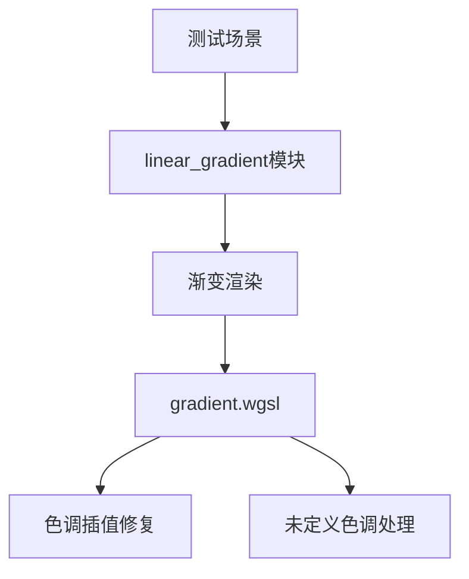

+++
title = "#20010 UI gradients long hue paths fix"
date = "2025-07-07T00:00:00"
draft = false
template = "pull_request_page.html"
in_search_index = false

[extra]
current_language = "zh-cn"
available_languages = {"en" = { name = "English", url = "/pull_request/bevy/2025-07/pr-20010-en-20250707" }, "zh-cn" = { name = "中文", url = "/pull_request/bevy/2025-07/pr-20010-zh-cn-20250707" }}
+++

# UI gradients long hue paths fix

## 基本信息
- **标题**: UI gradients long hue paths fix
- **PR链接**: https://github.com/bevyengine/bevy/pull/20010
- **作者**: ickshonpe
- **状态**: 已合并
- **标签**: C-Bug, A-Rendering, A-UI, S-Ready-For-Final-Review, D-Straightforward, D-Shaders, A-Color, M-Deliberate-Rendering-Change
- **创建时间**: 2025-07-07T11:18:36Z
- **合并时间**: 2025-07-07T22:40:26Z
- **合并者**: alice-i-cecile

## 描述翻译

### Objective 目标

`lerp_hue_long`函数中select语句的false和true参数顺序错误，导致选择了错误的色调路径：


### Solution 解决方案

交换参数顺序。在测试过程中还发现了另一个问题：当一端端点未定义色调时（例如从黑色到黄色的渐变），色调仍会被插值。在这些情况下，它不应该插值，而应返回另一端点的色调。

### Testing 测试

在testbed `ui`示例中添加了`linear_gradient`模块，运行：
```bash
cargo run --example testbed_ui
```

在线性渐变屏幕中（按空格键切换），显示一列从红色到黄色的线性渐变。该列中的最后一个渐变使用OKLCH长路径，效果应如下：


与CSS中的相同渐变匹配：
https://jsfiddle.net/fevshkdy/14/

## PR分析

### 问题背景
在Bevy的UI渲染系统中，渐变着色器处理色调插值时存在两个关键问题：
1. **色调路径选择错误**：`lerp_hue_long`函数中`select`语句的参数顺序颠倒，导致长路径色调插值选择了错误的路径方向
2. **未定义色调处理不当**：当渐变一端颜色没有定义色调时（如黑色或白色），着色器仍尝试进行色调插值，导致渲染异常

这些问题在特定颜色组合的渐变中表现明显，如红色到黄色的长路径渐变。原实现产生的渲染效果与CSS标准不一致，影响UI视觉效果的可预测性。

### 解决方案
开发者采取了直接有效的修复方案：
1. 修正`lerp_hue_long`函数中的参数顺序
2. 增加对未定义色调情况的处理逻辑
3. 添加测试用例验证修复效果

核心策略是：
- 当颜色A的色度（chroma）为0时（即无色相），使用颜色B的色调值
- 当颜色B的色度为0时，使用颜色A的色调值
- 仅当两端都有有效色调时才执行插值

### 实现细节
#### 1. 修复色调插值路径
```wgsl
// 修复前：
fn lerp_hue_long(a: f32, b: f32, t: f32) -> f32 {
    let diff = rem_euclid(b - a + PI, TAU) - PI;
    return rem_euclid(a + select(diff - TAU, diff + TAU, 0. < diff) * t, TAU);
}

// 修复后：
fn lerp_hue_long(a: f32, b: f32, t: f32) -> f32 {
    let diff = rem_euclid(b - a + PI, TAU) - PI;
    return rem_euclid(a + (diff + select(TAU, -TAU, 0. < diff)) * t, TAU);
}
```
关键修改是将`select`的参数顺序从`(diff - TAU, diff + TAU, 0. < diff)`更正为`(TAU, -TAU, 0. < diff)`，确保选择正确的路径方向。

#### 2. 处理未定义色调
```wgsl
// 新增未定义色调处理：
fn mix_oklcha(a: vec4<f32>, b: vec4<f32>, t: f32) -> vec4<f32> {
    let ah = select(a.z, b.z, a.y == 0.); // 当a色度为0时使用b的色调
    let bh = select(b.z, a.z, b.y == 0.); // 当b色度为0时使用a的色调
    return vec4(
        mix(a.xy, b.xy, t),
        lerp_hue(ah, bh, t), // 使用调整后的色调值
        mix(a.a, b.a, t)
    );
}

// 同样修改应用于mix_oklcha_long
```

#### 3. 优化HSLA转换
```wgsl
// 优化后更简洁的HSLA转换：
fn linear_rgba_to_hsla(c: vec4<f32>) -> vec4<f32> {
    let max = max(max(c.r, c.g), c.b);
    let min = min(min(c.r, c.g), c.b);
    let l = (max + min) * 0.5;
    if max == min {
        return vec4(0., 0., l, c.a); // 直接处理无色相情况
    } else {
        // ...正常计算色相和饱和度
    }
}
```

### 技术洞察
1. **色调空间特性**：色调是环形值（0-360°），两点间插值有两条可能路径（短路径和长路径）
2. **色度为零的处理**：当颜色色度（chroma）为零时（如黑、白、灰），色调值无意义，应跳过插值
3. **着色器优化**：通过条件选择（select）避免分支，保持GPU执行效率
4. **测试策略**：添加可视化测试场景，覆盖多种颜色空间和边界情况

### 影响
1. 修复长路径色调插值的渲染错误
2. 正确处理黑白等无色相颜色的渐变
3. 确保与CSS渐变标准的一致性
4. 新增测试用例防止回归

### 测试验证
新增的测试场景覆盖了多种颜色空间和渐变组合：
- LinearRgb, Srgb, OkLab, OkLch, OkLchLong, Hsl, HslLong, Hsv, HsvLong
- 简单渐变（红到黄）和复杂渐变（黑-红-白）
- 特别验证了OkLchLong路径的正确性

## 组件关系


## 关键文件变更

### 1. `crates/bevy_ui_render/src/gradient.wgsl`
**变更说明**：修复色调插值路径错误，增加未定义色调处理逻辑

```wgsl
// 关键修改1：修复色调插值路径
// 修改前：
return rem_euclid(a + select(diff - TAU, diff + TAU, 0. < diff) * t, TAU);

// 修改后：
return rem_euclid(a + (diff + select(TAU, -TAU, 0. < diff)) * t, TAU);

// 关键修改2：增加未定义色调处理
// 修改前：
return vec4(
    mix(a.xy, b.xy, t),
    lerp_hue(a.z, b.z, t),
    mix(a.a, b.a, t)
);

// 修改后：
let ah = select(a.z, b.z, a.y == 0.);
let bh = select(b.z, a.z, b.y == 0.);
return vec4(
    mix(a.xy, b.xy, t),
    lerp_hue(ah, bh, t),
    mix(a.a, b.a, t)
);
```

### 2. `examples/testbed/ui.rs`
**变更说明**：添加线性渐变测试场景，覆盖多种颜色空间

```rust
// 新增场景枚举
enum Scene {
    // ...
    LinearGradient, // 新增线性渐变测试场景
    RadialGradient,
}

// 场景切换顺序调整
impl Next for Scene {
    fn next(&self) -> Self {
        match self {
            // ...
            Scene::LayoutRounding => Scene::LinearGradient,
            Scene::LinearGradient => Scene::RadialGradient,
            // ...
        }
    }
}

// 新增线性渐变测试模块
mod linear_gradient {
    pub fn setup(mut commands: Commands) {
        // 创建包含多种颜色空间渐变的测试节点
        commands.spawn(/* ... */).with_children(|commands| {
            for stops in [gradient1, gradient2] {
                for color_space in [
                    InterpolationColorSpace::LinearRgb,
                    InterpolationColorSpace::Srgb,
                    InterpolationColorSpace::OkLab,
                    InterpolationColorSpace::OkLch,
                    InterpolationColorSpace::OkLchLong,
                    InterpolationColorSpace::Hsl,
                    InterpolationColorSpace::HslLong,
                    InterpolationColorSpace::Hsv,
                    InterpolationColorSpace::HsvLong,
                ] {
                    commands.spawn((
                        Node { /* ... */ },
                        BackgroundGradient::from(LinearGradient {
                            color_space,
                            angle: LinearGradient::TO_RIGHT,
                            stops: stops.clone(),
                        }),
                        // ...
                    ));
                }
            }
        });
    }
}
```

## 延伸阅读
1. [OKLCH颜色空间说明](https://evilmartians.com/chronicles/oklch-in-css-why-quit-rgb-hsl)
2. [WGSL选择函数文档](https://gpuweb.github.io/gpuweb/wgsl/#select-builtin)
3. [CSS渐变规范](https://developer.mozilla.org/en-US/docs/Web/CSS/gradient/linear-gradient)
4. [色相插值算法](https://www.alanzucconi.com/2016/01/06/colour-interpolation/)