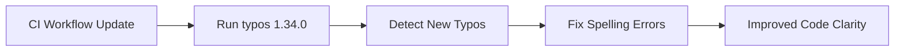

+++
title = "#20013 Bump `typos` to 1.34.0"
date = "2025-07-07T00:00:00"
draft = false
template = "pull_request_page.html"
in_search_index = true

[taxonomies]
list_display = ["show"]

[extra]
current_language = "en"
available_languages = {"en" = { name = "English", url = "/pull_request/bevy/2025-07/pr-20013-en-20250707" }, "zh-cn" = { name = "中文", url = "/pull_request/bevy/2025-07/pr-20013-zh-cn-20250707" }}
labels = ["D-Trivial", "A-Build-System", "C-Code-Quality"]
+++

# Bump `typos` to 1.34.0

## Basic Information
- **Title**: Bump `typos` to 1.34.0
- **PR Link**: https://github.com/bevyengine/bevy/pull/20013
- **Author**: rparrett
- **Status**: MERGED
- **Labels**: D-Trivial, A-Build-System, C-Code-Quality, S-Ready-For-Final-Review
- **Created**: 2025-07-07T14:40:19Z
- **Merged**: 2025-07-07T20:53:20Z
- **Merged By**: alice-i-cecile

## Description Translation
# Objective

Closes #20006

## Solution

Bump `typos` and also fix the new typos detected

## Testing

CI

## The Story of This Pull Request

The Bevy project uses the `typos` tool in its CI pipeline to catch spelling errors in code comments and documentation. This PR addresses two related needs: updating the `typos` tool to its latest version (1.34.0) and fixing the new spelling errors detected by this updated version. The changes are straightforward but improve code clarity and maintain consistency across the codebase.

The update was initiated because newer versions of `typos` include expanded dictionaries and improved detection rules. When the tool was upgraded in the CI pipeline, it identified several misspelled words that previous versions hadn't caught. These included common misspellings like "cappacity" instead of "capacity" and "shorctuts" instead of "shortcuts". Fixing these errors enhances code readability and ensures documentation remains professional and clear.

The implementation involved two main changes: updating the GitHub Actions workflow to use the new `typos` version, and correcting the newly detected spelling mistakes across multiple files. All changes were limited to comments and documentation strings, meaning no runtime behavior was affected. The corrections were applied consistently using the same patterns throughout the codebase.

From an engineering perspective, this change demonstrates good maintenance practices. Keeping static analysis tools updated ensures the codebase benefits from the latest checks. Fixing the identified issues immediately prevents the accumulation of minor quality issues. The changes are minimal and localized, making them low-risk while providing clear value to developers reading and maintaining the code.

## Visual Representation



## Key Files Changed

1. **`.github/workflows/ci.yml`**  
   Updated the `typos` action to v1.34.0  
   Before:
   ```yaml
   uses: crate-ci/typos@v1.33.1
   ```
   After:
   ```yaml
   uses: crate-ci/typos@v1.34.0
   ```

2. **`crates/bevy_core_widgets/src/core_slider.rs`**  
   Fixed "shorctuts" → "shortcuts" in documentation  
   Before:
   ```rust
   /// shorctuts. Defaults to 1.0.
   ```
   After:
   ```rust
   /// shortcuts. Defaults to 1.0.
   ```

3. **`crates/bevy_ecs/src/archetype.rs`**  
   Fixed "cappacity" → "capacity" in comment  
   Before:
   ```rust
   // ...never exceeds u32's cappacity.
   ```
   After:
   ```rust
   // ...never exceeds u32's capacity.
   ```

4. **`crates/bevy_ecs/src/storage/table/mod.rs`**  
   Fixed "cappacity" → "capacity" in comment (same correction as above)  
   Before:
   ```rust
   // ...never exceeds u32's cappacity.
   ```
   After:
   ```rust
   // ...never exceeds u32's capacity.
   ```

5. **`crates/bevy_picking/src/hover.rs`**  
   Fixed "descenants" → "descendants" in algorithm comment  
   Before:
   ```rust
   // ...set of descenants of) that entity...
   ```
   After:
   ```rust
   // ...set of descendants of) that entity...
   ```

6. **`crates/bevy_reflect/src/kind.rs`**  
   Fixed two instances of "refeence" → "reference" in documentation  
   Before:
   ```rust
   /// An immutable refeence to an [opaque] type.
   /// A mutable refeence to an [opaque] type.
   ```
   After:
   ```rust
   /// An immutable reference to an [opaque] type.
   /// A mutable reference to an [opaque] type.
   ```

7. **`crates/bevy_utils/src/debug_info.rs`**  
   Fixed "corresping" → "corresponding" in documentation  
   Before:
   ```rust
   /// Get the [`ShortName`] corresping to this debug name
   ```
   After:
   ```rust
   /// Get the [`ShortName`] corresponding to this debug name
   ```

## Further Reading
1. `typos` GitHub repository: https://github.com/crate-ci/typos  
2. Bevy's Contribution Guide (code quality standards): https://github.com/bevyengine/bevy/blob/main/CONTRIBUTING.md  
3. GitHub Actions workflow syntax: https://docs.github.com/en/actions/using-workflows/workflow-syntax-for-github-actions

# Full Code Diff
```diff
diff --git a/.github/workflows/ci.yml b/.github/workflows/ci.yml
index 08d34fec7adbd..8ae7f6597ede9 100644
--- a/.github/workflows/ci.yml
+++ b/.github/workflows/ci.yml
@@ -294,7 +294,7 @@ jobs:
     steps:
       - uses: actions/checkout@v4
       - name: Check for typos
-        uses: crate-ci/typos@v1.33.1
+        uses: crate-ci/typos@v1.34.0
       - name: Typos info
         if: failure()
         run: |
diff --git a/crates/bevy_core_widgets/src/core_slider.rs b/crates/bevy_core_widgets/src/core_slider.rs
index 8a5e27f8855ca..521e6fc1d39ff 100644
--- a/crates/bevy_core_widgets/src/core_slider.rs
+++ b/crates/bevy_core_widgets/src/core_slider.rs
@@ -176,7 +176,7 @@ impl Default for SliderRange {
 }
 
 /// Defines the amount by which to increment or decrement the slider value when using keyboard
-/// shorctuts. Defaults to 1.0.
+/// shortcuts. Defaults to 1.0.
 #[derive(Component, Debug, PartialEq, Clone)]
 #[component(immutable)]
 pub struct SliderStep(pub f32);
diff --git a/crates/bevy_ecs/src/archetype.rs b/crates/bevy_ecs/src/archetype.rs
index 1ecbad16a1a37..f682554ce9a51 100644
--- a/crates/bevy_ecs/src/archetype.rs
+++ b/crates/bevy_ecs/src/archetype.rs
@@ -630,7 +630,7 @@ impl Archetype {
     #[inline]
     pub fn len(&self) -> u32 {
         // No entity may have more than one archetype row, so there are no duplicates,
-        // and there may only ever be u32::MAX entities, so the length never exceeds u32's cappacity.
+        // and there may only ever be u32::MAX entities, so the length never exceeds u32's capacity.
         self.entities.len() as u32
     }
 
diff --git a/crates/bevy_ecs/src/storage/table/mod.rs b/crates/bevy_ecs/src/storage/table/mod.rs
index be75c58f03828..548ba82103f8a 100644
--- a/crates/bevy_ecs/src/storage/table/mod.rs
+++ b/crates/bevy_ecs/src/storage/table/mod.rs
@@ -597,7 +597,7 @@ impl Table {
     #[inline]
     pub fn entity_count(&self) -> u32 {
         // No entity may have more than one table row, so there are no duplicates,
-        // and there may only ever be u32::MAX entities, so the length never exceeds u32's cappacity.
+        // and there may only ever be u32::MAX entities, so the length never exceeds u32's capacity.
         self.entities.len() as u32
     }
 
diff --git a/crates/bevy_picking/src/hover.rs b/crates/bevy_picking/src/hover.rs
index dbb6ee942ed01..f6755683940be 100644
--- a/crates/bevy_picking/src/hover.rs
+++ b/crates/bevy_picking/src/hover.rs
@@ -344,7 +344,7 @@ pub fn update_is_hovered(
     }
 
     // Algorithm: for each entity having a `Hovered` component, we want to know if the current
-    // entry in the hover map is "within" (that is, in the set of descenants of) that entity. Rather
+    // entry in the hover map is "within" (that is, in the set of descendants of) that entity. Rather
     // than doing an expensive breadth-first traversal of children, instead start with the hovermap
     // entry and search upwards. We can make this even cheaper by building a set of ancestors for
     // the hovermap entry, and then testing each `Hovered` entity against that set.
diff --git a/crates/bevy_reflect/src/kind.rs b/crates/bevy_reflect/src/kind.rs
index 8988b30aa5691..e8a2310b0f49d 100644
--- a/crates/bevy_reflect/src/kind.rs
+++ b/crates/bevy_reflect/src/kind.rs
@@ -215,7 +215,7 @@ pub enum ReflectRef<'a> {
     /// [function-like]: Function
     #[cfg(feature = "functions")]
     Function(&'a dyn Function),
-    /// An immutable refeence to an [opaque] type.
+    /// An immutable reference to an [opaque] type.
     ///
     /// [opaque]: ReflectKind::Opaque
     Opaque(&'a dyn PartialReflect),
@@ -281,7 +281,7 @@ pub enum ReflectMut<'a> {
     ///
     /// [function-like]: Function
     Function(&'a mut dyn Function),
-    /// A mutable refeence to an [opaque] type.
+    /// A mutable reference to an [opaque] type.
     ///
     /// [opaque]: ReflectKind::Opaque
     Opaque(&'a mut dyn PartialReflect),
diff --git a/crates/bevy_utils/src/debug_info.rs b/crates/bevy_utils/src/debug_info.rs
index 292b77d352f98..71ce96ea0026e 100644
--- a/crates/bevy_utils/src/debug_info.rs
+++ b/crates/bevy_utils/src/debug_info.rs
@@ -79,7 +79,7 @@ impl DebugName {
         }
     }
 
-    /// Get the [`ShortName`] corresping to this debug name
+    /// Get the [`ShortName`] corresponding to this debug name
     ///
     /// The value will be a static string if the `debug` feature is not enabled
     pub fn shortname(&self) -> ShortName {
```