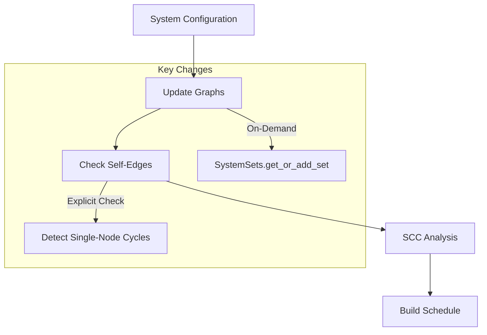

+++
title = "#20015"
date = "2025-07-08T00:00:00"
draft = false
template = "pull_request_page.html"
in_search_index = true

[taxonomies]
list_display = ["show"]

[extra]
current_language = "en"
available_languages = {"en" = { name = "English", url = "/pull_request/bevy/2025-07/pr-20015-en-20250708" }, "zh-cn" = { name = "中文", url = "/pull_request/bevy/2025-07/pr-20015-zh-cn-20250708" }}
+++

## Technical Analysis of PR #20015: Simplify self-edge checking in schedule building

### The Problem and Context
The Bevy engine's ECS scheduler had two interconnected issues in its graph construction logic. First, the `check_edges` and `check_hierarchy` functions combined node initialization with cycle detection, creating unclear code paths. This made it difficult to understand how self-edges (a system set depending on itself) were being validated. Second, there was a specific bug where chaining a set to itself (`(SameSet, SameSet).chain()`) triggered an unhelpful `index_a < index_b` panic instead of a proper dependency cycle error.

The core challenge was that Tarjan's SCC algorithm (used for cycle detection) doesn't report single-node cycles (self-edges) since they form trivial strongly-connected components. The existing implementation missed this edge case because it relied solely on the SCC output for cycle detection.

### The Solution Approach
The author addressed these issues through three key changes:
1. **Separation of concerns**: Decoupled node initialization from cycle detection
2. **On-demand initialization**: Replaced preemptive graph walks with lazy node creation
3. **Explicit self-edge check**: Added direct validation for self-references before SCC analysis

A new `SystemSets` struct was introduced to resolve borrowing complications:
```rust
struct SystemSets {
    sets: SlotMap<SystemSetKey, SystemSetNode>,
    conditions: SecondaryMap<SystemSetKey, Vec<ConditionWithAccess>>,
    ids: HashMap<InternedSystemSet, SystemSetKey>,
}

impl SystemSets {
    fn get_or_add_set(&mut self, set: InternedSystemSet) -> SystemSetKey {
        *self.ids.entry(set).or_insert_with(|| {
            let key = self.sets.insert(SystemSetNode::new(set));
            self.conditions.insert(key, Vec::new());
            key
        })
    }
}
```
This encapsulation allows efficient node creation while avoiding mutable borrow conflicts on the main `ScheduleGraph`.

### The Implementation
The key changes occurred in three areas:

**1. Node initialization simplified**
The previous dual-purpose checking functions were removed entirely. Node creation now happens lazily through `get_or_add_set` during graph updates:
```rust
// Before: Manual set addition and checking
fn add_set(&mut self, set: InternedSystemSet) -> SystemSetKey {
    let key = self.system_sets.insert(SystemSetNode::new(set));
    self.system_set_conditions.insert(key, Vec::new());
    self.system_set_ids.insert(set, key);
    key
}

// After: On-demand initialization
fn configure_set_inner(&mut self, set: ScheduleConfig<InternedSystemSet>) -> SystemSetKey {
    let key = self.system_sets.get_or_add_set(set);
    // ... metadata processing ...
}
```

**2. Self-edge detection moved**
The explicit self-edge check was added directly before SCC analysis:
```rust
fn iter_sccs(
    &self,
    graph: &DiGraph,
    report: ReportCycles,
) -> Result<Vec<NodeId>, ScheduleBuildError> {
    // New explicit self-edge check
    if let Some((node, _)) = graph.all_edges().find(|(left, right)| left == right) {
        let name = self.get_node_name(&node);
        let error = match report {
            ReportCycles::Hierarchy => ScheduleBuildError::HierarchyLoop(name),
            ReportCycles::Dependency => ScheduleBuildError::DependencyLoop(name),
        };
        return Err(error);
    }
    
    // Existing SCC analysis
    let mut top_sorted_nodes = Vec::with_capacity(graph.node_count());
    let mut sccs_with_cycles = Vec::new();
    // ... Tarjan's algorithm ...
}
```

**3. Error handling improved**
Tests were updated to validate proper error returns instead of panics:
```rust
// Before:
#[should_panic]
fn dependency_loop() { ... }

// After:
fn dependency_loop_from_chain() {
    schedule.configure_sets((TestSystems::X, TestSystems::X).chain());
    let result = schedule.initialize(&mut world);
    assert!(matches!(result, Err(ScheduleBuildError::DependencyLoop(_)));
}
```

### Technical Insights
The solution demonstrates several sound software engineering principles:
1. **Lazy initialization** improves performance by avoiding redundant graph walks
2. **Single-responsibility principle** is enforced through dedicated structs
3. **Cycle detection completeness** is achieved by complementing SCC analysis with explicit edge checks
4. **Error granularity** is enhanced by replacing panics with typed errors

A subtle but important improvement is how the solution handles borrowing constraints. By extracting `SystemSets` into a separate struct, the implementation avoids mutable borrow conflicts that would occur when trying to modify the graph while accessing set data.

### The Impact
These changes provide concrete benefits:
1. **Fixed bug**: Chaining a set to itself now returns a meaningful `DependencyLoop` error
2. **Clearer code**: 129 lines removed vs 73 added (-56 net) indicates significant simplification
3. **Maintainability**: Separation of concerns makes future modifications easier
4. **Diagnostics**: Errors now contain the problematic node's name for better debugging

The PR also improves test coverage by adding explicit cases for the chaining edge case, ensuring all self-reference scenarios are validated.

## Visual Representation



## Key Files Changed

### crates/bevy_ecs/src/schedule/schedule.rs (+73/-129)
**Changes:**
1. Introduced `SystemSets` struct to manage set-related data
2. Replaced panic-based self-edge checks with explicit validation
3. Removed obsolete `check_edges` and `check_hierarchy` functions
4. Simplified graph update logic to use on-demand node creation

**Key diff:**
```rust
// Before: Manual set management
system_set_ids: HashMap<InternedSystemSet, SystemSetKey>,
system_sets: SlotMap<SystemSetKey, SystemSetNode>,
system_set_conditions: SecondaryMap<SystemSetKey, Vec<ConditionWithAccess>>,

fn add_set(&mut self, set: InternedSystemSet) -> SystemSetKey {
    let key = self.system_sets.insert(SystemSetNode::new(set));
    self.system_set_conditions.insert(key, Vec::new());
    self.system_set_ids.insert(set, key);
    key
}

// After: Encapsulated set management
system_sets: SystemSets, // Contains sets/conditions/ids

struct SystemSets {
    sets: SlotMap<SystemSetKey, SystemSetNode>,
    conditions: SecondaryMap<SystemSetKey, Vec<ConditionWithAccess>>,
    ids: HashMap<InternedSystemSet, SystemSetKey>,
}

fn get_or_add_set(&mut self, set: InternedSystemSet) -> SystemSetKey {
    *self.ids.entry(set).or_insert_with(|| {
        let key = self.sets.insert(SystemSetNode::new(set));
        self.conditions.insert(key, Vec::new());
        key
    })
}
```

### crates/bevy_ecs/src/schedule/mod.rs (+15/-2)
**Changes:**
1. Updated tests to validate error returns instead of panics
2. Added new test case for set chaining scenario

**Key diff:**
```rust
// Before: Panic test
#[test]
#[should_panic]
fn dependency_loop() {
    schedule.configure_sets(TestSystems::X.after(TestSystems::X));
}

// After: Error matching test
#[test]
fn dependency_loop_from_chain() {
    schedule.configure_sets((TestSystems::X, TestSystems::X).chain());
    let result = schedule.initialize(&mut world);
    assert!(matches!(result, Err(ScheduleBuildError::DependencyLoop(_))));
}
```

## Further Reading
1. [Tarjan's SCC Algorithm](https://en.wikipedia.org/wiki/Tarjan%27s_strongly_connected_components_algorithm)
2. [Rust Borrowing Rules](https://doc.rust-lang.org/book/ch04-02-references-and-borrowing.html)
3. [Bevy ECS Scheduling](https://bevyengine.org/learn/book/getting-started/ecs/#systems)