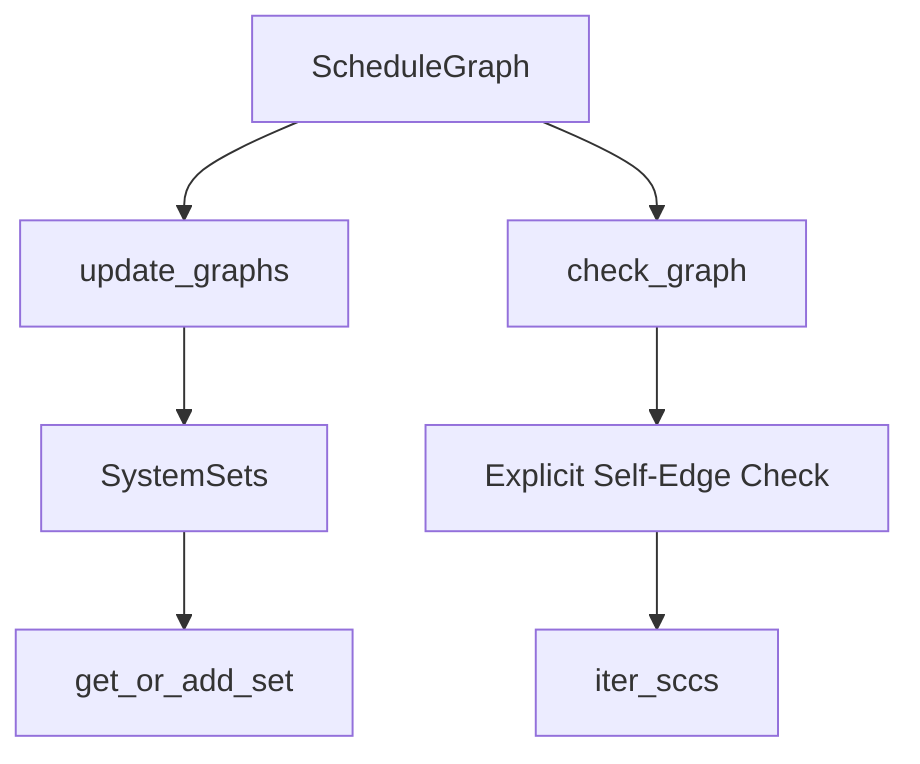

+++
title = "#20015 Simplify self-edge checking in schedule building"
date = "2025-07-08T00:00:00"
draft = false
template = "pull_request_page.html"
in_search_index = false

[extra]
current_language = "zh-cn"
available_languages = {"en" = { name = "English", url = "/pull_request/bevy/2025-07/pr-20015-en-20250708" }, "zh-cn" = { name = "中文", url = "/pull_request/bevy/2025-07/pr-20015-zh-cn-20250708" }}
labels = ["C-Bug", "A-ECS", "C-Code-Quality", "D-Modest"]
+++

# Simplify self-edge checking in schedule building

## Basic Information
- **Title**: Simplify self-edge checking in schedule building
- **PR Link**: https://github.com/bevyengine/bevy/pull/20015
- **Author**: chescock
- **Status**: MERGED
- **Labels**: C-Bug, A-ECS, C-Code-Quality, S-Ready-For-Final-Review, X-Uncontroversial, D-Modest
- **Created**: 2025-07-07T18:45:07Z
- **Merged**: 2025-07-08T18:29:49Z
- **Merged By**: alice-i-cecile

## Description Translation
**目标 (Objective)**  
使调度图代码更易理解，并将部分 panic 替换为 `Result`。  
`check_edges` 和 `check_hierarchy` 函数[有些令人困惑](https://github.com/bevyengine/bevy/pull/19352#discussion_r2181486099)，因为它们将两个关注点耦合在一起：初始化系统集的图节点，以及检查系统集的自引用边。由于不清楚 `NodeId` 检查的对象，自引用检查难以理解。因此需要分离这些关注点，并将其移至更合适的位置。  
修复 `schedule.configure_sets((SameSet, SameSet).chain());` 触发 panic 的 bug，该 bug 会导致错误信息 `assertion failed: index_a < index_b`。

**解决方案 (Solution)**  
移除 `check_edges` 和 `check_hierarchy` 函数，将初始化行为和检查行为分离并移至更易理解的位置。  
对于初始化图节点，使用 `entry` API 按需处理，将 `self.system_set_ids[&set]` 替换为 `self.system_sets.get_or_add_set(set)` 方法，避免额外图遍历和查找。  
由于在 `ScheduleGraph` 上直接实现该方法会导致借用整个结构体的错误，因此将管理系统集的集合拆分到独立结构体。  
对于自引用检查，将其移至更晚阶段，通过 `Schedule::initialize` 返回 `Result` 来报告错误而非在 `configure_set_inner` 中 panic。问题在于 `iter_sccs` 不报告单节点自引用为循环，但后续代码假设所有边都向前指。因此直接在调用 `iter_sccs` 前显式检查自引用边。  
这确保捕获所有可能的自引用添加方式。原代码遗漏了 `chain()` 将集合链接到自身创建自引用边的情况。

## The Story of This Pull Request

### 问题与背景 (The Problem and Context)
在 Bevy 的调度系统构建过程中，处理系统集(SystemSet)依赖关系时存在两个关键问题。首先，`check_edges` 和 `check_hierarchy` 函数将图节点初始化和自引用检查逻辑耦合，导致代码难以理解和维护。特别是当开发者配置如 `(SameSet, SameSet).chain()` 的依赖时，原实现无法正确检测自引用，触发 `index_a < index_b` 的 panic 而非明确错误。

其次，原实现在处理系统集时采用两步过程：先添加所有系统集到图中，再进行依赖检查。这导致：
1. 需要额外的图遍历和哈希查找
2. 自引用检查不完整（遗漏 `chain` 场景）
3. 错误处理不统一（部分路径使用 panic 而非返回 `Result`）

这些问题直接影响调度器正确性，并给开发者带来困惑的调试体验。

### 解决方案方法 (The Solution Approach)
解决方案的核心是分离关注点和优化自引用检查：
1. **解耦初始化与检查**：将系统集节点初始化与自引用检查分离
2. **按需初始化**：使用 entry API 延迟初始化系统集节点
3. **显式自引用检查**：在调用 SCC 算法前直接检测自引用边
4. **错误处理统一**：将 panic 替换为返回 `ScheduleBuildError`

关键决策是将系统集管理逻辑提取到独立结构体 `SystemSets`，解决借用冲突问题。该结构体封装系统集元数据，并提供 `get_or_add_set` 方法按需初始化：

```rust
struct SystemSets {
    sets: SlotMap<SystemSetKey, SystemSetNode>,
    conditions: SecondaryMap<SystemSetKey, Vec<ConditionWithAccess>>,
    ids: HashMap<InternedSystemSet, SystemSetKey>,
}

impl SystemSets {
    fn get_or_add_set(&mut self, set: InternedSystemSet) -> SystemSetKey {
        *self.ids.entry(set).or_insert_with(|| {
            let key = self.sets.insert(SystemSetNode::new(set));
            self.conditions.insert(key, Vec::new());
            key
        })
    }
}
```

### 实现细节 (The Implementation)
#### 自引用检查优化
在 `check_graph` 中添加显式自引用检查，确保覆盖所有情况：

```rust
// 在 iter_sccs 前添加自引用检查
if let Some((node, _)) = graph.all_edges().find(|(left, right)| left == right) {
    let name = self.get_node_name(&node);
    let error = match report {
        ReportCycles::Hierarchy => ScheduleBuildError::HierarchyLoop(name),
        ReportCycles::Dependency => ScheduleBuildError::DependencyLoop(name),
    };
    return Err(error);
}
```

#### 图更新简化
重构 `update_graphs` 方法，移除冗余检查：
```rust
// 更新后：不再包含自引用检查
fn update_graphs(&mut self, id: NodeId, graph_info: GraphInfo) {
    // ...仅保留图更新逻辑...
}
```

#### 错误处理改进
测试用例验证错误处理路径：
```rust
#[test]
fn dependency_loop_from_chain() {
    let mut schedule = Schedule::default();
    schedule.configure_sets((TestSystems::X, TestSystems::X).chain());
    let mut world = World::new();
    let result = schedule.initialize(&mut world);
    assert!(matches!(result, Err(ScheduleBuildError::DependencyLoop(_))));
}
```

### 技术洞察 (Technical Insights)
1. **SCC 算法限制**：Tarjan 的 SCC 算法不将单节点自引用视为循环，需要显式检查
2. **借用冲突解决**：通过提取 `SystemSets` 结构体解决 `&mut self` 的借用冲突
3. **延迟初始化优势**：`get_or_add_set` 方法避免预初始化所有系统集，减少不必要的计算
4. **错误处理一致性**：统一使用 `Result` 返回错误，提升 API 健壮性

### 影响 (The Impact)
1. **正确性提升**：修复 `chain()` 自引用未检测的 bug
2. **代码简化**：移除 56 行代码（+73/-129）
3. **可维护性**：分离初始化与检查逻辑，降低认知负荷
4. **错误信息**：提供明确的 `DependencyLoop` 错误而非 panic
5. **性能**：按需初始化减少不必要的操作

## Visual Representation



## Key Files Changed

### crates/bevy_ecs/src/schedule/schedule.rs (+73/-129)
核心变更：重构系统集管理逻辑，添加显式自引用检查。

**系统集管理重构**：
```rust
// 新增 SystemSets 结构体
struct SystemSets {
    sets: SlotMap<SystemSetKey, SystemSetNode>,
    conditions: SecondaryMap<SystemSetKey, Vec<ConditionWithAccess>>,
    ids: HashMap<InternedSystemSet, SystemSetKey>,
}

// 原 ScheduleGraph 结构调整
pub struct ScheduleGraph {
    systems: SlotMap<SystemKey, SystemNode>,
    system_conditions: SecondaryMap<SystemKey, Vec<ConditionWithAccess>>,
    system_sets: SystemSets, // 替换原有多个字段
    // ...其他字段...
}
```

**自引用检查实现**：
```rust
fn check_graph(
    &self,
    graph: &DiGraph,
    report: ReportCycles,
) -> Result<Vec<NodeId>, ScheduleBuildError> {
    // 显式自引用检查
    if let Some((node, _)) = graph.all_edges().find(|(left, right)| left == right) {
        let name = self.get_node_name(&node);
        let error = match report {
            ReportCycles::Hierarchy => ScheduleBuildError::HierarchyLoop(name),
            ReportCycles::Dependency => ScheduleBuildError::DependencyLoop(name),
        };
        return Err(error);
    }
    
    // 原有 SCC 检查逻辑...
}
```

### crates/bevy_ecs/src/schedule/mod.rs (+15/-2)
测试用例增强：验证自引用场景的错误处理。

```rust
#[test]
fn dependency_loop_from_chain() {
    let mut schedule = Schedule::default();
    schedule.configure_sets((TestSystems::X, TestSystems::X).chain());
    let mut world = World::new();
    let result = schedule.initialize(&mut world);
    assert!(matches!(result, Err(ScheduleBuildError::DependencyLoop(_))));
}
```

## Further Reading
1. [Tarjan's SCC Algorithm](https://en.wikipedia.org/wiki/Tarjan%27s_strongly_connected_components_algorithm) - 强连通分量算法原理
2. [Rust Borrow Checker Patterns](https://doc.rust-lang.org/book/ch04-02-references-and-borrowing.html) - 解决借用冲突的常用模式
3. [Bevy Schedule Execution Model](https://bevyengine.org/learn/book/next/programming/schedules) - 官方调度系统文档
4. [Graph Theory in ECS](https://www.fredericvanplancke.com/2021/12/03/ecs-scheduling/) - ECS 调度中的图论应用