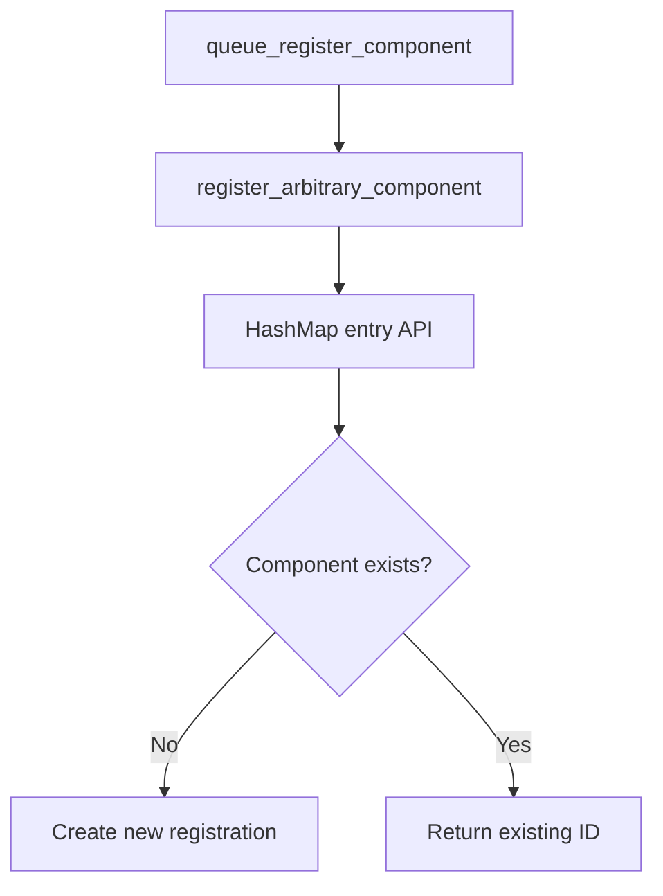

+++
title = "#20016 Prevent TOCTOU bugs in ComponentsQueuedRegistrator"
date = "2025-07-14T00:00:00"
draft = false
template = "pull_request_page.html"
in_search_index = true

[taxonomies]
list_display = ["show"]

[extra]
current_language = "en"
available_languages = {"en" = { name = "English", url = "/pull_request/bevy/2025-07/pr-20016-en-20250714" }, "zh-cn" = { name = "中文", url = "/pull_request/bevy/2025-07/pr-20016-zh-cn-20250714" }}
labels = ["C-Bug", "A-ECS"]
+++

## Prevent TOCTOU Bugs in ComponentsQueuedRegistrator: A Technical Analysis

### Basic Information
- **Title**: Prevent TOCTOU bugs in ComponentsQueuedRegistrator
- **PR Link**: https://github.com/bevyengine/bevy/pull/20016
- **Author**: SkiFire13
- **Status**: MERGED
- **Labels**: C-Bug, A-ECS, S-Ready-For-Final-Review
- **Created**: 2025-07-07T18:53:21Z
- **Merged**: 2025-07-14T21:11:14Z
- **Merged By**: alice-i-cecile

### Description Translation
# Objective

- Fix #20014

## Solution

- Don't make the `force_register_` family of functions always enqueue of the component/resource; instead have them check again whether it was already queued or not.

## Testing

- I added a small regression test but it's non-deterministic: if the bug is fixed it will always pass, but if the bug is presen then it has a (hopefully small) chance of passing. On my PC it failed after ~100 iterations, so hopefully 1000 is enough in CI (assuming it doesn't have single core runners...)

### The Story of This Pull Request

#### The Problem and Context
The ECS component registration system contained a subtle race condition when multiple threads tried to register the same component simultaneously. This TOCTOU (Time of Check to Time of Use) bug occurred because the registration functions first checked if a component was already queued, then later added it to the queue. If two threads passed the initial check simultaneously, both would attempt to register the same component, causing a panic due to duplicate registration attempts. This violated thread safety guarantees and could crash applications using parallel systems.

#### The Solution Approach
The fix required making the check-and-register operation atomic. Instead of having separate "check" and "register" steps, we needed to combine them into a single atomic operation. The optimal approach was to use Rust's `entry` API for concurrent maps, which performs the check and insertion in one atomic operation. This eliminates the race window between checking for a component's presence and actually registering it.

#### The Implementation
The core changes refactored the registration functions to use `HashMap::entry` for atomic check-and-insert operations. The previous `force_register_arbitrary_component` and `force_register_arbitrary_resource` functions were renamed to `register_arbitrary_component` and `register_arbitrary_resource` respectively, reflecting their new thread-safe behavior:

```rust
// Before: Non-atomic insertion
unsafe fn force_register_arbitrary_component(...) {
    let id = self.ids.next();
    self.components.queued.write().components.insert(
        type_id,
        unsafe { QueuedRegistration::new(id, descriptor, func) },
    );
    id
}

// After: Atomic check-and-insert
unsafe fn register_arbitrary_component(...) {
    self.components.queued.write()
        .components
        .entry(type_id)
        .or_insert_with(|| 
            unsafe { QueuedRegistration::new(self.ids.next(), descriptor, func) }
        )
        .id
}
```

The public interface methods like `queue_register_component` were updated to call these safer internal functions. The safety comments were also updated to clarify the new invariants - now the functions only require that the component isn't already registered, rather than requiring it not be queued either.

#### Technical Insights
The key insight is that concurrent data structures require atomic operations for correctness. The `entry` API provides exactly this atomicity by either returning an existing entry or inserting a new one in a single operation. This pattern is generally preferable to manual "check-then-act" sequences when working with shared mutable state.

The solution maintains the same performance characteristics as the original implementation - O(1) average case for insertions and lookups - while adding thread safety. The atomicity comes at no extra runtime cost since it uses standard HashMap operations.

#### The Impact
These changes eliminate a race condition that could cause runtime panics in multithreaded Bevy applications. The fix ensures that:
1. Multiple threads can safely attempt to register the same component
2. The component will only be registered once
3. All threads will receive the same consistent ComponentId
4. No panics occur from duplicate registration attempts

A regression test was added to verify the fix works under concurrent access patterns:

```rust
#[test]
fn queue_register_component_toctou() {
    for _ in 0..1000 {
        let w = World::new();
        std::thread::scope(|s| {
            let c1 = s.spawn(|| w.components_queue().queue_register_component::<A>());
            let c2 = s.spawn(|| w.components_queue().queue_register_component::<A>());
            assert_eq!(c1.join().unwrap(), c2.join().unwrap());
        });
    }
}
```

This test runs 1000 iterations to probabilistically detect any remaining race conditions. The non-deterministic nature is acceptable here since a correct implementation will always pass, while a buggy one will eventually fail.

### Visual Representation



### Key Files Changed

1. `crates/bevy_ecs/src/component/register.rs` (+27/-27)
   - Refactored registration functions to use atomic check-and-insert
   - Updated safety comments to reflect new invariants
   - Renamed functions for clarity

```rust
// Before: Non-atomic insertion
unsafe fn force_register_arbitrary_component(...) -> ComponentId {
    let id = self.ids.next();
    self.components.queued.write().components.insert(
        type_id,
        unsafe { QueuedRegistration::new(id, descriptor, func) },
    );
    id
}

// After: Atomic insertion
unsafe fn register_arbitrary_component(...) -> ComponentId {
    self.components.queued.write()
        .components
        .entry(type_id)
        .or_insert_with(|| 
            unsafe { QueuedRegistration::new(self.ids.next(), descriptor, func) }
        )
        .id
}
```

2. `crates/bevy_ecs/src/lib.rs` (+13/-0)
   - Added concurrency test to verify thread safety

```rust
#[test]
fn queue_register_component_toctou() {
    for _ in 0..1000 {
        let w = World::new();
        std::thread::scope(|s| {
            let c1 = s.spawn(|| w.components_queue().queue_register_component::<A>());
            let c2 = s.spawn(|| w.components_queue().queue_register_component::<A>());
            assert_eq!(c1.join().unwrap(), c2.join().unwrap());
        });
    }
}
```

### Further Reading
1. [TOCTOU Race Condition](https://en.wikipedia.org/wiki/Time-of-check_to_time-of-use)
2. [Rust HashMap::entry API](https://doc.rust-lang.org/std/collections/hash_map/struct.HashMap.html#method.entry)
3. [Rust Synchronization Primitives](https://doc.rust-lang.org/book/ch16-04-extensible-concurrency-sync-and-send.html)
4. [Bevy ECS Component Registration](https://bevyengine.org/learn/book/next/programming/ecs/components)