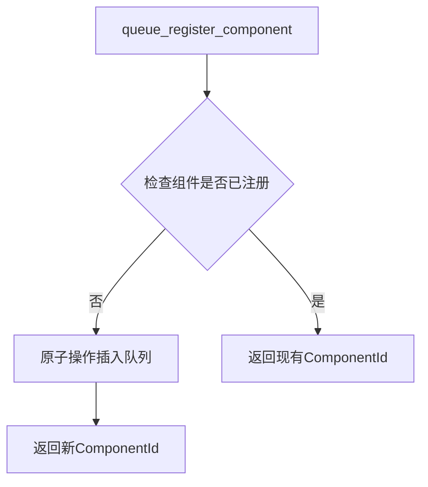

+++
title = "#20016 Prevent TOCTOU bugs in ComponentsQueuedRegistrator"
date = "2025-07-14T00:00:00"
draft = false
template = "pull_request_page.html"
in_search_index = false

[extra]
current_language = "zh-cn"
available_languages = {"en" = { name = "English", url = "/pull_request/bevy/2025-07/pr-20016-en-20250714" }, "zh-cn" = { name = "中文", url = "/pull_request/bevy/2025-07/pr-20016-zh-cn-20250714" }}
+++

# PR #20016: 防止 ComponentsQueuedRegistrator 中的 TOCTOU 错误

## 基本信息
- **标题**: Prevent TOCTOU bugs in ComponentsQueuedRegistrator
- **PR链接**: https://github.com/bevyengine/bevy/pull/20016
- **作者**: SkiFire13
- **状态**: 已合并
- **标签**: C-Bug, A-ECS, S-Ready-For-Final-Review
- **创建时间**: 2025-07-07T18:53:21Z
- **合并时间**: 2025-07-14T21:11:14Z
- **合并人**: alice-i-cecile

## 描述翻译
### 目标
- 修复 #20014

### 解决方案
- 不再让 `force_register_` 系列函数总是将组件/资源加入队列；而是让它们再次检查该组件/资源是否已被加入队列。

### 测试
- 添加了一个小的回归测试，但它是非确定性的：如果错误已修复，测试将始终通过；如果错误存在，则测试有（希望很小的）概率通过。在我的电脑上，大约100次迭代后失败，因此在CI中运行1000次应该足够（假设CI没有单核运行器...）。

## 这个PR的故事

### 问题发现
在Bevy的ECS系统中，`ComponentsQueuedRegistrator`负责管理组件注册队列。当多个线程同时尝试注册同一组件时，原实现存在TOCTOU（检查时间到使用时间）漏洞。具体表现为：
1. 线程A检查组件是否已注册（未发现）
2. 线程B也检查同一组件（未发现）
3. 两个线程都尝试将组件加入队列
4. 导致组件被重复注册，产生冲突的ComponentId

### 解决方案选择
核心修复方案是将注册操作从"检查后插入"改为"原子性插入检查"：
1. 使用HashMap的entry API确保类型检查与插入的原子性
2. 重构`force_register_`系列函数，使其在插入前检查类型是否已存在
3. 统一返回已存在条目的ComponentId（避免ID冲突）

### 实现细节
在`register.rs`中，原`force_register_arbitrary_component`函数被重构。关键修改点：

```rust
// 修改前：
let id = self.ids.next();
self.components
    .queued
    .write()
    .unwrap_or_else(PoisonError::into_inner)
    .components
    .insert(
        type_id,
        unsafe { QueuedRegistration::new(id, descriptor, func) },
    );
id

// 修改后：
self.components
    .queued
    .write()
    .unwrap_or_else(PoisonError::into_inner)
    .components
    .entry(type_id)
    .or_insert_with(|| {
        unsafe { QueuedRegistration::new(self.ids.next(), descriptor, func) }
    })
    .id
```

这个修改确保：
1. 使用`entry()`方法原子性检查类型是否存在
2. `or_insert_with`只在类型不存在时创建新条目
3. 统一返回条目的ComponentId（新创建或已存在）

### 安全考虑
函数的安全要求从：
> The [`TypeId`] must not already be registered or queued as a component.

更新为：
> The [`TypeId`] must not already be registered as a component.

因为队列检查现在由函数内部处理，调用者只需确保类型未正式注册。

### 测试策略
添加非确定性回归测试验证并发场景：
```rust
#[test]
fn queue_register_component_toctou() {
    for _ in 0..1000 {
        let w = World::new();
        std::thread::scope(|s| {
            let c1 = s.spawn(|| w.components_queue().queue_register_component::<A>());
            let c2 = s.spawn(|| w.components_queue().queue_register_component::<A>());
            assert_eq!(c1.join().unwrap(), c2.join().unwrap());
        });
    }
}
```
测试特点：
1. 循环1000次增加捕获竞态概率
2. 两个线程同时注册同类型组件
3. 验证返回的ComponentId一致

### 影响分析
1. 修复多线程环境下的ComponentId冲突
2. 避免因重复注册导致的panic
3. 保持接口兼容性（函数签名不变）
4. 轻微性能提升（避免重复注册操作）

## 可视化表示



## 关键文件变更

### 1. `crates/bevy_ecs/src/component/register.rs` (+27/-27)
**变更目的**：重构组件/资源注册逻辑，修复TOCTOU漏洞

**核心修改**：
```rust
// 函数重命名 + 逻辑重构
- unsafe fn force_register_arbitrary_component(...)
+ unsafe fn register_arbitrary_component(...) {
-   let id = self.ids.next();
-   ...insert(type_id, QueuedRegistration::new(id, ...));
-   id
+   ...entry(type_id)
+      .or_insert_with(|| { QueuedRegistration::new(self.ids.next(), ...) })
+      .id
}

// 调用点同步更新
- self.force_register_arbitrary_component(...)
+ self.register_arbitrary_component(...)
```

**安全注释更新**：
```rust
// 修改前：
// The [`TypeId`] must not already be registered or queued as a component.

// 修改后：
// The [`TypeId`] must not already be registered as a component.
```

### 2. `crates/bevy_ecs/src/lib.rs` (+13/-0)
**变更目的**：添加并发注册测试用例

**测试代码**：
```rust
#[test]
fn queue_register_component_toctou() {
    for _ in 0..1000 {  // 循环1000次增加捕获竞态概率
        let w = World::new();
        std::thread::scope(|s| {
            let c1 = s.spawn(|| w.components_queue().queue_register_component::<A>());
            let c2 = s.spawn(|| w.components_queue().queue_register_component::<A>());
            assert_eq!(c1.join().unwrap(), c2.join().unwrap());
        });
    }
}
```

## 延伸阅读
1. [TOCTOU漏洞详解](https://en.wikipedia.org/wiki/Time-of-check_to_time-of-use) - 维基百科
2. [Rust HashMap.entry文档](https://doc.rust-lang.org/std/collections/hash_map/struct.HashMap.html#method.entry) - 原子插入模式
3. [Bevy ECS组件注册机制](https://bevyengine.org/learn/book/next/ecs/components/) - 官方文档