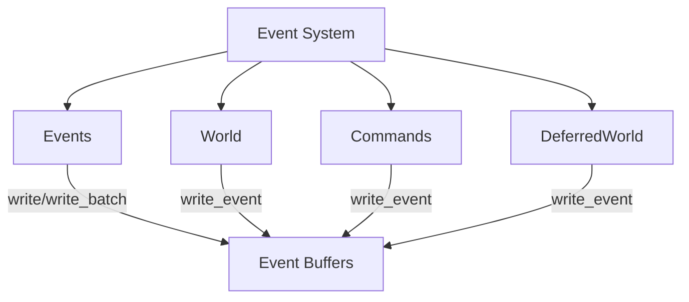

+++
title = "#20017 Rename `send_event` and similar methods to `write_event`"
date = "2025-07-07T00:00:00"
draft = false
template = "pull_request_page.html"
in_search_index = true

[taxonomies]
list_display = ["show"]

[extra]
current_language = "en"
available_languages = {"en" = { name = "English", url = "/pull_request/bevy/2025-07/pr-20017-en-20250707" }, "zh-cn" = { name = "中文", url = "/pull_request/bevy/2025-07/pr-20017-zh-cn-20250707" }}
labels = ["A-ECS", "C-Usability", "X-Contentious", "D-Straightforward"]
+++

# Title: Rename `send_event` and similar methods to `write_event`

## Basic Information
- **Title**: Rename `send_event` and similar methods to `write_event`
- **PR Link**: https://github.com/bevyengine/bevy/pull/20017
- **Author**: AlephCubed
- **Status**: MERGED
- **Labels**: A-ECS, C-Usability, S-Ready-For-Final-Review, M-Needs-Migration-Guide, X-Contentious, D-Straightforward
- **Created**: 2025-07-07T19:56:19Z
- **Merged**: 2025-07-07T22:24:24Z
- **Merged By**: alice-i-cecile

## Description Translation
Fixes: #18963  
Follows up on: #17977  
Adopts: #18966  

In 0.16, `EventWriter::send` was renamed to `EventWriter::write`, but many methods were missed (sorry about that). This completes that refactor by renaming all `send` methods and internals.  

| Old                                 | New                                  |  
|-------------------------------------|--------------------------------------|  
| `World::send_event`                 | `World::write_event`                 |  
| `World::send_event_default`         | `World::write_event_default`         |  
| `World::send_event_batch`           | `World::write_event_batch`           |  
| `DeferredWorld::send_event`         | `DeferredWorld::write_event`         |  
| `DeferredWorld::send_event_default` | `DeferredWorld::write_event_default` |  
| `DeferredWorld::send_event_batch`   | `DeferredWorld::write_event_batch`   |  
| `Commands::send_event`              | `Commmands::write_event`             |  
| `Events::send`                      | `Events::write`                      |  
| `Events::send_default`              | `Events::write_default`              |  
| `Events::send_batch`                | `Events::write_batch`                |  
| `RemovedComponentEvents::send`      | `RemovedComponentEvents::write`      |  
| `command::send_event`               | `commmand::write_event`              |  
| `SendBatchIds`                      | `WriteBatchIds`                      |  

## The Story of This Pull Request

### The Problem and Context
After Bevy 0.16 renamed `EventWriter::send` to `EventWriter::write`, several related methods remained unchanged. This inconsistency created confusion in the API surface area, as users encountered both `send` and `write` terminology for the same operation. The original issue (#17977) addressed part of this problem, but follow-up issues (#18963, #18966) identified missing renames across the codebase. Maintaining two naming conventions increased cognitive load for users and violated Bevy's API consistency principles.

### The Solution Approach
The solution involved a systematic rename of all remaining `send_event`-style methods to `write_event` equivalents. The approach included:
1. Identifying all instances of `send_event`, `send_batch`, and similar patterns
2. Renaming methods while preserving existing functionality
3. Adding deprecation warnings for old methods
4. Updating documentation and internal references
5. Maintaining backward compatibility through deprecation markers

The author considered alternatives like introducing new methods without removing old ones but rejected them due to potential long-term maintenance costs. The straightforward rename approach was chosen for consistency with Bevy's established patterns.

### The Implementation
The implementation required coordinated changes across multiple subsystems. Key technical aspects included:

**Event System Core Changes**
The `Events` struct saw the most significant changes. Old methods were deprecated and new `write_*` methods added:

```rust
// File: crates/bevy_ecs/src/event/collections.rs
// Before:
pub fn send(&mut self, event: E) -> EventId<E> { ... }
pub fn send_batch(&mut self, events: impl IntoIterator<Item = E>) -> SendBatchIds<E> { ... }

// After:
#[deprecated]
pub fn send(&mut self, event: E) -> EventId<E> { ... }

pub fn write(&mut self, event: E) -> EventId<E> { ... }
pub fn write_batch(&mut self, events: impl IntoIterator<Item = E>) -> WriteBatchIds<E> { ... }
```

**World and Commands API Updates**
The `World` and `Commands` APIs were updated to match the new terminology:

```rust
// File: crates/bevy_ecs/src/world/mod.rs
// Before:
pub fn send_event<E: BufferedEvent>(&mut self, event: E) -> Option<EventId<E>> { ... }

// After:
#[deprecated]
pub fn send_event<E: BufferedEvent>(&mut self, event: E) -> Option<EventId<E>> { ... }

pub fn write_event<E: BufferedEvent>(&mut self, event: E) -> Option<EventId<E>> { ... }
```

**Type Renames**
The `SendBatchIds` type was renamed to `WriteBatchIds` to reflect the new method names:

```rust
// File: crates/bevy_ecs/src/event/collections.rs
// Before:
pub struct SendBatchIds<E> { ... }

// After:
pub struct WriteBatchIds<E> { ... }
#[deprecated]
pub type SendBatchIds<E> = WriteBatchIds<E>;
```

### Technical Insights
The changes required special handling for:
1. **Deprecation Strategy**: All old methods were marked with `#[deprecated]` attributes with migration instructions
2. **Batch Processing**: The `write_batch` methods maintain their efficiency advantages over single-event writes
3. **Entity Component System**: Changes to `RemovedComponentEvents` required updates to entity removal tracking
4. **Cursor Behavior**: Event cursors function identically with the new naming scheme

The PR avoided changing the underlying event buffering mechanism or reader behavior, focusing solely on naming consistency.

### The Impact
These changes:
1. Unified Bevy's event API terminology under the `write_*` pattern
2. Reduced cognitive load for users learning the ECS event system
3. Prepared for future event system improvements by eliminating naming inconsistencies
4. Maintained backward compatibility through deprecation warnings
5. Affected 34 files across the codebase with minimal functional changes

The migration path is straightforward: replace `send_` prefixes with `write_` and update type references from `SendBatchIds` to `WriteBatchIds`. The included migration guide provides a complete reference table for developers updating their projects.

## Visual Representation



## Key Files Changed

### `crates/bevy_ecs/src/event/collections.rs` (+57/-24)
Core event handling methods renamed to use `write` terminology. Added deprecation markers for old methods.

```rust
// Before:
pub fn send(&mut self, event: E) -> EventId<E> { ... }
pub fn send_batch(&mut self, events: impl IntoIterator<Item = E>) -> SendBatchIds<E> { ... }

// After:
#[deprecated]
pub fn send(&mut self, event: E) -> EventId<E> { ... }

pub fn write(&mut self, event: E) -> EventId<E> { ... }
pub fn write_batch(&mut self, events: impl IntoIterator<Item = E>) -> WriteBatchIds<E> { ... }
```

### `crates/bevy_ecs/src/world/mod.rs` (+45/-15)
Updated World methods to use `write_event` naming convention.

```rust
// Before:
pub fn send_event<E: BufferedEvent>(&mut self, event: E) -> Option<EventId<E>> { ... }

// After:
#[deprecated]
pub fn send_event<E: BufferedEvent>(&mut self, event: E) -> Option<EventId<E>> { ... }

pub fn write_event<E: BufferedEvent>(&mut self, event: E) -> Option<EventId<E>> { ... }
```

### `crates/bevy_ecs/src/event/mod.rs` (+52/-51)
Updated event module exports and test cases to use new naming.

```rust
// Before:
pub use collections::{Events, SendBatchIds};

// After:
pub use collections::{Events, SendBatchIds, WriteBatchIds};
```

### `crates/bevy_ecs/src/world/deferred_world.rs` (+51/-15)
Updated DeferredWorld methods to match new naming conventions.

```rust
// Before:
pub fn send_event<E: BufferedEvent>(&mut self, event: E) -> Option<EventId<E>> { ... }

// After:
#[deprecated]
pub fn send_event<E: BufferedEvent>(&mut self, event: E) -> Option<EventId<E>> { ... }

pub fn write_event<E: BufferedEvent>(&mut self, event: E) -> Option<EventId<E>> { ... }
```

### `crates/bevy_winit/src/state.rs` (+30/-30)
Updated winit integration to use new event writing methods.

```rust
// Before:
world.send_event(e);

// After:
world.write_event(e);
```

## Further Reading
1. [Bevy Events Documentation](https://docs.rs/bevy/latest/bevy/ecs/event/index.html)
2. [Event System Migration Guide](https://github.com/bevyengine/bevy/blob/main/release-content/migration-guides/send_event_rename.md)
3. [Original EventWriter Rename PR (#17977)](https://github.com/bevyengine/bevy/pull/17977)