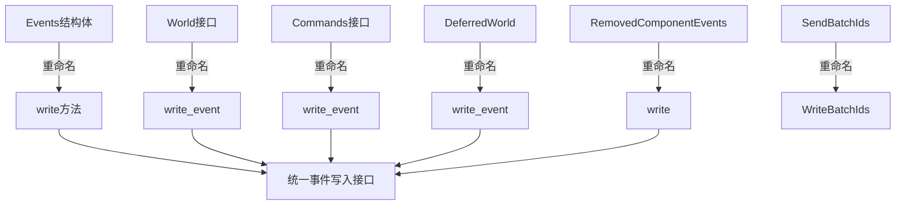

+++
title = "#20017 Rename `send_event` and similar methods to `write_event"
date = "2025-07-07T00:00:00"
draft = false
template = "pull_request_page.html"
in_search_index = false

[extra]
current_language = "zh-cn"
available_languages = {"en" = { name = "English", url = "/pull_request/bevy/2025-07/pr-20017-en-20250707" }, "zh-cn" = { name = "中文", url = "/pull_request/bevy/2025-07/pr-20017-zh-cn-20250707" }}
+++

# PR分析报告：事件发送方法重命名

## 基本信息
- **标题**: Rename `send_event` and similar methods to `write_event`
- **PR链接**: https://github.com/bevyengine/bevy/pull/20017
- **作者**: AlephCubed
- **状态**: MERGED
- **标签**: A-ECS, C-Usability, S-Ready-For-Final-Review, M-Needs-Migration-Guide, X-Contentious, D-Straightforward
- **创建时间**: 2025-07-07T19:56:19Z
- **合并时间**: 2025-07-07T22:24:24Z
- **合并人**: alice-i-cecile

## 描述翻译
Fixes: #18963  
Follows up on: #17977  
Adopts: #18966  

在0.16版本中，`EventWriter::send`被重命名为`EventWriter::write`，但许多相关方法被遗漏了（对此表示抱歉）。本次PR通过重命名所有`send`方法和内部实现来完成该重构。

| 旧方法                             | 新方法                               |
|-------------------------------------|--------------------------------------|
| `World::send_event`                 | `World::write_event`                 |
| `World::send_event_default`         | `World::write_event_default`         |
| `World::send_event_batch`           | `World::write_event_batch`           |
| `DeferredWorld::send_event`         | `DeferredWorld::write_event`         |
| `DeferredWorld::send_event_default` | `DeferredWorld::write_event_default` |
| `DeferredWorld::send_event_batch`   | `DeferredWorld::write_event_batch`   |
| `Commands::send_event`              | `Commmands::write_event`             |
| `Events::send`                      | `Events::write`                      |
| `Events::send_default`              | `Events::write_default`              |
| `Events::send_batch`                | `Events::write_batch`                |
| `RemovedComponentEvents::send`      | `RemovedComponentEvents::write`      |
| `command::send_event`               | `commmand::write_event`              |
| `SendBatchIds`                      | `WriteBatchIds`                      |

## 本PR的技术故事

### 问题背景
在之前的0.16版本中，Bevy团队将`EventWriter::send`方法重命名为`EventWriter::write`以提高API一致性。然而，这次重构遗漏了代码库中多个相关的事件发送方法，导致API存在不一致性。用户在使用不同的事件发送机制时会遇到命名不一致的问题，这增加了学习曲线和维护成本。需要统一所有事件发送方法的命名，确保整个代码库的一致性。

### 解决方案
本次PR采用直接重命名策略：
1. 将所有`send_event`前缀的方法统一重命名为`write_event`
2. 保留旧方法作为弃用别名，提供向后兼容性
3. 更新所有内部调用点使用新方法名
4. 确保文档和测试用例同步更新

关键决策点包括：
- 为所有事件发送方法建立统一的`write`前缀
- 添加`#[deprecated]`属性标记旧方法，指导用户迁移
- 使用类型别名`SendBatchIds = WriteBatchIds`保持兼容性
- 在迁移指南中明确列出所有变更点

### 实现细节
核心修改集中在事件系统相关的ECS模块。主要变更包括：

**1. Events结构体重命名**
在`crates/bevy_ecs/src/event/collections.rs`中：
```rust
// Before:
pub fn send(&mut self, event: E) -> EventId<E> { ... }
pub fn send_batch(&mut self, events: impl IntoIterator<Item = E>) -> SendBatchIds<E> { ... }

// After:
pub fn write(&mut self, event: E) -> EventId<E> { ... }
pub fn write_batch(&mut self, events: impl IntoIterator<Item = E>) -> WriteBatchIds<E> { ... }

// 保留弃用方法
#[deprecated(since = "0.17.0", note = "Use `Events<E>::write` instead.")]
pub fn send(&mut self, event: E) -> EventId<E> { 
    self.write(event)
}
```

**2. World接口更新**
在`crates/bevy_ecs/src/world/mod.rs`中：
```rust
// Before:
pub fn send_event<E: BufferedEvent>(&mut self, event: E) -> Option<EventId<E>> { ... }

// After:
pub fn write_event<E: BufferedEvent>(&mut self, event: E) -> Option<EventId<E>> { ... }

// 弃用旧方法
#[deprecated(since = "0.17.0", note = "Use `World::write_event` instead.")]
pub fn send_event<E: BufferedEvent>(&mut self, event: E) -> Option<EventId<E>> {
    self.write_event(event)
}
```

**3. Commands接口更新**
在`crates/bevy_ecs/src/system/commands/mod.rs`中：
```rust
// Before:
pub fn send_event<E: BufferedEvent>(&mut self, event: E) -> &mut Self { ... }

// After:
pub fn write_event<E: BufferedEvent>(&mut self, event: E) -> &mut Self { ... }

// 弃用旧方法
#[deprecated(since = "0.17.0", note = "Use `Commands::write_event` instead.")]
pub fn send_event<E: BufferedEvent>(&mut self, event: E) -> &mut Self {
    self.write_event(event)
}
```

**4. 批量事件ID类型重命名**
```rust
// Before:
pub struct SendBatchIds<E> { ... }

// After:
pub struct WriteBatchIds<E> { ... }

// 类型别名保持兼容
#[deprecated(since = "0.17.0", note = "Use `WriteBatchIds` instead.")]
pub type SendBatchIds<E> = WriteBatchIds<E>;
```

### 技术洞察
1. **弃用策略**：通过`#[deprecated]`属性提供平滑迁移路径，避免破坏现有代码
2. **类型别名**：使用`type SendBatchIds = WriteBatchIds`确保现有类型引用继续有效
3. **调用点更新**：修改了25个crate文件、4个示例和3个基准测试文件中的调用点
4. **事件系统一致性**：统一了`World`、`Commands`、`Events`和`RemovedComponentEvents`的接口

### 影响
1. **API一致性**：统一了所有事件发送方法的命名规范
2. **迁移成本**：提供清晰的弃用信息和迁移指南，降低用户迁移难度
3. **代码清晰度**：`write`前缀更准确地反映了事件写入缓冲区的本质
4. **性能**：纯重命名操作，不影响运行时性能

## 关键文件变更

### 1. crates/bevy_ecs/src/event/collections.rs (+57/-24)
将`Events`结构体的`send*`方法重命名为`write*`，并添加弃用别名。
```rust
// 关键变更：
pub fn write(&mut self, event: E) -> EventId<E> { ... }
pub fn write_batch(...) -> WriteBatchIds<E> { ... }

#[deprecated]
pub fn send(...) { self.write(...) }
```

### 2. crates/bevy_ecs/src/world/deferred_world.rs (+51/-15)
更新`DeferredWorld`的事件发送方法。
```rust
// 关键变更：
pub fn write_event<E: BufferedEvent>(...) { ... }
pub fn write_event_batch(...) { ... }

#[deprecated]
pub fn send_event(...) { self.write_event(...) }
```

### 3. crates/bevy_ecs/src/world/mod.rs (+45/-15)
更新`World`的事件发送接口。
```rust
// 关键变更：
pub fn write_event<E: BufferedEvent>(...) { ... }
pub fn write_event_batch(...) { ... }

#[deprecated]
pub fn send_event(...) { self.write_event(...) }
```

### 4. crates/bevy_ecs/src/system/commands/mod.rs (+30/-30)
更新`Commands`的事件发送方法。
```rust
// 关键变更：
pub fn write_event<E: BufferedEvent>(...) { ... }

#[deprecated]
pub fn send_event(...) { self.write_event(...) }
```

### 5. crates/bevy_winit/src/state.rs (+30/-30)
更新winit事件处理中的事件发送调用。
```rust
// 变更示例：
// Before:
events.send(event);

// After:
events.write(event);
```

## 视觉表示



## 完整代码变更
<details>
<summary>展开查看完整diff</summary>

```diff
diff --git a/benches/benches/bevy_ecs/events/iter.rs b/benches/benches/bevy_ecs/events/iter.rs
index 9ad17ed8c8536..5f85633312c43 100644
--- a/benches/benches/bevy_ecs/events/iter.rs
+++ b/benches/benches/bevy_ecs/events/iter.rs
@@ -10,7 +10,7 @@ impl<const SIZE: usize> Benchmark<SIZE> {
         let mut events = Events::default();
 
         for _ in 0..count {
-            events.send(BenchEvent([0u8; SIZE]));
+            events.write(BenchEvent([0u8; SIZE]));
         }
 
         Self(events)
diff --git a/benches/benches/bevy_ecs/events/mod.rs b/benches/benches/bevy_ecs/events/mod.rs
index c2c7f3ee28056..fcc807c96856d 100644
--- a/benches/benches/bevy_ecs/events/mod.rs
+++ b/benches/benches/bevy_ecs/events/mod.rs
@@ -1,5 +1,5 @@
 mod iter;
-mod send;
+mod write;
 
 use criterion::{criterion_group, Criterion};
 
@@ -11,19 +11,19 @@ fn send(c: &mut Criterion) {
     group.measurement_time(core::time::Duration::from_secs(4));
     for count in [100, 1_000, 10_000] {
         group.bench_function(format!("size_4_events_{count}"), |b| {
-            let mut bench = send::Benchmark::<4>::new(count);
+            let mut bench = write::Benchmark::<4>::new(count);
             b.iter(move || bench.run());
         });
     }
     for count in [100, 1_000, 10_000] {
         group.bench_function(format!("size_16_events_{count}"), |b| {
-            let mut bench = send::Benchmark::<16>::new(count);
+            let mut bench = write::Benchmark::<16>::new(count);
             b.iter(move || bench.run());
         });
     }
     for count in [100, 1_000, 10_000] {
         group.bench_function(format!("size_512_events_{count}"), |b| {
-            let mut bench = send::Benchmark::<512>::new(count);
+            let mut bench = write::Benchmark::<512>::new(count);
             b.iter(move || bench.run());
         });
     }
diff --git a/benches/benches/bevy_ecs/events/send.rs b/benches/benches/bevy_ecs/events/write.rs
similarity index 86%
rename from benches/benches/bevy_ecs/events/send.rs
rename to benches/benches/bevy_ecs/events/write.rs
index be8934e789152..8095aee738677 100644
--- a/benches/benches/bevy_ecs/events/send.rs
+++ b/benches/benches/bevy_ecs/events/write.rs
@@ -21,7 +21,7 @@ impl<const SIZE: usize> Benchmark<SIZE> {
         // Force both internal buffers to be allocated.
         for _ in 0..2 {
             for _ in 0..count {
-                events.send(BenchEvent([0u8; SIZE]));
+                events.write(BenchEvent([0u8; SIZE]));
             }
             events.update();
         }
@@ -32,7 +32,7 @@ impl<const SIZE: usize> Benchmark<SIZE> {
     pub fn run(&mut self) {
         for _ in 0..self.count {
             self.events
-                .send(core::hint::black_box(BenchEvent([0u8; SIZE])));
+                .write(core::hint::black_box(BenchEvent([0u8; SIZE])));
         }
         self.events.update();
     }
diff --git a/crates/bevy_app/src/app.rs b/crates/bevy_app/src/app.rs
index 05f3de27b116f..a9057c787dc53 100644
--- a/crates/bevy_app/src/app.rs
+++ b/crates/bevy_app/src/app.rs
@@ -1864,7 +1864,7 @@ mod tests {
         app.update();
 
         // Sending one event
-        app.world_mut().send_event(TestEvent);
+        app.world_mut().write_event(TestEvent);
 
         let test_events = app.world().resource::<Events<TestEvent>>();
         assert_eq!(test_events.len(), 1);
@@ -1872,8 +1872,8 @@ mod tests {
         app.update();
 
         // Sending two events on the next frame
-        app.world_mut().send_event(TestEvent);
-        app.world_mut().send_event(TestEvent);
+        app.world_mut().write_event(TestEvent);
+        app.world_mut().write_event(TestEvent);
 
         let test_events = app.world().resource::<Events<TestEvent>>();
         assert_eq!(test_events.len(), 3); // Events are double-buffered, so we see 1 + 2 = 3
diff --git a/crates/bevy_asset/src/server/mod.rs b/crates/bevy_asset/src/server/mod.rs
index 0b64fe74e0afb..69dc8428da87d 100644
--- a/crates/bevy_asset/src/server/mod.rs
+++ b/crates/bevy_asset/src/server/mod.rs
@@ -167,7 +167,7 @@ impl AssetServer {
         fn sender<A: Asset>(world: &mut World, id: UntypedAssetId) {
             world
                 .resource_mut::<Events<AssetEvent<A>>>()
-                .send(AssetEvent::LoadedWithDependencies { id: id.typed() });
+                .write(AssetEvent::LoadedWithDependencies { id: id.typed() });
         }
         fn failed_sender<A: Asset>(
             world: &mut World,
@@ -177,7 +177,7 @@ impl AssetServer {
         ) {
             world
                 .resource_mut::<Events<AssetLoadFailedEvent<A>>>()
-                .send(AssetLoadFailedEvent {
+                .write(AssetLoadFailedEvent {
                     id: id.typed(),
                     path,
                     error,
@@ -1685,7 +1685,7 @@ pub fn handle_internal_asset_events(world: &mut World) {
         }
 
         if !untyped_failures.is_empty() {
-            world.send_event_batch(untyped_failures);
+            world.write_event_batch(untyped_failures);
         }
 
         fn queue_ancestors(
diff --git a/crates/bevy_dev_tools/src/ci_testing/systems.rs b/crates/bevy_dev_tools/src/ci_testing/systems.rs
index ae7a2a774e44e..8e0b502aa095d 100644
--- a/crates/bevy_dev_tools/src/ci_testing/systems.rs
+++ b/crates/bevy_dev_tools/src/ci_testing/systems.rs
@@ -18,7 +18,7 @@ pub(crate) fn send_events(world: &mut World, mut current_frame: Local<u32>) {
         debug!("Handling event: {:?}", event);
         match event {
             CiTestingEvent::AppExit => {
-                world.send_event(AppExit::Success);
+                world.write_event(AppExit::Success);
                 info!("Exiting after {} frames. Test successful!", *current_frame);
             }
             CiTestingEvent::ScreenshotAndExit => {
@@ -53,7 +53,7 @@ pub(crate) fn send_events(world: &mut World, mut current_frame: Local<u32>) {
             }
             // Custom events are forwarded to the world.
             CiTestingEvent::Custom(event_string) => {
-                world.send_event(CiTestingCustomEvent(event_string));
+                world.write_event(CiTestingCustomEvent(event_string));
             }
         }
     }
diff --git a/crates/bevy_ecs/src/bundle.rs b/crates/bevy_ecs/src/bundle.rs
index 78948f81b1d5e..75c2c89ff852b 100644
--- a/crates/bevy_ecs/src/bundle.rs
+++ b/crates/bevy_ecs/src/bundle.rs
@@ -1584,7 +1584,7 @@ impl<'w> BundleRemover<'w> {
         // Handle sparse set removes
         for component_id in self.bundle_info.as_ref().iter_explicit_components() {
             if self.old_archetype.as_ref().contains(component_id) {
-                world.removed_components.send(component_id, entity);
+                world.removed_components.write(component_id, entity);
 
                 // Make sure to drop components stored in sparse sets.
                 // Dense components are dropped later in `move_to_and_drop_missing_unchecked`.
diff --git a/crates/bevy_ecs/src/event/collections.rs b/crates/bevy_ecs/src/event/collections.rs
index 7d1854149ecbe..5175efb03ae4c 100644
--- a/crates/bevy_ecs/src/event/collections.rs
+++ b/crates/bevy_ecs/src/event/collections.rs
@@ -54,8 +54,8 @@ use {
 /// // run this once per update/frame
 /// events.update();
 ///
-/// // somewhere else: send an event
-/// events.send(MyEvent { value: 1 });
+/// // somewhere else: write an event
+/// events.write(MyEvent { value: 1 });
 ///
 /// // somewhere else: read the events
 /// for event in cursor.read(&events) {
@@ -118,22 +118,22 @@ impl<E: BufferedEvent> Events<E> {
         self.events_a.start_event_count
     }
 
-    /// "Sends" an `event` by writing it to the current event buffer.
+    /// Writes an `event` to the current event buffer.
     /// [`EventReader`](super::EventReader)s can then read the event.
-    /// This method returns the [ID](`EventId`) of the sent `event`.
+    /// This method returns the [ID](`EventId`) of the written `event`.
     #[track_caller]
-    pub fn send(&mut self, event: E) -> EventId<E> {
-        self.send_with_caller(event, MaybeLocation::caller())
+    pub fn write(&mut self, event: E) -> EventId<E> {
+        self.write_with_caller(event, MaybeLocation::caller())
     }
 
-    pub(crate) fn send_with_caller(&mut self, event: E, caller: MaybeLocation) -> EventId<E> {
+    pub(crate) fn write_with_caller(&mut self, event: E, caller: MaybeLocation) -> EventId<E> {
         let event_id = EventId {
             id: self.event_count,
             caller,
             _marker: PhantomData,
         };
         #[cfg(feature = "detailed_trace")]
-        tracing::trace!("Events::send() -> id: {}", event_id);
+        tracing::trace!("Events::write() -> id: {}", event_id);
 
         let event_instance = EventInstance { event_id, event };
 
@@ -143,30 +143,59 @@ impl<E: BufferedEvent> Events<E> {
         event_id
     }
 
-    /// Sends a list of `events` all at once, which can later be read by [`EventReader`](super::EventReader)s.
-    /// This is more efficient than sending each event individually.
-    /// This method returns the [IDs](`EventId`) of the sent `events`.
+    /// Writes a list of `events` all at once, which can later be read by [`EventReader`](super::EventReader)s.
+    /// This is more efficient than writing each event individually.
+    /// This method returns the [IDs](`EventId`) of the written `events`.
     #[track_caller]
-    pub fn send_batch(&mut self, events: impl IntoIterator<Item = E>) -> SendBatchIds<E> {
+    pub fn write_batch(&mut self, events: impl IntoIterator<Item = E>) -> WriteBatchIds<E> {
         let last_count = self.event_count;
 
         self.extend(events);
 
-        SendBatchIds {
+        WriteBatchIds {
             last_count,
             event_count: self.event_count,
             _marker: PhantomData,
         }
     }
 
+    /// Writes the default value of the event. Useful when the event is an empty struct.
+    /// This method returns the [ID](`EventId`) of the written `event`.
+    #[track_caller]
+    pub fn write_default(&mut self) -> EventId<E>
+    where
+        E: Default,
+    {
+        self.write(Default::default())
+    }
+
+    /// "Sends" an `event` by writing it to the current event buffer.
+    /// [`EventReader`](super::EventReader)s can then read the event.
+    /// This method returns the [ID](`EventId`) of the sent `event`.
+    #[deprecated(since = "0.17.0", note = "Use `Events<E>::write` instead.")]
+    #[track_caller]
+    pub fn send(&mut self, event: E) -> EventId<E> {
+        self.write(event)
+    }
+
+    /// Sends a list of `events` all at once, which can later be read by [`EventReader`](super::EventReader)s.
+    /// This is more efficient than sending each event individually.
+    /// This method returns the [IDs](`EventId`) of the sent `events`.
+    #[deprecated(since = "0.17.0", note = "Use `Events<E>::write_batch` instead.")]
+    #[track_caller]
+    pub fn send_batch(&mut self, events: impl IntoIterator<Item = E>) -> WriteBatchIds<E> {
+        self.write_batch(events)
+    }
+
     /// Sends the default value of the event. Useful when the event is an empty struct.
     /// This method returns the [ID](`EventId`) of the sent `event`.
+    #[deprecated(since = "0.17.0", note = "Use `Events<E>::write_default` instead.")]
     #[track_caller]
     pub fn send_default(&mut self) -> EventId<E>
     where
         E: Default,
     {
-        self.send(Default::default())
+        self.write_default()
     }
 
     /// Gets a new [`EventCursor`]. This will include all events already in the event buffers.
@@ -351,14 +380,18 @@ impl<E: BufferedEvent> DerefMut for EventSequence<E> {
     }
 }
 
-/// [`Iterator`] over sent [`EventIds`](`EventId`) from a batch.
-pub struct SendBatchIds<E> {
+/// [`Iterator`] over written [`EventIds`](`EventId`) from a batch.
+pub struct WriteBatchIds<E> {
     last_count: usize,
     event_count: usize,
     _marker: PhantomData<E>,
 }
 
-impl<E: BufferedEvent> Iterator for SendBatchIds<E> {
+/// [`Iterator`] over sent [`EventIds`](`EventId`) from a batch.
+#[deprecated(since = "0.17.0", note = "Use `WriteBatchIds` instead.")]
+pub type SendBatchIds<E> = WriteBatchIds<E>;
+
+impl<E: BufferedEvent> Iterator for WriteBatchIds<E> {
     type Item = EventId<E>;
 
     fn next(&mut self) -> Option<Self::Item> {
@@ -378,7 +411,7 @@ impl<E: BufferedEvent> Iterator for SendBatchIds<E> {
     }
 }
 
-impl<E: BufferedEvent> ExactSizeIterator for SendBatchIds<E> {
+impl<E: BufferedEvent> ExactSizeIterator for WriteBatchIds<E> {
     fn len(&self) -> usize {
         self.event_count.saturating_sub(self.last_count)
     }
@@ -400,22 +433,22 @@ mod tests {
         assert_eq!(test_events.iter_current_update_events().count(), 0);
         test_events.update();
 
-        // Sending one event
-        test_events.send(TestEvent);
+        // Writing one event
+        test_events.write(TestEvent);
 
         assert_eq!(test_events.len(), 1);
         assert_eq!(test_events.iter_current_update_events().count(), 1);
         test_events.update();
 
-        // Sending two events on the next frame
-        test_events.send(TestEvent);
-        test_events.send(TestEvent);
+        // Writing two events on the next frame
+        test_events.write(TestEvent);
+        test_events.write(TestEvent);
 
         assert_eq!(test_events.len(), 3); // Events are double-buffered, so we see 1 + 2 = 3
         assert_eq!(test_events.iter_current_update_events().count(), 2);
         test_events.update();
 
-        // Sending zero events
+        // Writing zero events
         assert_eq!(test_events.len(), 2); // Events are double-buffered, so we see 2 + 0 = 2
         assert_eq!(test_events.iter_current_update_events().count(), 0);
     }
diff --git a/crates/bevy_ecs/src/event/event_cursor.rs b/crates/bevy_ecs/src/event/event_cursor.rs
index 70e19a732c3df..f0460a942410e 100644
--- a/crates/bevy_ecs/src/event/event_cursor.rs
+++ b/crates/bevy_ecs/src/event/event_cursor.rs
@@ -41,7 +41,7 @@ use core::marker::PhantomData;
 ///     }
 ///
 ///     for event in events_to_resend {
-///         events.send(MyEvent);
+///         events.write(MyEvent);
 ///     }
 /// }
 ///
diff --git a/crates/bevy_ecs/src/event/mod.rs b/crates/bevy_ecs/src/event/mod.rs
index ec930cd269eee..77741a47abc62 100644
--- a/crates/bevy_ecs/src/event/mod.rs
+++ b/crates/bevy_ecs/src/event/mod.rs
@@ -13,7 +13,8 @@ mod writer;
 pub(crate) use base::EventInstance;
 pub use base::{BufferedEvent, EntityEvent, Event, EventId, EventKey};
 pub use bevy_ecs_macros::{BufferedEvent, EntityEvent, Event};
-pub use collections::{Events, SendBatchIds};
+#[expect(deprecated, reason = "`SendBatchIds` was renamed to `WriteBatchIds`.")]
+pub use collections::{Events, SendBatchIds, WriteBatchIds};
 pub use event_cursor::EventCursor;
 #[cfg(feature = "multi_threaded")]
 pub use iterators::EventParIter;
@@ -68,7 +69,7 @@ mod tests {
 
         let mut reader_a: EventCursor<TestEvent> = events.get_cursor();
 
-        events.send(event_0);
+        events.write(event_0);
 
         assert_eq!(
             get_events(&events, &mut reader_a),
@@ -94,7 +95,7 @@ mod tests {
             "second iteration of reader_b created after event results in zero events"
         );
 
-        events.send(event_1);
+        events.write(event_1);
 
         let mut reader_c = events.get_cursor();
 
@@ -119,7 +120,7 @@ mod tests {
 
         let mut reader_d = events.get_cursor();
 
-        events.send(event_2);
+        events.write(event_2);
 
         assert_eq!(
             get_events(&events, &mut reader_a),
@@ -153,17 +154,17 @@ mod tests {
