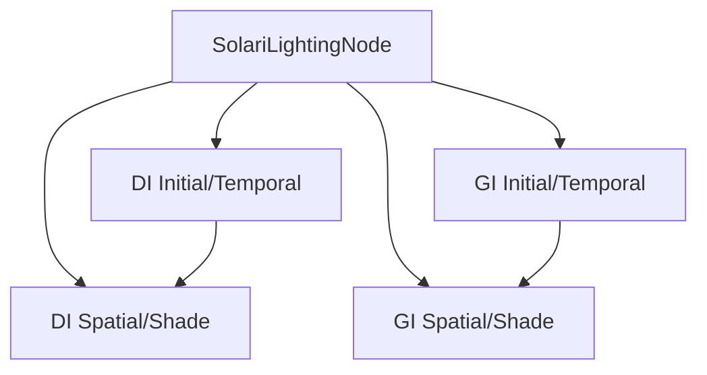

+++
title = "#20020 Solari initial GI"
date = "2025-07-13T00:00:00"
draft = false
template = "pull_request_page.html"
in_search_index = true

[taxonomies]
list_display = ["show"]

[extra]
current_language = "en"
available_languages = {"en" = { name = "English", url = "/pull_request/bevy/2025-07/pr-20020-en-20250713" }, "zh-cn" = { name = "中文", url = "/pull_request/bevy/2025-07/pr-20020-zh-cn-20250713" }}
labels = ["C-Feature", "A-Rendering"]
+++

# Technical Analysis of PR #20020: Solari initial GI

## Basic Information
- **Title**: Solari initial GI
- **PR Link**: https://github.com/bevyengine/bevy/pull/20020
- **Author**: JMS55
- **Status**: MERGED
- **Labels**: C-Feature, A-Rendering, S-Ready-For-Final-Review, M-Needs-Release-Note
- **Created**: 2025-07-07T20:59:24Z
- **Merged**: 2025-07-13T17:42:51Z
- **Merged By**: alice-i-cecile

## Description Translation
# Objective
- Add 1-bounce RT GI

## Solution

- Implement a very very basic version of ReSTIR GI https://d1qx31qr3h6wln.cloudfront.net/publications/ReSTIR%20GI.pdf
- Pretty much a copy of the ReSTIR DI code, but adjusted for GI. 
- Didn't implement add more spatial samples, or do anything needed for better quality.
- Didn't try to improve perf at all yet (it's actually faster than DI though, unfortunately 😅)
- Didn't spend any time cleaning up the shared abstractions between DI/GI

---

## Showcase


## The Story of This Pull Request

### The Problem and Context
Bevy's experimental raytraced lighting system (Solari) previously only implemented direct illumination (DI) using ReSTIR techniques. While this provided realistic direct lighting, it lacked global illumination (GI) - the critical effect where light bounces off surfaces to illuminate other objects. Without GI, scenes appeared flat and lacked realistic light interactions between objects. This PR addresses that gap by implementing a basic 1-bounce global illumination solution.

The technical challenge involved adapting the existing ReSTIR DI implementation to handle indirect lighting while maintaining real-time performance constraints. The solution needed to integrate with Bevy's existing rendering pipeline and resource management systems without disrupting existing functionality.

### The Solution Approach
The implementation follows the ReSTIR GI paper, adapting the existing ReSTIR DI codebase for indirect illumination. The approach maintains the same two-pass structure (initial/temporal and spatial/shade) but with significant modifications for GI-specific requirements:

1. **Separate pipelines**: Created distinct compute pipelines for DI and GI to handle their different sampling requirements
2. **New reservoir structure**: Designed a new reservoir format to store GI-specific sample data (position, normal, radiance)
3. **Visibility handling**: Implemented point-to-point visibility tracing for spatial reuse
4. **Jacobian adjustments**: Added geometric correction factors for spatial resampling

The implementation prioritizes getting a functional foundation in place over optimization or quality improvements, explicitly deferring those to future work.

### The Implementation
The core implementation adds a new `restir_gi.wgsl` shader with 310 lines of new WGSL code. The GI algorithm works in two compute passes:

1. **Initial and Temporal Pass**:
   - Generates initial samples by tracing rays in random hemispherical directions
   - Reuses samples from previous frames using motion vectors
   - Combines current and temporal samples using reservoir merging

```wgsl
// Initial sample generation
let ray_direction = sample_uniform_hemisphere(world_normal, rng);
let ray_hit = trace_ray(world_position, ray_direction, RAY_T_MIN, RAY_T_MAX, RAY_FLAG_NONE);
let sample_point = resolve_ray_hit_full(ray_hit);
```

2. **Spatial and Shade Pass**:
   - Gathers samples from neighboring pixels
   - Applies Jacobian corrections for geometric consistency
   - Computes final radiance contribution

```wgsl
// Jacobian correction
let jacobian = (phi_r * ql * ql) / (phi_q * rl * rl);
spatial_reservoir.unbiased_contribution_weight *= jacobian;
```

The node system was extended to manage four distinct compute pipelines (DI initial/temporal, DI spatial/shade, GI initial/temporal, GI spatial/shade). Resource preparation was updated to create separate buffer sets for DI and GI reservoirs with different struct sizes (32 bytes for DI, 48 bytes for GI).

### Technical Insights
Key technical aspects of the implementation:

1. **Reservoir Differences**:
   - DI reservoirs store light samples (LightSample struct)
   - GI reservoirs store surface samples (position, normal, radiance)
   - GI requires additional fields (confidence_weight, unbiased_contribution_weight)

```wgsl
// DI Reservoir (32 bytes)
struct Reservoir {
    sample: LightSample,
    weight_sum: f32,
    visibility: f32,
    M: f32,
    W: f32,
}

// GI Reservoir (48 bytes)
struct Reservoir {
    sample_point_world_position: vec3<f32>,
    weight_sum: f32,
    radiance: vec3<f32>,
    confidence_weight: f32,
    sample_point_world_normal: vec3<f32>,
    unbiased_contribution_weight: f32,
}
```

2. **Visibility Handling**:
   - DI uses single-ray visibility checks
   - GI requires point-to-point visibility between surfaces
   - Added `trace_point_visibility` function to handle this

```wgsl
fn trace_point_visibility(ray_origin: vec3<f32>, point: vec3<f32>) -> f32 {
    let ray = point - ray_origin;
    let dist = length(ray);
    let ray_direction = ray / dist;
    // ... trace ray between points
}
```

3. **Sampling Differences**:
   - DI samples light sources directly
   - GI samples hemispherical directions and collects surface hits
   - Added `sample_uniform_hemisphere` for GI initial sampling

### The Impact
This PR adds foundational global illumination capabilities to Bevy's rendering system:

1. **New rendering feature**: 1-bounce real-time global illumination
2. **Performance characteristics**: Initial implementation is unoptimized but functional
3. **Architectural changes**:
   - Extended pipeline with GI-specific stages
   - Added new resource types (GI reservoirs)
   - Modified sampling infrastructure

The implementation leaves several areas for future improvement:
- Quality enhancements (more spatial samples, better denoising)
- Performance optimization
- Abstraction sharing between DI/GI systems
- Multi-bounce GI support

## Visual Representation



## Key Files Changed

1. `crates/bevy_solari/src/realtime/restir_gi.wgsl` (+310/-0)
   - Implements core GI algorithm with initial/temporal and spatial/shade passes
   - Adds GI-specific reservoir structure and merging logic
   - Implements Jacobian corrections for spatial reuse

```wgsl
// Key GI reservoir merge logic
fn merge_reservoirs(...) -> ReservoirMergeResult {
    // ... reservoir combination logic
    let jacobian = (phi_r * ql * ql) / (phi_q * rl * rl);
    return select(jacobian, 0.0, isinf(jacobian) || isnan(jacobian));
}
```

2. `crates/bevy_solari/src/realtime/node.rs` (+77/-17)
   - Adds separate compute pipelines for GI
   - Extends bind groups to include GI reservoirs
   - Dispatches all four compute passes (2 DI + 2 GI)

```rust
// Pipeline setup for GI
let gi_initial_and_temporal_pipeline = pipeline_cache.queue_compute_pipeline(
    ComputePipelineDescriptor {
        label: Some("solari_lighting_gi_initial_and_temporal_pipeline".into()),
        shader: load_embedded_asset!(world, "restir_gi.wgsl"),
        // ...
    }
);
```

3. `crates/bevy_solari/src/realtime/prepare.rs` (+32/-13)
   - Creates separate buffer sets for DI and GI reservoirs
   - Uses different struct sizes for DI (32B) and GI (48B) reservoirs

```rust
// GI buffer creation
let gi_reservoirs_a = render_device.create_buffer(&BufferDescriptor {
    label: Some("solari_lighting_gi_reservoirs_a"),
    size: (view_size.x * view_size.y) as u64 * GI_RESERVOIR_STRUCT_SIZE, // 48 bytes
    // ...
});
```

4. `crates/bevy_solari/src/realtime/restir_di.wgsl` (+24/-19)
   - Adjusts binding indices to accommodate new GI resources
   - Adds explicit checks for temporal sample validity

```wgsl
// Updated binding indices
@group(1) @binding(5) var gbuffer: texture_2d<u32>;
@group(1) @binding(6) var depth_buffer: texture_depth_2d;
```

5. `crates/bevy_solari/src/scene/sampling.wgsl` (+26/-5)
   - Adds uniform hemisphere sampling for GI
   - Modifies light sampling to return inverse PDF
   - Implements point-to-point visibility tracing

```wgsl
// New sampling function for GI
fn sample_uniform_hemisphere(normal: vec3<f32>, rng: ptr<function, u32>) -> vec3<f32> {
    let cos_theta = rand_f(rng);
    let phi = PI_2 * rand_f(rng);
    // ... compute direction
}
```

## Further Reading
1. [ReSTIR GI Paper](https://d1qx31qr3h6wln.cloudfront.net/publications/ReSTIR%20GI.pdf) - Original paper describing the algorithm
2. [ReSTIR Course Notes](https://intro-to-restir.cwyman.org/presentations/2023ReSTIR_Course_Notes.pdf) - Comprehensive introduction to ReSTIR techniques
3. [Bevy Rendering Documentation](https://bevyengine.org/learn/book/rendering/) - Bevy's rendering concepts