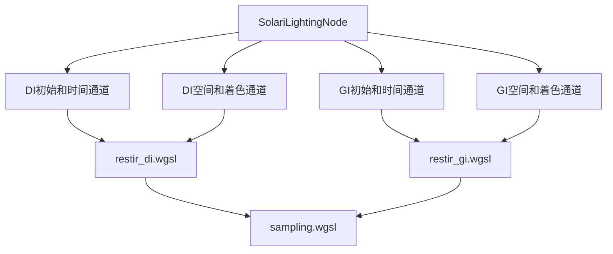

+++
title = "#20020 Solari initial GI"
date = "2025-07-13T00:00:00"
draft = false
template = "pull_request_page.html"
in_search_index = false

[extra]
current_language = "zh-cn"
available_languages = {"en" = { name = "English", url = "/pull_request/bevy/2025-07/pr-20020-en-20250713" }, "zh-cn" = { name = "中文", url = "/pull_request/bevy/2025-07/pr-20020-zh-cn-20250713" }}
+++

# Solari initial GI

## 基本信息
- **标题**: Solari initial GI
- **PR链接**: https://github.com/bevyengine/bevy/pull/20020
- **作者**: JMS55
- **状态**: MERGED
- **标签**: C-Feature, A-Rendering, S-Ready-For-Final-Review, M-Needs-Release-Note
- **创建时间**: 2025-07-07T20:59:24Z
- **合并时间**: 2025-07-13T17:42:51Z
- **合并者**: alice-i-cecile

## 描述翻译
### 目标
- 添加单次反射的RT GI

### 解决方案
- 实现了一个非常基础的ReSTIR GI版本 https://d1qx31qr3h6wln.cloudfront.net/publications/ReSTIR%20GI.pdf
- 基本上是ReSTIR DI代码的调整，用于GI
- 没有实现更多的空间采样，也没有做任何提高质量的改进
- 尚未尝试优化性能（实际上它比DI更快 😅）
- 没有花时间清理DI/GI之间的共享抽象

---

### 展示


## 这个Pull Request的故事

### 问题背景
Bevy的Solari光线追踪模块需要添加全局光照(GI)功能。之前的实现只支持直接光照(DI)，缺乏全局光照能力会限制场景的真实感和光照准确性。ReSTIR GI算法是解决这个问题的合适选择，因为它能高效地复用光线样本，减少噪声。

### 解决方案选择
开发者选择了ReSTIR GI算法作为基础实现：
- 复用现有的ReSTIR DI实现框架
- 调整采样策略：从光源采样改为半球均匀采样
- 扩展Reservoir数据结构以存储额外的GI相关信息
- 添加新的计算管线处理GI的时空重采样

这种方法利用了现有DI实现的验证代码，快速实现了基本功能，但暂时牺牲了优化和代码抽象。

### 实现细节
#### 新增GI着色器
创建了`restir_gi.wgsl`文件实现核心GI逻辑：
- 初始采样：从表面点向半球发射光线，收集间接光照
- 时间重采样：复用前一帧的有效样本
- 空间重采样：从邻近像素收集样本
- 光照计算：合并样本并计算最终贡献

```wgsl
// 初始采样函数
fn generate_initial_reservoir(world_position: vec3<f32>, world_normal: vec3<f32>, rng: ptr<function, u32>) -> Reservoir {
    let ray_direction = sample_uniform_hemisphere(world_normal, rng);
    let ray_hit = trace_ray(world_position, ray_direction, RAY_T_MIN, RAY_T_MAX, RAY_FLAG_NONE);
    // ...解析命中点并计算光照贡献
}
```

#### 扩展渲染管线
在`node.rs`中：
- 添加了GI专用的计算管线
- 修改了绑定组以包含GI的存储缓冲区
- 在渲染流程中加入了GI处理阶段

```rust
// 在渲染流程中添加GI处理
pass.set_pipeline(gi_initial_and_temporal_pipeline);
pass.dispatch_workgroups(viewport.x.div_ceil(8), viewport.y.div_ceil(8), 1);

pass.set_pipeline(gi_spatial_and_shade_pipeline);
pass.dispatch_workgroups(viewport.x.div_ceil(8), viewport.y.div_ceil(8), 1);
```

#### 资源准备
在`prepare.rs`中：
- 创建了GI专用的存储缓冲区
- 修改了资源结构体以区分DI和GI资源
- 根据GI需求调整了缓冲区大小

```rust
// 创建GI缓冲区
let gi_reservoirs_a = render_device.create_buffer(&BufferDescriptor {
    label: Some("solari_lighting_gi_reservoirs_a"),
    size: (view_size.x * view_size.y) as u64 * GI_RESERVOIR_STRUCT_SIZE,
    usage: BufferUsages::STORAGE,
    mapped_at_creation: false,
});
```

#### DI改进
在`restir_di.wgsl`中：
- 增加了重置标志处理
- 改进了时间重投影的边界检查
- 添加了更详细的注释说明逻辑

```wgsl
// 改进的时间重投影检查
if any(temporal_pixel_id_float < vec2(0.0)) || 
   any(temporal_pixel_id_float >= view.viewport.zw) || 
   bool(constants.reset) {
    return empty_reservoir();
}
```

### 技术挑战
1. **数据结构差异**：GI需要存储更多信息（命中点位置、法线等），导致Reservoir结构从32字节增加到48字节
2. **采样策略变化**：用半球均匀采样替代光源采样
3. **权重计算**：引入雅可比行列式校正空间重采样权重
4. **资源管理**：需要创建和维护额外的GPU缓冲区

### 影响与未来工作
这个PR为Bevy添加了基础的实时全局光照能力：
- 实现了单次反射的间接光照
- 与现有DI实现协同工作
- 性能意外地优于DI实现（需要进一步分析原因）

待改进领域：
- 增加更多空间采样提升质量
- 优化性能（特别是内存带宽使用）
- 重构共享DI/GI抽象
- 支持高光全局光照

## 可视化组件关系


## 关键文件变更

1. **`crates/bevy_solari/src/realtime/restir_gi.wgsl`** (新增)
   - 实现ReSTIR GI的核心逻辑
   - 添加GI专用的Reservoir结构（48字节）
   - 实现初始采样、时空重采样和着色逻辑

```wgsl
// GI Reservoir结构
struct Reservoir {
    sample_point_world_position: vec3<f32>,
    weight_sum: f32,
    radiance: vec3<f32>,
    confidence_weight: f32,
    sample_point_world_normal: vec3<f32>,
    unbiased_contribution_weight: f32,
}
```

2. **`crates/bevy_solari/src/realtime/node.rs`**
   - 添加GI计算管线
   - 扩展绑定组以包含GI资源
   - 在渲染流程中集成GI处理

```rust
// 添加GI管线
let gi_initial_and_temporal_pipeline = pipeline_cache.queue_compute_pipeline(
    ComputePipelineDescriptor {
        label: Some("solari_lighting_gi_initial_and_temporal_pipeline".into()),
        shader: load_embedded_asset!(world, "restir_gi.wgsl"),
        // ...
    });
```

3. **`crates/bevy_solari/src/realtime/prepare.rs`**
   - 创建GI专用存储缓冲区
   - 修改资源结构体区分DI/GI资源

```rust
// 资源结构体更新
pub struct SolariLightingResources {
    pub di_reservoirs_a: Buffer,
    pub di_reservoirs_b: Buffer,
    pub gi_reservoirs_a: Buffer,
    pub gi_reservoirs_b: Buffer,
    // ...
}
```

4. **`crates/bevy_solari/src/realtime/restir_di.wgsl`**
   - 改进时间重投影逻辑
   - 添加重置标志处理
   - 增加代码注释

```wgsl
// 添加重置检查
if ... || bool(constants.reset) {
    return empty_reservoir();
}
```

5. **`crates/bevy_solari/src/scene/sampling.wgsl`**
   - 添加半球均匀采样函数
   - 扩展光照采样返回结构
   - 添加点对点可见性检测

```wgsl
// 半球均匀采样
fn sample_uniform_hemisphere(normal: vec3<f32>, rng: ptr<function, u32>) -> vec3<f32> {
    let cos_theta = rand_f(rng);
    let phi = PI_2 * rand_f(rng);
    // ...
}
```

## 延伸阅读
1. [ReSTIR GI原始论文](https://d1qx31qr3h6wln.cloudfront.net/publications/ReSTIR%20GI.pdf) - 算法理论基础
2. [ReSTIR课程笔记](https://intro-to-restir.cwyman.org/presentations/2023ReSTIR_Course_Notes.pdf) - 实用实现指南
3. [Bevy Solari示例](https://github.com/bevyengine/bevy/tree/main/examples/3d/solari) - 实际使用案例
4. [全局光照技术概览](https://developer.nvidia.com/rtx/global-illumination) - 不同GI技术比较