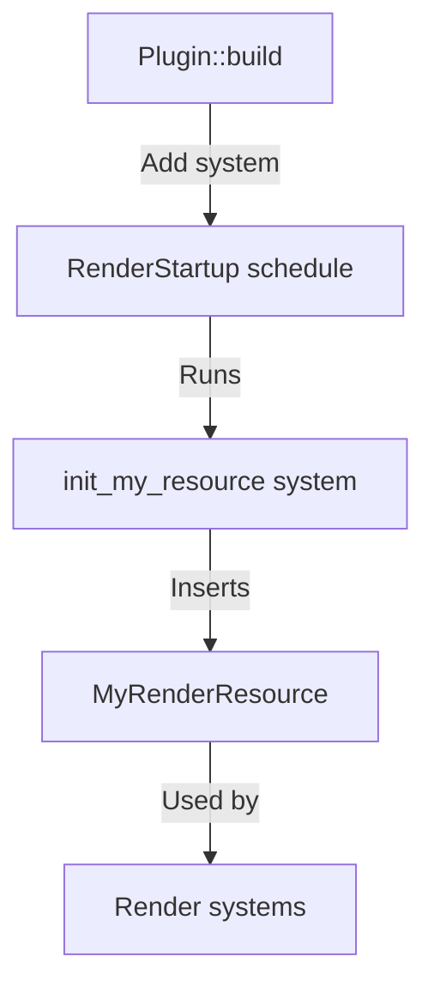

+++
title = "#20024 Add release notes and a migration guide for `RenderStartup`."
date = "2025-07-10T00:00:00"
draft = false
template = "pull_request_page.html"
in_search_index = true

[taxonomies]
list_display = ["show"]

[extra]
current_language = "en"
available_languages = {"en" = { name = "English", url = "/pull_request/bevy/2025-07/pr-20024-en-20250710" }, "zh-cn" = { name = "中文", url = "/pull_request/bevy/2025-07/pr-20024-zh-cn-20250710" }}
labels = ["C-Docs", "D-Trivial", "A-Rendering"]
+++

## Title  
Add release notes and a migration guide for `RenderStartup`

## Basic Information  
- **Title**: Add release notes and a migration guide for `RenderStartup`.  
- **PR Link**: https://github.com/bevyengine/bevy/pull/20024  
- **Author**: andriyDev  
- **Status**: MERGED  
- **Labels**: C-Docs, D-Trivial, A-Rendering, S-Ready-For-Final-Review, M-Needs-Migration-Guide, M-Needs-Release-Note  
- **Created**: 2025-07-08T06:25:03Z  
- **Merged**: 2025-07-10T00:00:28Z  
- **Merged By**: alice-i-cecile  

## Description Translation  
# Objective  

- Document #19887 changes.  

## Solution  

- Just some writing for Mwriting Monday!  

## The Story of This Pull Request  

The PR addresses a documentation gap for architectural changes introduced in #19887 and related PRs. Previously, Bevy's renderer initialization used non-standard patterns compared to typical ECS workflows. Resources like `UiPipeline` or `TaaPipeline` were initialized during `Plugin::finish` using `FromWorld` implementations. This approach diverged from Bevy's standard system-based initialization, creating inconsistency and raising barriers for new contributors.  

To resolve this, #19887 introduced the `RenderStartup` schedule. This allows render resources to be initialized via standard systems instead of `FromWorld`, aligning renderer initialization with core ECS patterns. This PR provides essential documentation to help users adapt to these changes.  

The migration guide explains concrete steps to convert render resource initialization. Previously, resources were defined with `FromWorld` implementations and initialized in `Plugin::finish`:  

```rust
impl Plugin for MyRenderingPlugin {
    fn finish(&self, app: &mut App) {
        let render_app = app.get_sub_app_mut(RenderApp).unwrap();
        render_app.init_resource::<MyRenderResource>();
    }
}

impl FromWorld for MyRenderResource {
    fn from_world(world: &mut World) -> Self {
        let render_device = world.resource::<RenderDevice>();
        MyRenderResource { /* ... */ }
    }
}
```  

Now, initialization moves to a standard system added to `RenderStartup`:  

```rust
impl Plugin for MyRenderingPlugin {
    fn build(&self, app: &mut App) {
        let render_app = app.get_sub_app_mut(RenderApp).unwrap();
        render_app.add_systems(RenderStartup, init_my_resource);
    }
}

fn init_my_resource(mut commands: Commands, render_device: Res<RenderDevice>) {
    commands.insert_resource(MyRenderResource { /* ... */ });
}
```  

Key technical considerations during migration:  
1. Resource dependencies are explicitly declared via system parameters instead of implicit `world.resource()` calls  
2. `load_embedded_asset` calls require an `AssetServer` reference instead of `&World`  
3. Resource initialization ordering is enforced using `.after()` constraints when dependencies exist between render resources  

The release notes emphasize why this change matters: it eliminates special-case rendering patterns, allows explicit initialization ordering, and makes dependencies visible through system parameters. This reduces cognitive load for developers extending the renderer.  

The documentation also lists affected resources (`UiPipeline`, `FxaaPipeline`, etc.), helping users identify required migrations. The consistent system-based approach encourages abandoning `Plugin::finish` entirely in favor of `Plugin::build`.  

## Visual Representation  



## Key Files Changed  

### `release-content/migration-guides/render_startup.md` (+116/-0)  
Provides step-by-step migration instructions for render resources affected by the `RenderStartup` changes. Includes concrete code examples showing the conversion from `FromWorld` to initialization systems.  

**Key snippet**:  
```markdown
// Before: FromWorld implementation
impl FromWorld for MyRenderResource {
    fn from_world(world: &mut World) -> Self {
        let render_device = world.resource::<RenderDevice>();
        MyRenderResource { ... }
    }
}

// After: System-based initialization
fn init_my_resource(
    mut commands: Commands,
    render_device: Res<RenderDevice>,
) {
    commands.insert_resource(MyRenderResource { ... });
}
```

### `release-content/release-notes/render_startup.md` (+103/-0)  
Explains the motivation and benefits of moving render resource initialization to `RenderStartup`. Compares old and new patterns through code examples.  

**Key snippet**:  
```markdown
// Before: finish-based initialization
fn finish(&self, app: &mut App) {
    render_app.init_resource::<MyRenderResource>();
}

// After: build-based initialization
fn build(&self, app: &mut App) {
    render_app.add_systems(RenderStartup, init_my_resource);
}
```

## Further Reading  
- [Original RenderStartup implementation PR (#19887)](https://github.com/bevyengine/bevy/pull/19887)  
- [Bevy ECS System Params documentation](https://docs.rs/bevy-ecs/latest/bevy_ecs/system/trait.SystemParam.html)  
- [Plugin API documentation](https://docs.rs/bevy-app/latest/bevy_app/trait.Plugin.html)  

## Full Code Diff  
```diff
diff --git a/release-content/migration-guides/render_startup.md b/release-content/migration-guides/render_startup.md
new file mode 100644
index 0000000000000..c1f20f78b3b3d
--- /dev/null
+++ b/release-content/migration-guides/render_startup.md
@@ -0,0 +1,116 @@
+---
+title: Many render resources now initialized in `RenderStartup`
+pull_requests: [19841, 19926, 19885, 19886, 19897, 19898, 19901]
+---
+
+Many render resources are **no longer present** during `Plugin::finish`. Instead they are
+initialized during `RenderStartup` (which occurs once the app starts running). If you only access
+the resource during the `Render` schedule, then there should be no change. However, if you need one
+of these render resources to initialize your own resource, you will need to convert your resource
+initialization into a system.
+
+The following are the (public) resources that are now initialized in `RenderStartup`.
+
+- `CasPipeline`
+- `FxaaPipeline`
+- `SmaaPipelines`
+- `TaaPipeline`
+- `BoxShadowPipeline`
+- `GradientPipeline`
+- `UiPipeline`
+- `UiMaterialPipeline<M>`
+- `UiTextureSlicePipeline`
+
+The vast majority of cases for initializing render resources look like so (in Bevy 0.16):
+
+```rust
+impl Plugin for MyRenderingPlugin {
+    fn build(&self, app: &mut App) {
+        // Do nothing??
+    }
+
+    fn finish(&self, app: &mut App) {
+        let Some(render_app) = app.get_sub_app_mut(RenderApp) else {
+            return;
+        };
+
+        render_app.init_resource::<MyRenderResource>();
+        render_app.add_systems(Render, my_render_system);
+    }
+}
+
+pub struct MyRenderResource {
+    ...
+}
+
+impl FromWorld for MyRenderResource {
+    fn from_world(world: &mut World) -> Self {
+        let render_device = world.resource::<RenderDevice>();
+        let render_adapter = world.resource::<RenderAdapter>();
+        let asset_server = world.resource::<AssetServer>();
+
+        MyRenderResource {
+            ...
+        }
+    }
+}
+```
+
+The two main things to focus on are:
+
+1. The resource implements the `FromWorld` trait which collects all its dependent resources (most
+    commonly, `RenderDevice`), and then creates an instance of the resource.
+2. The plugin adds its systems and resources in `Plugin::finish`.
+
+First, we need to rewrite our `FromWorld` implementation as a system. This generally means
+converting calls to `World::resource` into system params, and then using `Commands` to insert the
+resource. In the above case, that would look like:
+
+```rust
+// Just a regular old system!!
+fn init_my_resource(
+    mut commands: Commands,
+    render_device: Res<RenderDevice>,
+    render_adapter: Res<RenderAdapter>,
+    asset_server: Res<AssetServer>,
+) {
+    commands.insert_resource(MyRenderResource {
+        ...
+    });
+}
+```
+
+Each case will be slightly different. Two notes to be wary of:
+
+1. Functions that accept `&RenderDevice` for example may no longer compile after switching to
+    `Res<RenderDevice>`. This can be resolved by passing `&render_device` instead of
+    `render_device`.
+2. If you are using `load_embedded_asset(world, "my_asset.png")`, you may need to first add
+    `asset_server` as a system param, then change this to
+    `load_embedded_asset(asset_server.as_ref(), "my_asset.png")`.
+
+Now that we have our initialization system, we just need to add the system to `RenderStartup`:
+
+```rust
+impl Plugin for MyRenderingPlugin {
+    fn build(&self, app: &mut App) {
+        let Some(render_app) = app.get_sub_app_mut(RenderApp) else {
+            return;
+        };
+
+        render_app
+            .add_systems(RenderStartup, init_my_resource)
+            .add_systems(Render, my_render_system);
+    }
+
+    // No more finish!!
+}
+```
+
+In addition, if your resource requires one of the affected systems above, you will need to use
+system ordering to ensure your resource initializes after the other system. For example, if your
+system uses `Res<UiPipeline>`, you will need to add an ordering like:
+
+```rust
+render_app.add_systems(RenderStartup, init_my_resource.after(init_ui_pipeline));
+```
diff --git a/release-content/release-notes/render_startup.md b/release-content/release-notes/render_startup.md
new file mode 100644
index 0000000000000..a97c68393da1c
--- /dev/null
+++ b/release-content/release-notes/render_startup.md
@@ -0,0 +1,103 @@
+---
+title: `RenderStartup` and making the renderer my ECS-y
+authors: ["@IceSentry", "@andriyDev"]
+pull_requests: [19841, 19926, 19885, 19886, 19897, 19898, 19901]
+---
+
+Previous rendering code looked quite different from other Bevy code. In general, resources were
+initialized with the `FromWorld` trait (where most Bevy code only uses the `Default` trait for most
+resources) and systems/resources were added in `Plugin::finish` (where nearly all Bevy code does not
+use `Plugin::finish` at all). This difference with Bevy code can make it harder for new developers
+to learn rendering, and can result in "cargo cult" copying of rendering code (e.g., "is it important
+to be using `FromWorld` here? Better to be safe and just do what the rendering code is doing!").
+
+As a step towards making the renderer more accessible (and maintainable), we have introduced the
+`RenderStartup` schedule and ported many rendering resources to be initialized in `RenderStartup`
+with systems! This has several benefits:
+
+1. Creating resources in systems makes it clearer that rendering resources **are just regular
+    resources**. Hopefully, this better communicates that how you initialize these resources is
+    totally up to you!
+2. We can now use the system ordering API to ensure that resources are initialized in the correct
+    order. For example, we can do `init_material_pipeline.after(init_mesh_pipeline)` if we need the
+    mesh pipeline to initialize the material pipeline.
+3. These initialization systems clearly describe what resources they require through their argument
+    list. If a system has an argument of `deferred_lighting_layout: Res<DeferredLightingLayout>`, it
+    clearly documents that this system needs to be run **after** we initialize the
+    `DeferredLightingLayout`.
+
+We want developers to become more familiar and comfortable with Bevy's rendering stack, and hope
+that bringing the renderer closer to regular ECS code will encourage that. Code that previously looked
+like this (in Bevy 0.16):
+
+```rust
+impl Plugin for MyRenderingPlugin {
+    fn build(&self, app: &mut App) {
+        // Do nothing??
+    }
+
+    fn finish(&self, app: &mut App) {
+        let Some(render_app) = app.get_sub_app_mut(RenderApp) else {
+            return;
+        };
+
+        render_app.init_resource::<MyRenderResource>();
+    }
+}
+
+pub struct MyRenderResource {
+    ...
+}
+
+impl FromWorld for MyRenderResource {
+    fn from_world(world: &mut World) -> Self {
+        let render_device = world.resource::<RenderDevice>();
+        let render_adapter = world.resource::<RenderAdapter>();
+        let asset_server = world.resource::<AssetServer>();
+
+        MyRenderResource {
+            ...
+        }
+    }
+}
+```
+
+Can now be written like:
+
+```rust
+impl Plugin for MyRenderingPlugin {
+    fn build(&self, app: &mut App) {
+        let Some(render_app) = app.get_sub_app_mut(RenderApp) else {
+            return;
+        };
+
+        render_app.add_systems(RenderStartup, init_my_resource);
+    }
+
+    // No more finish!!
+}
+
+pub struct MyRenderResource {
+    ...
+}
+
+// Just a regular old system!!
+fn init_my_resource(
+    mut commands: Commands,
+    render_device: Res<RenderDevice>,
+    render_adapter: Res<RenderAdapter>,
+    asset_server: Res<AssetServer>,
+) {
+    commands.insert_resource(MyRenderResource {
+        ...
+    });
+}
+```
+
+We highly encourage users to port their own rendering resources to this new system approach (and for
+resources whose initialization depends on a Bevy core resource, it may be required). In fact, we
+encourage users to abandon `Plugin::finish` entirely and move all their system and resource
+initializations for rendering into `Plugin::build` instead.
+
+As stated before, we've ported many resources to be initialized in `RenderStartup`. See the
+migration guide for a full list of affected resources.
```