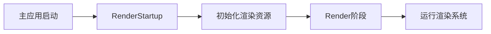

+++
title = "#20024 Add release notes and a migration guide for `RenderStartup`."
date = "2025-07-10T00:00:00"
draft = false
template = "pull_request_page.html"
in_search_index = false

[extra]
current_language = "zh-cn"
available_languages = {"en" = { name = "English", url = "/pull_request/bevy/2025-07/pr-20024-en-20250710" }, "zh-cn" = { name = "中文", url = "/pull_request/bevy/2025-07/pr-20024-zh-cn-20250710" }}
+++

# 分析报告：PR #20024 - 为`RenderStartup`添加发布说明和迁移指南

## 基本信息
- **标题**: Add release notes and a migration guide for `RenderStartup`.
- **PR链接**: https://github.com/bevyengine/bevy/pull/20024
- **作者**: andriyDev
- **状态**: 已合并
- **标签**: C-Docs, D-Trivial, A-Rendering, S-Ready-For-Final-Review, M-Needs-Migration-Guide, M-Needs-Release-Note
- **创建时间**: 2025-07-08T06:25:03Z
- **合并时间**: 2025-07-10T00:00:28Z
- **合并人**: alice-i-cecile

## 描述翻译
```markdown
# 目标

- 为 #19887 的变更编写文档。

## 解决方案

- 只是为"写作星期一"(Mwriting Monday)写点东西！
```

## 这个Pull Request的故事

### 问题背景
在Bevy 0.16版本中，渲染资源的初始化方式与引擎其他部分存在显著差异。渲染资源通常通过`Plugin::finish`方法添加，并使用`FromWorld` trait进行初始化，而常规ECS代码则直接在`Plugin::build`中添加系统和资源。这种不一致性导致几个问题：
1. 新开发者学习渲染代码的难度增加
2. 资源初始化顺序难以管理
3. 开发者可能错误地复制渲染代码模式到非渲染场景
4. `Plugin::finish`的使用增加了代码复杂度

PR #19887通过引入`RenderStartup`计划解决了这些问题，但需要相应的文档帮助用户迁移代码。

### 解决方案方法
本次PR采用直接的文档解决方案：
1. 创建迁移指南，详细说明如何从旧模式迁移到新系统
2. 编写发布说明，解释变更动机和好处
3. 提供具体的代码迁移示例
4. 列出所有受影响的渲染资源

文档重点强调模式转换：将`FromWorld`实现改为常规系统，并在`Plugin::build`中添加这些系统到`RenderStartup`计划。

### 实现细节
迁移指南的核心是展示如何将`FromWorld`实现转换为系统函数。关键变化包括：
1. 将`world.resource()`调用替换为系统参数
2. 使用`Commands`插入资源而非直接返回
3. 在`Plugin::build`而非`Plugin::finish`中添加系统

```rust
// 旧方法 (Bevy 0.16)
impl FromWorld for MyRenderResource {
    fn from_world(world: &mut World) -> Self {
        let render_device = world.resource::<RenderDevice>();
        MyRenderResource { ... }
    }
}

// 新方法
fn init_my_resource(
    mut commands: Commands,
    render_device: Res<RenderDevice>,  // 通过系统参数注入
) {
    commands.insert_resource(MyRenderResource { ... });
}
```

对于资源依赖，文档建议使用系统排序：
```rust
render_app.add_systems(RenderStartup, init_my_resource.after(init_ui_pipeline));
```

### 技术见解
1. **显式依赖声明**：系统参数清晰表达了资源依赖关系
2. **初始化顺序控制**：系统排序API解决了资源初始化顺序问题
3. **API统一**：渲染资源现在与常规ECS资源使用相同初始化模式
4. **简化插件结构**：完全移除`Plugin::finish`的使用

### 影响
1. **降低学习曲线**：新开发者不需要学习特殊的渲染初始化模式
2. **减少错误**：明确的依赖声明减少了初始化顺序问题
3. **代码一致性**：渲染代码模式与常规ECS代码保持一致
4. **迁移要求**：依赖渲染资源初始化自定义资源的插件需要迁移

## 视觉表示


## 关键文件变更

### 1. `release-content/migration-guides/render_startup.md`
**目的**：提供从旧模式迁移到`RenderStartup`的详细指南  
**关键内容**：
```markdown
## 迁移步骤
旧版代码 (Bevy 0.16)：
```rust
impl Plugin for MyRenderingPlugin {
    fn finish(&self, app: &mut App) {
        render_app.init_resource::<MyRenderResource>();
    }
}

impl FromWorld for MyRenderResource { /* ... */ }
```

新版代码：
```rust
impl Plugin for MyRenderingPlugin {
    fn build(&self, app: &mut App) {
        render_app.add_systems(RenderStartup, init_my_resource);
    }
}

fn init_my_resource(commands: Commands, /* 依赖资源 */) {
    commands.insert_resource(MyRenderResource::new(/* ... */));
}
```

### 2. `release-content/release-notes/render_startup.md`
**目的**：解释变更背景、好处和鼓励最佳实践  
**关键内容**：
```markdown
## 动机
渲染代码与常规ECS不一致 -> 增加学习难度

## 解决方案
引入`RenderStartup`，用系统初始化资源

## 好处
1. 资源即普通资源（不再特殊）
2. 系统排序管理初始化顺序
3. 依赖关系通过系统参数显式声明
```

## 延伸阅读
1. [Bevy ECS 文档](https://bevyengine.org/learn/book/ecs) - 理解系统、资源和计划
2. PR #19887 - 实现`RenderStartup`的核心变更
3. [Bevy 渲染架构](https://github.com/bevyengine/bevy/blob/main/docs/plugins_guidelines.md) - 插件开发指南