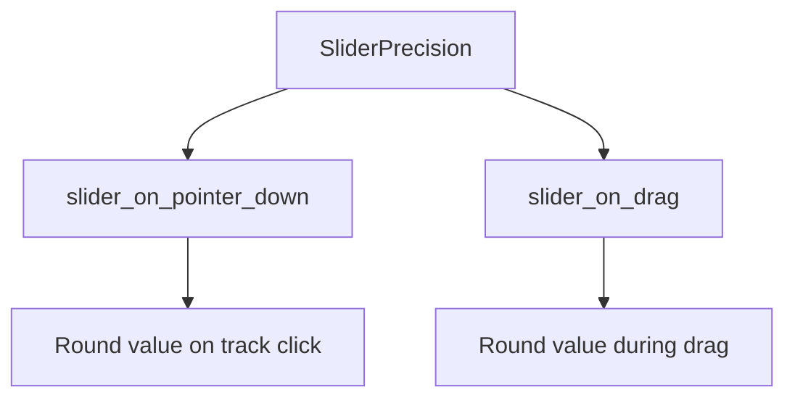

+++
title = "#20032 SliderPrecision component"
date = "2025-07-09T00:00:00"
draft = false
template = "pull_request_page.html"
in_search_index = true

[taxonomies]
list_display = ["show"]

[extra]
current_language = "en"
available_languages = {"en" = { name = "English", url = "/pull_request/bevy/2025-07/pr-20032-en-20250709" }, "zh-cn" = { name = "中文", url = "/pull_request/bevy/2025-07/pr-20032-zh-cn-20250709" }}
labels = ["C-Feature", "A-UI", "D-Modest"]
+++

# SliderPrecision component

## Basic Information
- **Title**: SliderPrecision component
- **PR Link**: https://github.com/bevyengine/bevy/pull/20032
- **Author**: viridia
- **Status**: MERGED
- **Labels**: C-Feature, A-UI, S-Ready-For-Final-Review, X-Uncontroversial, D-Modest
- **Created**: 2025-07-08T16:37:29Z
- **Merged**: 2025-07-09T20:26:38Z
- **Merged By**: alice-i-cecile

## Description Translation
This PR adds a `SliderPrecision` component that lets you control the rounding when dragging a slider.

Part of #19236 

## The Story of This Pull Request

The slider widgets in Bevy's UI system lacked control over value precision during user interaction. When users dragged a slider thumb or clicked on the track, the calculated value would often have excessive decimal places that weren't meaningful for the specific use case. This was particularly problematic for sliders controlling discrete values or values requiring specific precision levels.

To address this, the PR introduces a new `SliderPrecision` component. This component allows developers to specify the rounding behavior during slider interactions. The implementation approach was straightforward: add a new component that stores the desired precision level as an integer representing decimal places, then apply rounding in the slider's interaction systems.

The precision is implemented using a rounding function that operates based on powers of 10. The component's integer value determines the rounding factor:
- Positive values round to decimal places (e.g., 2 rounds to hundredths)
- Zero rounds to integers
- Negative values round to powers of ten (e.g., -1 rounds to tens)

The component was designed to be optional and backward compatible. When present, it modifies the slider's value calculation during two interaction points:
1. Track clicks (when clicking outside the thumb)
2. Thumb dragging

The rounding is applied after calculating the raw value but before clamping to the slider's range and before triggering any value change callbacks. This ensures the final value respects both the precision setting and the valid range.

Performance impact is minimal since the rounding operation is a simple mathematical calculation applied only during user interactions. The component was added to the existing slider systems with minimal disruption to the existing logic.

This change provides more control over slider behavior without breaking existing functionality. Developers can now ensure slider values align with their application's precision requirements during direct manipulation.

## Visual Representation



## Key Files Changed

1. `crates/bevy_core_widgets/src/core_slider.rs` (+69/-8)
   - Added `SliderPrecision` component and rounding logic
   - Modified interaction systems to use precision
   - Added unit tests for rounding behavior

```rust
// Before (track click handling):
TrackClick::Snap => click_val,

// After (with precision rounding):
TrackClick::Snap => precision
    .map(|prec| prec.round(click_val))
    .unwrap_or(click_val),
```

```rust
// Before (drag handling):
let new_value = ...;
commands.notify_with(&slider.on_change, new_value);

// After (with precision rounding):
let rounded_value = range.clamp(
    precision
        .map(|prec| prec.round(new_value))
        .unwrap_or(new_value),
);
commands.notify_with(&slider.on_change, rounded_value);
```

```rust
// New component definition:
#[derive(Component, Debug, Default, Clone, Copy)]
pub struct SliderPrecision(pub i32);

impl SliderPrecision {
    fn round(&self, value: f32) -> f32 {
        let factor = ops::powf(10.0_f32, self.0 as f32);
        (value * factor).round() / factor
    }
}
```

2. `examples/ui/feathers.rs` (+4/-2)
   - Updated example to demonstrate precision usage

```rust
// Before:
SliderStep(10.)

// After:
(SliderStep(10.), SliderPrecision(2)),
```

3. `crates/bevy_core_widgets/src/lib.rs` (+1/-1)
   - Exported new component for public use

```rust
// Before:
pub use core_slider::{ ... SliderStep, SliderValue ... };

// After:
pub use core_slider::{ ... SliderPrecision, SliderStep, SliderValue ... };
```

4. `release-content/release-notes/headless-widgets.md` (+1/-1)
   - Added PR to release notes

```markdown
// Before:
pull_requests: [19366, 19584, 19665, 19778, 19803, 20036]

// After:
pull_requests: [19366, 19584, 19665, 19778, 19803, 20032, 20036]
```

## Further Reading
1. [Bevy UI System Documentation](https://docs.rs/bevy_ui/latest/bevy_ui/)
2. [Floating-Point Precision Concepts](https://en.wikipedia.org/wiki/Floating-point_arithmetic#Precision_limitations)
3. [Slider Widget Design Patterns](https://material.io/components/sliders)