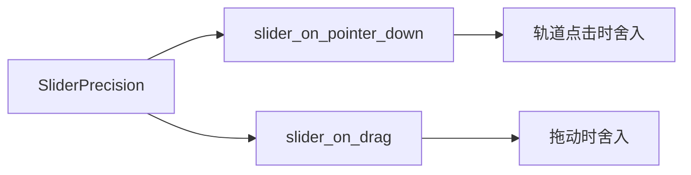

+++
title = "#20032 SliderPrecision component"
date = "2025-07-09T00:00:00"
draft = false
template = "pull_request_page.html"
in_search_index = false

[extra]
current_language = "zh-cn"
available_languages = {"en" = { name = "English", url = "/pull_request/bevy/2025-07/pr-20032-en-20250709" }, "zh-cn" = { name = "中文", url = "/pull_request/bevy/2025-07/pr-20032-zh-cn-20250709" }}
+++

# SliderPrecision component

## 基本资料
- **标题**: SliderPrecision component
- **PR链接**: https://github.com/bevyengine/bevy/pull/20032
- **作者**: viridia
- **状态**: 已合并
- **标签**: C-Feature, A-UI, S-Ready-For-Final-Review, X-Uncontroversial, D-Modest
- **创建时间**: 2025-07-08T16:37:29Z
- **合并时间**: 2025-07-09T20:26:38Z
- **合并者**: alice-i-cecile

## 描述翻译
这个PR添加了一个`SliderPrecision`组件，用于在拖动滑块时控制数值的舍入。

属于#19236的一部分

## 这个PR的故事

### 问题和背景
在Bevy的UI系统中，滑块(slider)组件允许用户通过拖动滑块来调整数值。然而，现有的实现存在一个限制：在拖动过程中，数值的变化是连续的，没有提供舍入(rounding)控制。这导致在某些场景下，滑块的值会出现不需要的小数部分。例如，即使设置了步进(step)为10，在拖动过程中仍然可能产生非整数值（如12.345），这不符合某些应用场景的需求。

该问题在issue #19236中被提出，需要一种机制来控制滑块在拖动过程中的数值精度。核心需求是：在拖动滑块时，能够将数值舍入到指定的精度（例如，保留两位小数或舍入到最近的整数）。

### 解决方案
为了解决这个问题，我们引入了新的组件`SliderPrecision`。该组件允许用户指定一个精度值（整数），表示要保留的小数位数（正数）或舍入的位数（负数）。例如：
- 精度值2表示舍入到百分位（0.01）
- 精度值0表示舍入到整数
- 精度值-1表示舍入到十位

该组件的核心方法是`round`，它根据精度对输入值进行四舍五入：
```rust
fn round(&self, value: f32) -> f32 {
    let factor = ops::powf(10.0_f32, self.0 as f32);
    (value * factor).round() / factor
}
```

### 实现细节
实现主要集中在两个地方：处理轨道点击(track click)和处理拖动(drag)事件。

在`slider_on_pointer_down`系统中（处理轨道点击），我们修改了当用户点击滑块轨道时的数值计算逻辑：
```rust
// 修改前
TrackClick::Snap => click_val,

// 修改后
TrackClick::Snap => precision
    .map(|prec| prec.round(click_val))
    .unwrap_or(click_val),
```

在`slider_on_drag`系统中（处理拖动事件），我们在计算新值后添加了舍入步骤：
```rust
// 修改前
let new_value = ...;
range.clamp(new_value)

// 修改后
let new_value = ...; // 计算原始值
let rounded_value = range.clamp(
    precision
        .map(|prec| prec.round(new_value))
        .unwrap_or(new_value)
);
```

### 设计考虑
1. **向后兼容**：`SliderPrecision`是可选组件，不影响现有代码。未添加该组件的滑块行为保持不变。
2. **精度与步进的关系**：精度控制拖动时的舍入，步进控制键盘调整时的增量。两者可以独立使用。
3. **测试覆盖**：添加了单元测试验证不同精度下的舍入行为：
```rust
#[test]
fn test_slider_precision_rounding() {
    // 测试正精度（小数位）
    let precision_2dp = SliderPrecision(2);
    assert_eq!(precision_2dp.round(1.234567), 1.23);
    assert_eq!(precision_2dp.round(1.235), 1.24);

    // 测试零精度（舍入到整数）
    let precision_0dp = SliderPrecision(0);
    assert_eq!(precision_0dp.round(1.4), 1.0);

    // 测试负精度（舍入到十位）
    let precision_neg1 = SliderPrecision(-1);
    assert_eq!(precision_neg1.round(14.0), 10.0);
}
```

### 影响和整合
1. **示例更新**：在`feathers.rs`示例中演示了如何使用新组件：
```rust
// 修改前
SliderStep(10.)

// 修改后
(SliderStep(10.), SliderPrecision(2))
```
2. **API导出**：在lib.rs中导出新组件，使其在外部可用：
```rust
pub use core_slider::{
    ...,
    SliderPrecision, // 新增
    ...
};
```
3. **发布说明**：将本PR添加到headless-widgets的发布说明中

## 视觉表示


## 关键文件变更

### 1. `crates/bevy_core_widgets/src/core_slider.rs` (+69/-8)
添加了SliderPrecision组件并修改了相关逻辑：
```rust
// 新增组件定义
#[derive(Component, Debug, Default, Clone, Copy)]
pub struct SliderPrecision(pub i32);

impl SliderPrecision {
    fn round(&self, value: f32) -> f32 {
        let factor = ops::powf(10.0_f32, self.0 as f32);
        (value * factor).round() / factor
    }
}

// 在slider_on_pointer_down中应用精度
TrackClick::Snap => precision
    .map(|prec| prec.round(click_val))
    .unwrap_or(click_val),

// 在slider_on_drag中应用精度
let rounded_value = range.clamp(
    precision
        .map(|prec| prec.round(new_value))
        .unwrap_or(new_value)
);

// 添加单元测试
#[cfg(test)]
mod tests {
    // ... 测试代码 ...
}
```

### 2. `examples/ui/feathers.rs` (+4/-2)
在示例中演示如何使用：
```rust
// 修改前
SliderStep(10.)

// 修改后
(SliderStep(10.), SliderPrecision(2))
```

### 3. `crates/bevy_core_widgets/src/lib.rs` (+1/-1)
导出新组件：
```rust
// 修改前
pub use core_slider::{..., SliderStep, ...};

// 修改后
pub use core_slider::{..., SliderPrecision, SliderStep, ...};
```

### 4. `release-content/release-notes/headless-widgets.md` (+1/-1)
更新发布说明：
```markdown
// 修改前
pull_requests: [19366, 19584, 19665, 19778, 19803, 20036]

// 修改后
pull_requests: [19366, 19584, 19665, 19778, 19803, 20032, 20036]
```

## 延伸阅读
1. [Bevy UI系统文档](https://bevyengine.org/learn/book/getting-started/ui/)
2. [原始PR讨论](https://github.com/bevyengine/bevy/pull/20032)
3. [相关Issue #19236](https://github.com/bevyengine/bevy/issues/19236)
4. [浮点数舍入方法](https://en.wikipedia.org/wiki/Rounding)