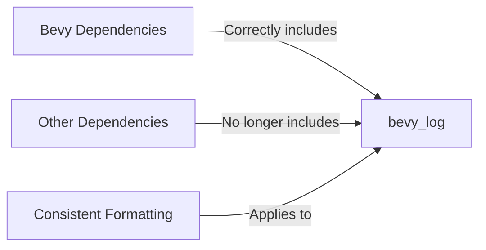

+++
title = "#20033 formatting fix in bevy_remote cargo.toml"
date = "2025-07-08T00:00:00"
draft = false
template = "pull_request_page.html"
in_search_index = true

[taxonomies]
list_display = ["show"]

[extra]
current_language = "en"
available_languages = {"en" = { name = "English", url = "/pull_request/bevy/2025-07/pr-20033-en-20250708" }, "zh-cn" = { name = "中文", url = "/pull_request/bevy/2025-07/pr-20033-zh-cn-20250708" }}
labels = ["D-Trivial", "C-Dependencies"]
+++

# Formatting Fix in bevy_remote Cargo.toml

## Basic Information
- **Title**: formatting fix in bevy_remote cargo.toml
- **PR Link**: https://github.com/bevyengine/bevy/pull/20033
- **Author**: mockersf
- **Status**: MERGED
- **Labels**: D-Trivial, C-Dependencies, S-Ready-For-Final-Review
- **Created**: 2025-07-08T16:45:45Z
- **Merged**: 2025-07-08T17:21:50Z
- **Merged By**: alice-i-cecile

## Description Translation
# Objective

- bevy_log is not "others". it's part of Bevy

## Solution

- Move it
- Also use the same format as other Bevy dependency (path first) as I use it in some regexes to run tests on the repo

## The Story of This Pull Request

The pull request addresses a minor but meaningful inconsistency in dependency management within Bevy's codebase. The core issue centered on how `bevy_log` was categorized and formatted in `bevy_remote`'s Cargo.toml file. 

`bevy_log` is an internal Bevy crate, but it was incorrectly grouped under the "# other" dependencies section alongside truly external crates like `anyhow` and `serde`. This misclassification created inconsistency in how Bevy's own components were organized. More importantly, the dependency specification format didn't match Bevy's standard convention: the `version` field appeared before `path`, whereas other Bevy dependencies consistently placed `path` first.

The developer encountered a practical problem with this inconsistency. Their automated testing workflow used regex patterns that expected the `path` attribute to appear first in Bevy dependency declarations. The existing formatting broke these patterns, making it harder to maintain and run tests efficiently. While not a runtime issue, this affected development workflows and violated consistency principles that help maintain large codebases.

The solution was straightforward but precise: 
1. Move `bevy_log` from the "other dependencies" section to the "Bevy dependencies" section
2. Reformat the dependency declaration to match Bevy's standard pattern with `path` preceding `version`

This change improved the file's organization by correctly categorizing `bevy_log` as an internal component rather than an external dependency. It also aligned the formatting with established conventions used throughout the codebase. The path-first format specifically resolved the author's regex-based tooling issue while creating visual consistency across dependency declarations.

The implementation required minimal changes—just two line modifications in a single file—but demonstrated good attention to detail in maintaining codebase hygiene. The change didn't affect runtime behavior or functionality, but improved maintainability by ensuring:
1. Logical grouping of dependencies
2. Consistent formatting patterns
3. Compatibility with existing development tooling

The rapid merge (within 36 minutes) indicates this was recognized as a clear improvement that aligned with project conventions without introducing any risk.

## Visual Representation



## Key Files Changed

### `crates/bevy_remote/Cargo.toml`
This file contained inconsistent dependency categorization and formatting. The changes:
1. Correctly categorize `bevy_log` as a Bevy dependency rather than external
2. Apply consistent path-first formatting to match other Bevy dependencies

**Key modifications:**
```toml
# Before:
# ... other dependencies ...
bevy_log = { version = "0.17.0-dev", path = "../bevy_log" }

# After:
bevy_log = { path = "../bevy_log", version = "0.17.0-dev" }
```

**Full context from diff:**
```diff
diff --git a/crates/bevy_remote/Cargo.toml b/crates/bevy_remote/Cargo.toml
index e7a40c65ba2a6..899ac8b846cad 100644
--- a/crates/bevy_remote/Cargo.toml
+++ b/crates/bevy_remote/Cargo.toml
@@ -30,6 +30,7 @@ bevy_platform = { path = "../bevy_platform", version = "0.17.0-dev", default-fea
   "serialize",
 ] }
 bevy_asset = { path = "../bevy_asset", version = "0.17.0-dev", optional = true }
+bevy_log = { path = "../bevy_log", version = "0.17.0-dev" }
 
 # other
 anyhow = "1"
@@ -38,7 +39,6 @@ serde = { version = "1", features = ["derive"] }
 serde_json = "1.0.140"
 http-body-util = "0.1"
 async-channel = "2"
-bevy_log = { version = "0.17.0-dev", path = "../bevy_log" }
 
 # dependencies that will not compile on wasm
 [target.'cfg(not(target_family = "wasm"))'.dependencies]
```

## Further Reading
1. [Cargo Specification Format](https://doc.rust-lang.org/cargo/reference/specifying-dependencies.html)
2. [Bevy's Contribution Guidelines](https://github.com/bevyengine/bevy/blob/main/CONTRIBUTING.md)
3. [Semantic Versioning in Rust](https://doc.rust-lang.org/cargo/reference/semver.html)
4. [Cargo Workspace Documentation](https://doc.rust-lang.org/cargo/reference/workspaces.html)