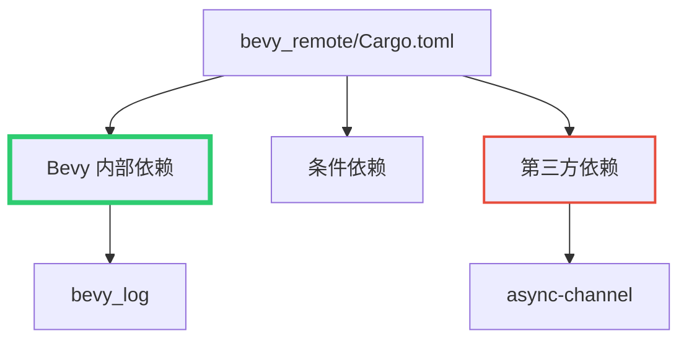

+++
title = "#20033 formatting fix in bevy_remote cargo.toml"
date = "2025-07-08T00:00:00"
draft = false
template = "pull_request_page.html"
in_search_index = false

[extra]
current_language = "zh-cn"
available_languages = {"en" = { name = "English", url = "/pull_request/bevy/2025-07/pr-20033-en-20250708" }, "zh-cn" = { name = "中文", url = "/pull_request/bevy/2025-07/pr-20033-zh-cn-20250708" }}
+++

## 格式化修复 bevy_remote Cargo.toml

### 基本信息
- **标题**: formatting fix in bevy_remote cargo.toml
- **PR链接**: https://github.com/bevyengine/bevy/pull/20033
- **作者**: mockersf
- **状态**: 已合并
- **标签**: D-Trivial, C-Dependencies, S-Ready-For-Final-Review
- **创建时间**: 2025-07-08T16:45:45Z
- **合并时间**: 2025-07-08T17:21:50Z
- **合并人**: alice-i-cecile

### 描述翻译
**目标**  
- bevy_log 不属于"其他"依赖，它是 Bevy 的一部分  

**解决方案**  
- 将其移动到正确位置  
- 使用与其他 Bevy 依赖相同的格式（路径优先），因为某些正则表达式依赖此格式执行仓库测试  

### PR 分析

#### 问题与背景
在 `bevy_remote` 的 Cargo.toml 文件中，`bevy_log` 被错误归类在 "other" 依赖部分。这导致两个问题：
1. 概念混淆：`bevy_log` 是 Bevy 核心库的一部分，不应与第三方依赖混为一谈
2. 工具兼容性：开发者使用正则表达式处理依赖时，依赖格式不一致会导致工具链失效

该问题属于依赖管理中的分类错误，虽然不影响编译，但会降低代码可维护性并可能破坏自动化工具。

#### 解决方案
解决方案采用最小化修改原则：
1. 将 `bevy_log` 移动到 Bevy 内部依赖区块
2. 统一依赖声明格式为 `path-first` 风格
3. 保持文件其他部分不变

决策依据：
- 与项目现有模式保持一致（所有 Bevy 内部 crate 均在同一区块声明）
- 遵循显式优于隐式原则（明确区分内部/外部依赖）
- 满足开发者工作流需求（正则匹配依赖格式）

#### 实现细节
关键修改在依赖声明位置和格式：
```toml
# 修改前
[target.'cfg(not(target_family = "wasm"))'.dependencies]
# ...
async-channel = "2"
bevy_log = { version = "0.17.0-dev", path = "../bevy_log" }

# 修改后
bevy_log = { path = "../bevy_log", version = "0.17.0-dev" }
# ...
[target.'cfg(not(target_family = "wasm"))'.dependencies]
# ...
async-channel = "2"
```

技术要点：
1. **位置调整**：从 wasm 条件依赖区块移至通用依赖区块
2. **格式标准化**：将 `version` 和 `path` 顺序统一为 path-first
3. **区块重组**：保持 wasm 条件依赖区仅含真正的外部依赖

#### 技术价值
1. **维护性提升**：依赖分类符合开发者心智模型
2. **工具兼容性**：统一格式确保以下工作流稳定：
   ```bash
   # 示例：提取所有Bevy路径依赖
   grep 'path = "../bevy_' Cargo.toml
   ```
3. **模式一致性**：与项目中其他 50+ Cargo.toml 文件保持相同风格

#### 影响
- **无功能变化**：纯元数据调整，不影响运行时行为
- **正向影响**：
  - 新贡献者可快速识别内部依赖关系
  - 自动化脚本不再需要处理格式特例
- **技术债消除**：修复了项目依赖声明的歧义点

### 可视化表示


### 关键文件变更
**crates/bevy_remote/Cargo.toml**  
依赖重组与格式标准化：
```toml
# 修改前：
# ... (其他依赖)
bevy_asset = { path = "../bevy_asset", version = "0.17.0-dev", optional = true }

# other
anyhow = "1"
# ... (其他第三方依赖)
async-channel = "2"
bevy_log = { version = "0.17.0-dev", path = "../bevy_log" }

# 修改后：
# ... (其他依赖)
bevy_asset = { path = "../bevy_asset", version = "0.17.0-dev", optional = true }
bevy_log = { path = "../bevy_log", version = "0.17.0-dev" }

# other
anyhow = "1"
# ... (其他第三方依赖)
async-channel = "2"
```

变更说明：
1. `bevy_log` 移至 Bevy 内部依赖区块
2. 声明格式改为 `path` 优先
3. 从 wasm 条件区块移除该依赖

### 完整代码变更
```diff
diff --git a/crates/bevy_remote/Cargo.toml b/crates/bevy_remote/Cargo.toml
index e7a40c65ba2a6..899ac8b846cad 100644
--- a/crates/bevy_remote/Cargo.toml
+++ b/crates/bevy_remote/Cargo.toml
@@ -30,6 +30,7 @@ bevy_platform = { path = "../bevy_platform", version = "0.17.0-dev", default-fea
   "serialize",
 ] }
 bevy_asset = { path = "../bevy_asset", version = "0.17.0-dev", optional = true }
+bevy_log = { path = "../bevy_log", version = "0.17.0-dev" }
 
 # other
 anyhow = "1"
@@ -38,7 +39,6 @@ serde = { version = "1", features = ["derive"] }
 serde_json = "1.0.140"
 http-body-util = "0.1"
 async-channel = "2"
-bevy_log = { version = "0.17.0-dev", path = "../bevy_log" }
 
 # dependencies that will not compile on wasm
 [target.'cfg(not(target_family = "wasm"))'.dependencies]
```

### 延伸阅读
1. [Cargo 依赖规范指南](https://doc.rust-lang.org/cargo/reference/specifying-dependencies.html)
2. [Bevy 工程结构](https://github.com/bevyengine/bevy/tree/main/crates)
3. [条件依赖管理实践](https://doc.rust-lang.org/cargo/reference/features.html)