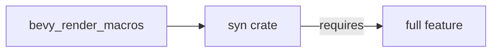

+++
title = "#20034 enable syn/full in bevy_render_macros"
date = "2025-07-08T00:00:00"
draft = false
template = "pull_request_page.html"
in_search_index = true

[taxonomies]
list_display = ["show"]

[extra]
current_language = "en"
available_languages = {"en" = { name = "English", url = "/pull_request/bevy/2025-07/pr-20034-en-20250708" }, "zh-cn" = { name = "中文", url = "/pull_request/bevy/2025-07/pr-20034-zh-cn-20250708" }}
labels = ["D-Trivial", "C-Dependencies"]
+++

## Title  
enable syn/full in bevy_render_macros  

### Basic Information  
- **Title**: enable syn/full in bevy_render_macros  
- **PR Link**: https://github.com/bevyengine/bevy/pull/20034  
- **Author**: mockersf  
- **Status**: MERGED  
- **Labels**: D-Trivial, C-Dependencies, S-Ready-For-Final-Review  
- **Created**: 2025-07-08T16:50:58Z  
- **Merged**: 2025-07-08T17:27:26Z  
- **Merged By**: alice-i-cecile  

### Description Translation  
**Objective**  

- `bevy_render_macros` fails to build on its own:  
```  
error[E0432]: unresolved import `syn::Pat`  
   --> crates/bevy_render/macros/src/specializer.rs:13:69  
    |  
13  |     DeriveInput, Expr, Field, Ident, Index, Member, Meta, MetaList, Pat, Path, Token, Type,  
    |                                                                     ^^^  
    |                                                                     |  
    |                                                                     no `Pat` in the root  
    |                                                                     help: a similar name exists in the module: `Path`  
    |  
note: found an item that was configured out  
   --> /home/runner/.cargo/registry/src/index.crates.io-1949cf8c6b5b557f/syn-2.0.104/src/lib.rs:485:15  
    |  
485 |     FieldPat, Pat, PatConst, PatIdent, PatLit, PatMacro, PatOr, PatParen, PatPath, PatRange,  
    |               ^^^  
note: the item is gated behind the `full` feature  
   --> /home/runner/.cargo/registry/src/index.crates.io-1949cf8c6b5b557f/syn-2.0.104/src/lib.rs:482:7  
    |  
482 | #[cfg(feature = "full")]  
    |       ^^^^^^^^^^^^^^^^  
```  

**Solution**  

- Enable the `full` feature of `syn`  

---

### The Story of This Pull Request  

The issue started when `bevy_render_macros` failed to compile independently due to an unresolved import of `syn::Pat`. This occurred because the `Pat` type in the `syn` crate is conditionally compiled behind the `full` feature flag. Without this flag enabled, the required type wasn't available during compilation, causing the build failure.  

The solution was straightforward: enable `syn`'s `full` feature in `bevy_render_macros`'s dependency declaration. This change ensures all necessary types from `syn` are available during compilation, resolving the import error. The fix was minimal—a one-line modification to the Cargo.toml file—but essential for maintaining a working build.  

This change aligns with common practices when using the `syn` crate for procedural macros. The `full` feature is typically required when working with complex macro implementations that need access to all of `syn`'s parsing capabilities. By enabling it, we ensure consistent build behavior and prevent similar issues in future development.  

---

### Visual Representation  


---

### Key Files Changed  

**File**: `crates/bevy_render/macros/Cargo.toml`  

**Changes**:  
- Enabled `full` feature for `syn` dependency  

**Code Diff**:  
```diff
# crates/bevy_render/macros/Cargo.toml
[dependencies]
bevy_macro_utils = { path = "../../bevy_macro_utils", version = "0.17.0-dev" }

-syn = "2.0"
+syn = { version = "2.0", features = ["full"] }
proc-macro2 = "1.0"
quote = "1.0"
```

**Reason**:  
This modification resolves the build error by making `syn::Pat` available during compilation. The `full` feature unlocks all parsing functionality in the `syn` crate, which is necessary for the procedural macros in `bevy_render_macros` to function correctly.  

---

### Further Reading  
1. [syn crate documentation](https://docs.rs/syn/latest/syn/) - Details about features and parsing capabilities  
2. [Cargo Features Guide](https://doc.rust-lang.org/cargo/reference/features.html) - How feature flags work in Rust  
3. [Procedural Macros Book Chapter](https://doc.rust-lang.org/reference/procedural-macros.html) - Official Rust reference  

--- 

### Full Code Diff  
```diff
diff --git a/crates/bevy_render/macros/Cargo.toml b/crates/bevy_render/macros/Cargo.toml
index 016fe887652e4..99d1dca5f9007 100644
--- a/crates/bevy_render/macros/Cargo.toml
+++ b/crates/bevy_render/macros/Cargo.toml
@@ -14,7 +14,7 @@ proc-macro = true
 [dependencies]
 bevy_macro_utils = { path = "../../bevy_macro_utils", version = "0.17.0-dev" }
 
-syn = "2.0"
+syn = { version = "2.0", features = ["full"] }
 proc-macro2 = "1.0"
 quote = "1.0"
```