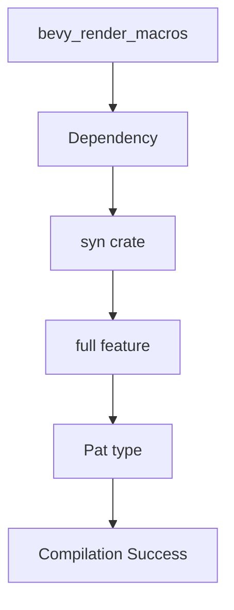

+++
title = "#20034 enable syn/full in bevy_render_macros"
date = "2025-07-08T00:00:00"
draft = false
template = "pull_request_page.html"
in_search_index = false

[extra]
current_language = "zh-cn"
available_languages = {"en" = { name = "English", url = "/pull_request/bevy/2025-07/pr-20034-en-20250708" }, "zh-cn" = { name = "中文", url = "/pull_request/bevy/2025-07/pr-20034-zh-cn-20250708" }}
labels = ["D-Trivial", "C-Dependencies"]
+++

# enable syn/full in bevy_render_macros

## Basic Information
- **Title**: enable syn/full in bevy_render_macros
- **PR Link**: https://github.com/bevyengine/bevy/pull/20034
- **Author**: mockersf
- **Status**: MERGED
- **Labels**: D-Trivial, C-Dependencies, S-Ready-For-Final-Review
- **Created**: 2025-07-08T16:50:58Z
- **Merged**: 2025-07-08T17:27:26Z
- **Merged By**: alice-i-cecile

## Description Translation
### Objective

- `bevy_render_macros` 无法独立构建：
```
error[E0432]: unresolved import `syn::Pat`
   --> crates/bevy_render/macros/src/specializer.rs:13:69
    |
13  |     DeriveInput, Expr, Field, Ident, Index, Member, Meta, MetaList, Pat, Path, Token, Type,
    |                                                                     ^^^
    |                                                                     |
    |                                                                     root 中没有 `Pat`
    |                                                                     help: 模块中存在相似名称: `Path`
    |
note: found an item that was configured out
   --> /home/runner/.cargo/registry/src/index.crates.io-1949cf8c6b5b557f/syn-2.0.104/src/lib.rs:485:15
    |
485 |     FieldPat, Pat, PatConst, PatIdent, PatLit, PatMacro, PatOr, PatParen, PatPath, PatRange,
    |               ^^^
note: the item is gated behind the `full` feature
   --> /home/runner/.cargo/registry/src/index.crates.io-1949cf8c6b5b557f/syn-2.0.104/src/lib.rs:482:7
    |
482 | #[cfg(feature = "full")]
    |       ^^^^^^^^^^^^^^^^
```

### Solution

- 启用 `syn` 的 `full` feature

## The Story of This Pull Request

在开发过程中，发现 `bevy_render_macros` 无法独立构建。具体错误出现在过程宏代码尝试导入 `syn::Pat` 类型时，构建系统报告该类型不存在于 `syn` 的 root 模块中。根本原因在于 `syn` crate 的 `Pat` 类型需要启用 `full` feature 才能使用，而当前依赖声明未启用此 feature。

错误分析显示，`syn` crate 将 `Pat` 类型及其相关模式匹配功能放在 `full` feature 门控之后。这是 `syn` 的常规设计模式——通过 feature flags 控制暴露的功能范围，以优化编译时间和二进制大小。当 `bevy_render_macros` 尝试在不启用 `full` feature 的情况下使用 `Pat` 类型时，编译器无法解析该符号。

解决方案直接明了：在 `bevy_render_macros` 的依赖声明中启用 `syn` 的 `full` feature。这通过修改 `Cargo.toml` 实现，将 `syn` 依赖从简单版本声明改为显式启用 `full` feature 的声明方式。这种修改确保过程宏代码可以访问所需的完整解析功能集。

该修复属于典型的依赖配置调整，不涉及实际业务逻辑变更。从工程角度看，值得注意：
1. 过程宏 crate 通常需要 `syn` 的完整功能集才能进行复杂语法树操作
2. Cargo feature 传播规则要求每个 crate 显式声明所需依赖特性
3. 独立构建验证是发现此类问题的有效手段

修改后，`bevy_render_macros` 可成功编译，其提供的渲染系统过程宏功能（如着色器特殊化）能正常服务上层 crate。此修复维护了项目模块化构建能力，同时遵循了 Rust 生态的依赖管理最佳实践。

## Visual Representation



## Key Files Changed

### `crates/bevy_render/macros/Cargo.toml`
**修改说明**：更新 `syn` 依赖声明以启用 `full` feature，解决编译错误  
**修改前后对比**：
```toml
# Before:
[dependencies]
bevy_macro_utils = { path = "../../bevy_macro_utils", version = "0.17.0-dev" }

syn = "2.0"
proc-macro2 = "1.0"
quote = "1.0"

# After:
[dependencies]
bevy_macro_utils = { path = "../../bevy_macro_utils", version = "0.17.0-dev" }

syn = { version = "2.0", features = ["full"] }
proc-macro2 = "1.0"
quote = "1.0"
```
**关联性**：这是本 PR 的唯一修改，直接解决描述的编译问题

## Further Reading
1. [syn crate documentation](https://docs.rs/syn/latest/syn/) - 官方 API 文档
2. [Cargo Features Guide](https://doc.rust-lang.org/cargo/reference/features.html) - 功能特性管理机制
3. [Procedural Macros Workshop](https://github.com/dtolnay/proc-macro-workshop) - 过程宏开发实践教程