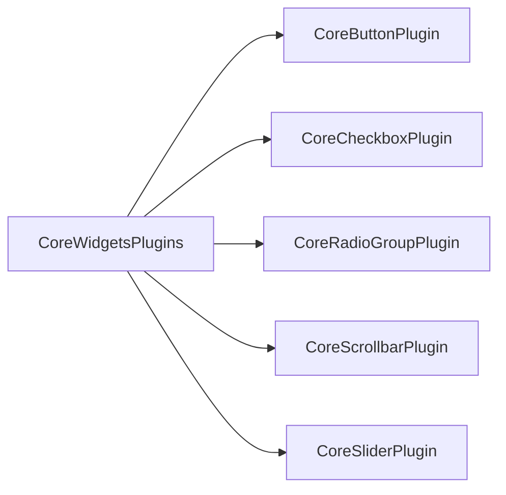

+++
title = "#20036 Change CoreWidgets plugin to plugin group."
date = "2025-07-09T00:00:00"
draft = false
template = "pull_request_page.html"
in_search_index = true

[taxonomies]
list_display = ["show"]

[extra]
current_language = "en"
available_languages = {"en" = { name = "English", url = "/pull_request/bevy/2025-07/pr-20036-en-20250709" }, "zh-cn" = { name = "中文", url = "/pull_request/bevy/2025-07/pr-20036-zh-cn-20250709" }}
labels = ["A-UI", "C-Usability", "D-Straightforward"]
+++

## Change CoreWidgets plugin to plugin group.

## Basic Information
- **Title**: Change CoreWidgets plugin to plugin group.
- **PR Link**: https://github.com/bevyengine/bevy/pull/20036
- **Author**: viridia
- **Status**: MERGED
- **Labels**: A-UI, C-Usability, S-Ready-For-Final-Review, D-Straightforward
- **Created**: 2025-07-08T17:10:01Z
- **Merged**: 2025-07-09T01:27:34Z
- **Merged By**: alice-i-cecile

## Description Translation
What it says on the tin. :)

## The Story of This Pull Request

### The Problem and Context
Bevy's UI system uses plugins to organize widget functionality. The original `CoreWidgetsPlugin` served as a container for registering multiple core widget plugins (button, checkbox, radio, etc.). However, this implementation had limitations:
1. It implemented `Plugin` rather than `PluginGroup`
2. This prevented users from controlling plugin order within the group
3. It didn't align with Bevy's standard patterns for plugin organization

The technical constraint was straightforward: Bevy's plugin system expects collections of related plugins to use `PluginGroup` for better control and consistency.

### The Solution Approach
The solution was to convert `CoreWidgetsPlugin` into a proper `PluginGroup`:
1. Rename the struct to `CoreWidgetsPlugins` (plural) for clarity
2. Implement `PluginGroup` trait instead of `Plugin`
3. Use `PluginGroupBuilder` to register individual widget plugins
4. Update all references in examples and documentation

No alternatives were seriously considered since this aligns with established Bevy patterns. The change is purely structural with no functional modifications.

### The Implementation
The core change refactors the plugin registration using Bevy's `PluginGroupBuilder`:

```rust
// Before: Plugin implementation
impl Plugin for CoreWidgetsPlugin {
    fn build(&self, app: &mut App) {
        app.add_plugins((
            CoreButtonPlugin,
            // ...other plugins
        ));
    }
}

// After: PluginGroup implementation
impl PluginGroup for CoreWidgetsPlugins {
    fn build(self) -> PluginGroupBuilder {
        PluginGroupBuilder::start::<Self>()
            .add(CoreButtonPlugin)
            // ...other plugins
    }
}
```
Key implementation details:
- `PluginGroupBuilder::start` initializes the builder
- Each widget plugin is explicitly added to the builder
- The builder pattern allows future flexibility for ordering

### Technical Insights
1. **PluginGroup benefits**:
   - Explicit control over plugin order
   - Standardized pattern across Bevy
   - Clearer intent (group vs single plugin)
   
2. **Naming convention**:
   - Pluralized `CoreWidgetsPlugins` signals it's a collection
   - Maintains discoverability in IDE autocompletion

3. **Backward compatibility**:
   - Existing users simply need to update the type name
   - No behavioral changes for widget functionality

### The Impact
1. **Improved consistency**:
   - Aligns with Bevy's plugin architecture standards
   - Sets consistent pattern for future widget additions

2. **Enhanced flexibility**:
   - Users can now control initialization order if needed
   - Prepares for potential future configuration options

3. **Minimal migration cost**:
   - Only requires renaming imports and type references
   - All examples updated in same PR for immediate consistency

## Visual Representation



## Key Files Changed

### `crates/bevy_core_widgets/src/lib.rs`
**Change**: Converted CoreWidgetsPlugin to PluginGroup implementation  
**Why**: To align with Bevy's plugin architecture standards  
```rust
// Before:
pub struct CoreWidgetsPlugin;
impl Plugin for CoreWidgetsPlugin {
    fn build(&self, app: &mut App) {
        app.add_plugins(( ... ));
    }
}

// After:
pub struct CoreWidgetsPlugins;
impl PluginGroup for CoreWidgetsPlugins {
    fn build(self) -> PluginGroupBuilder {
        PluginGroupBuilder::start::<Self>()
            .add(CoreButtonPlugin)
            .add(CoreCheckboxPlugin)
            .add(CoreRadioGroupPlugin)
            .add(CoreScrollbarPlugin)
            .add(CoreSliderPlugin)
    }
}
```

### Example Files
**Files**:  
- `examples/ui/core_widgets.rs`  
- `examples/ui/core_widgets_observers.rs`  
- `examples/ui/feathers.rs`  

**Change**: Updated plugin reference from `CoreWidgetsPlugin` to `CoreWidgetsPlugins`  
**Why**: Maintain consistency after core change  
```rust
// Before:
app.add_plugins((DefaultPlugins, CoreWidgetsPlugin, ...));

// After:
app.add_plugins((DefaultPlugins, CoreWidgetsPlugins, ...));
```

### `release-content/release-notes/headless-widgets.md`
**Change**: Added current PR (#20036) to relevant documentation  
**Why**: Keep release notes accurate for tracking changes  
```markdown
// Before:
pull_requests: [19366, 19584, 19665, 19778, 19803]

// After:
pull_requests: [19366, 19584, 19665, 19778, 19803, 20036]
```

## Further Reading
1. [Bevy Plugin Groups Documentation](https://bevyengine.org/learn/book/getting-started/plugins/#plugin-groups)
2. [PluginGroup Trait Reference](https://docs.rs/bevy_app/latest/bevy_app/trait.PluginGroup.html)
3. [Bevy Plugin System Design Discussion](https://github.com/bevyengine/bevy/discussions/6873)