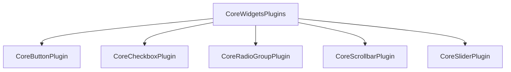

+++
title = "#20036 Change CoreWidgets plugin to plugin group"
date = "2025-07-09T00:00:00"
draft = false
template = "pull_request_page.html"
in_search_index = false

[extra]
current_language = "zh-cn"
available_languages = {"en" = { name = "English", url = "/pull_request/bevy/2025-07/pr-20036-en-20250709" }, "zh-cn" = { name = "中文", url = "/pull_request/bevy/2025-07/pr-20036-zh-cn-20250709" }}
+++

# 分析报告：PR #20036 - Change CoreWidgets plugin to plugin group

## 基本信息
- **标题**: Change CoreWidgets plugin to plugin group
- **PR链接**: https://github.com/bevyengine/bevy/pull/20036
- **作者**: viridia
- **状态**: 已合并
- **标签**: A-UI, C-Usability, S-Ready-For-Final-Review, D-Straightforward
- **创建时间**: 2025-07-08T17:10:01Z
- **合并时间**: 2025-07-09T01:27:34Z
- **合并者**: alice-i-cecile

## 描述翻译
名副其实。:)

## PR技术分析

### 问题背景
在Bevy引擎的UI系统中，`CoreWidgetsPlugin`作为核心小部件（按钮、复选框、滑块等）的集中注册点。但当前实现存在两个主要限制：
1. 它直接实现`Plugin`接口，强制用户全量引入所有小部件
2. 不符合Bevy的插件组(PluginGroup)模式，该模式提供更灵活的插件管理能力

这导致用户无法选择性地引入特定小部件，增加了不必要的运行时开销，也与Bevy其他模块的插件注册模式不一致。

### 解决方案
将`CoreWidgetsPlugin`重构为插件组(PluginGroup)实现：
1. 将struct重命名为`CoreWidgetsPlugins`（复数形式）
2. 实现`PluginGroup` trait替代原`Plugin` trait
3. 使用`PluginGroupBuilder`构建插件集合
4. 更新所有引用点使用新的插件组模式

这种转换保持了向后兼容性，同时提供了更灵活的插件管理能力。用户仍可通过单行代码添加所有小部件，但现在也能选择性地添加特定小部件插件。

### 实现细节
核心修改在`bevy_core_widgets`的lib.rs文件中：

```rust
// Before: 实现Plugin trait
pub struct CoreWidgetsPlugin;

impl Plugin for CoreWidgetsPlugin {
    fn build(&self, app: &mut App) {
        app.add_plugins((
            CoreButtonPlugin,
            CoreCheckboxPlugin,
            CoreRadioGroupPlugin,
            CoreScrollbarPlugin,
            CoreSliderPlugin,
        ));
    }
}

// After: 实现PluginGroup trait
pub struct CoreWidgetsPlugins;

impl PluginGroup for CoreWidgetsPlugins {
    fn build(self) -> PluginGroupBuilder {
        PluginGroupBuilder::start::<Self>()
            .add(CoreButtonPlugin)
            .add(CoreCheckboxPlugin)
            .add(CoreRadioGroupPlugin)
            .add(CoreScrollbarPlugin)
            .add(CoreSliderPlugin)
    }
}
```

关键变更点：
1. 类型名从单数`CoreWidgetsPlugin`改为复数`CoreWidgetsPlugins`，符合插件组命名规范
2. 使用`PluginGroupBuilder`的链式调用替代直接操作`App`
3. 保持原有的五个小部件插件注册逻辑

### 影响与收益
1. **灵活性提升**：用户现在可以单独引入特定小部件插件
   ```rust
   // 单独引入按钮插件
   app.add_plugins(CoreButtonPlugin);
   
   // 或引入整个插件组
   app.add_plugins(CoreWidgetsPlugins);
   ```
2. **一致性改进**：与Bevy其他插件组（如`DefaultPlugins`）保持相同模式
3. **API清晰度**：插件组命名（复数形式）明确表示包含多个插件
4. **无破坏性变更**：现有代码只需将`CoreWidgetsPlugin`替换为`CoreWidgetsPlugins`

### 使用示例更新
所有相关示例文件同步更新了插件引用方式：
```rust
// Before
.add_plugins((
    DefaultPlugins,
    CoreWidgetsPlugin,
))

// After
.add_plugins((
    DefaultPlugins,
    CoreWidgetsPlugins, // 注意复数形式
))
```

发布说明文件也相应添加了本PR的引用：
```markdown
pull_requests: [19366, 19584, 19665, 19778, 19803, 20036]
```

## 组件关系图



## 关键文件变更

### crates/bevy_core_widgets/src/lib.rs
**变更说明**：将核心小部件注册从Plugin重构为PluginGroup实现  
**代码变更**：
```diff
- use bevy_app::{App, Plugin};
+ use bevy_app::{PluginGroup, PluginGroupBuilder};

- pub struct CoreWidgetsPlugin;
+ pub struct CoreWidgetsPlugins;

- impl Plugin for CoreWidgetsPlugin {
-    fn build(&self, app: &mut App) {
-        app.add_plugins((
-            CoreButtonPlugin,
-            CoreCheckboxPlugin,
-            CoreRadioGroupPlugin,
-            CoreScrollbarPlugin,
-            CoreSliderPlugin,
-        ));
-    }
- }
+ impl PluginGroup for CoreWidgetsPlugins {
+    fn build(self) -> PluginGroupBuilder {
+        PluginGroupBuilder::start::<Self>()
+            .add(CoreButtonPlugin)
+            .add(CoreCheckboxPlugin)
+            .add(CoreRadioGroupPlugin)
+            .add(CoreScrollbarPlugin)
+            .add(CoreSliderPlugin)
+    }
+ }
```

### examples/ui/core_widgets.rs
**变更说明**：更新示例使用新的插件组  
**代码变更**：
```diff
- use bevy::core_widgets::CoreWidgetsPlugin;
+ use bevy::core_widgets::CoreWidgetsPlugins;

  .add_plugins((
      DefaultPlugins,
-     CoreWidgetsPlugin,
+     CoreWidgetsPlugins,
  ))
```

### release-content/release-notes/headless-widgets.md
**变更说明**：在发布说明中添加本PR引用  
**代码变更**：
```diff
- pull_requests: [19366, 19584, 19665, 19778, 19803]
+ pull_requests: [19366, 19584, 19665, 19778, 19803, 20036]
```

## 延伸阅读
1. [Bevy Plugin系统文档](https://bevyengine.org/learn/book/getting-started/plugins/)
2. [PluginGroup trait源码](https://github.com/bevyengine/bevy/blob/main/crates/bevy_app/src/plugin_group.rs)
3. [Bevy ECS插件设计模式](https://github.com/bevyengine/bevy/discussions/1201)