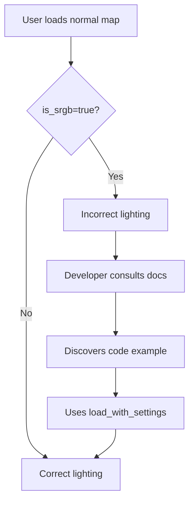

+++
title = "#20037 StandardMaterial docs: Make clear that lighting won't look correct if `is_srgb` is `true`"
date = "2025-07-10T00:00:00"
draft = false
template = "pull_request_page.html"
in_search_index = true

[taxonomies]
list_display = ["show"]

[extra]
current_language = "en"
available_languages = {"en" = { name = "English", url = "/pull_request/bevy/2025-07/pr-20037-en-20250710" }, "zh-cn" = { name = "中文", url = "/pull_request/bevy/2025-07/pr-20037-zh-cn-20250710" }}
labels = ["C-Docs", "A-Rendering", "D-Straightforward"]
+++

## StandardMaterial Documentation: Clarifying Normal Map sRGB Usage

### Basic Information
- **Title**: StandardMaterial docs: Make clear that lighting won't look correct if `is_srgb` is `true`
- **PR Link**: https://github.com/bevyengine/bevy/pull/20037
- **Author**: 772
- **Status**: MERGED
- **Labels**: C-Docs, A-Rendering, S-Ready-For-Final-Review, D-Straightforward
- **Created**: 2025-07-08T17:20:12Z
- **Merged**: 2025-07-10T19:02:02Z
- **Merged By**: alice-i-cecile

### Description Translation
# Objective

- Fix https://github.com/bevyengine/bevy/issues/12123

## Solution

- Add a code example found here: https://github.com/bevyengine/bevy/blob/main/examples/3d/parallax_mapping.rs#L209 to https://docs.rs/bevy/latest/bevy/pbr/struct.StandardMaterial.html

## Testing

- This pull request if only changing docs. But I tested the formatting via ```cargo doc --no-deps --open```.

### The Story of This Pull Request

**The Problem and Context**  
Users were experiencing incorrect lighting results when using normal maps with Bevy's PBR materials. The root cause was traced to how normal map textures were being loaded - specifically, the default `is_srgb = true` setting in the image loader was being applied to normal maps. Normal maps contain vector data rather than color information, and applying sRGB conversion corrupts this data since sRGB is a color space transformation. This led to subtle but significant rendering errors where lighting calculations produced incorrect results.

**The Solution Approach**  
The straightforward solution was to improve documentation clarity around this common pitfall. Rather than modifying engine behavior (which could break existing projects), the decision was made to add explicit guidance directly in the `StandardMaterial` documentation. This approach ensures users understand why lighting might appear incorrect and how to fix it without changing default behaviors that might be correct for other texture types.

**The Implementation**  
A code example was added to the `normal_map_texture` field documentation in `StandardMaterial`. This example demonstrates the correct way to load normal map textures by explicitly setting `is_srgb = false` during asset loading:

```rust
// Added documentation example
fn load_normal_map(asset_server: Res<AssetServer>) {
    let normal_handle: Handle<Image> = asset_server.load_with_settings(
        "textures/parallax_example/cube_normal.png",
        // The normal map texture is in linear color space. Lighting won't look correct
        // if `is_srgb` is `true`, which is the default.
        |settings: &mut ImageLoaderSettings| settings.is_srgb = false,
    );
}
```

The example clearly shows:
1. Using `load_with_settings` instead of standard asset loading
2. Explicitly disabling sRGB conversion via closure
3. An explanatory comment about the consequences of incorrect settings

**Technical Insights**  
The key technical distinction here is between color textures (which typically use sRGB space) and data textures (like normal maps) which require linear color space. When `is_srgb=true`, Bevy applies gamma correction that distorts the vector data in normal maps. This manifests as incorrect lighting because:
- Normal vectors become non-unit length after transformation
- Vector directions are altered by the gamma curve
- The dot products used in lighting calculations produce invalid results

**The Impact**  
This documentation change directly addresses GitHub issue #12123 by providing clear, in-context guidance. Developers working with normal maps will now immediately see the correct usage pattern when consulting the `StandardMaterial` documentation. This prevents subtle rendering errors that could otherwise take significant time to debug. The solution maintains backward compatibility while improving the developer experience for Bevy's PBR system.

### Visual Representation



### Key Files Changed

**crates/bevy_pbr/src/pbr_material.rs**  
Added documentation example to clarify normal map loading requirements.

```rust
// Before:
#[texture(9)]
#[sampler(10)]
#[dependency]
```

```rust
// After:
#[texture(9)]
#[sampler(10)]
#[dependency]
///
/// # Usage
///
/// ```
/// # use bevy_asset::{AssetServer, Handle};
/// # use bevy_ecs::change_detection::Res;
/// # use bevy_image::{Image, ImageLoaderSettings};
/// #
/// fn load_normal_map(asset_server: Res<AssetServer>) {
///     let normal_handle: Handle<Image> = asset_server.load_with_settings(
///         "textures/parallax_example/cube_normal.png",
///         // The normal map texture is in linear color space. Lighting won't look correct
///         // if `is_srgb` is `true`, which is the default.
///         |settings: &mut ImageLoaderSettings| settings.is_srgb = false,
///     );
/// }
/// ```
```

### Further Reading
1. [Bevy PBR Documentation](https://docs.rs/bevy/latest/bevy/pbr/struct.StandardMaterial.html)
2. [sRGB vs Linear Color Space Explanation](https://blog.demofox.org/2018/03/10/dont-convert-srgb-u8-to-linear-u8/)
3. [Normal Mapping Theory](https://learnopengl.com/Advanced-Lighting/Normal-Mapping)
4. [Original Issue #12123](https://github.com/bevyengine/bevy/issues/12123)