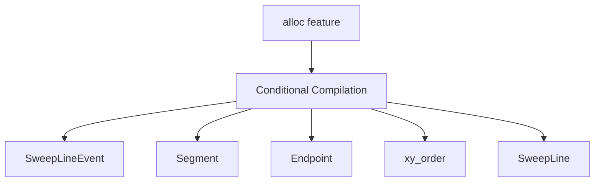

+++
title = "#20039 bevy_math: don't allow dead code"
date = "2025-07-08T00:00:00"
draft = false
template = "pull_request_page.html"
in_search_index = true

[taxonomies]
list_display = ["show"]

[extra]
current_language = "en"
available_languages = {"en" = { name = "English", url = "/pull_request/bevy/2025-07/pr-20039-en-20250708" }, "zh-cn" = { name = "中文", url = "/pull_request/bevy/2025-07/pr-20039-zh-cn-20250708" }}
labels = ["D-Trivial", "C-Code-Quality", "A-Math"]
+++

### bevy_math: don't allow dead code

#### Basic Information
- **Title**: bevy_math: don't allow dead code
- **PR Link**: https://github.com/bevyengine/bevy/pull/20039
- **Author**: mockersf
- **Status**: MERGED
- **Labels**: D-Trivial, C-Code-Quality, S-Ready-For-Final-Review, A-Math
- **Created**: 2025-07-08T17:30:01Z
- **Merged**: 2025-07-08T18:05:41Z
- **Merged By**: alice-i-cecile

#### Description Translation
# Objective

- `bevy_math` allows the `dead_code` lint on some private structs when `alloc` is not enabled
- allowing lints is not allowed, we should use expect

## Solution

- Don't even compile the code if its expected to be dead instead of allowing or expecting the lint

---

### The Story of This Pull Request

The polygon triangulation implementation in `bevy_math` contained several structures and functions that were only relevant when the `alloc` feature was enabled. Originally, the code used `#[cfg_attr]` with `allow(dead_code)` or `expect(dead_code)` to suppress compiler warnings for these unused items when `alloc` was disabled. However, this approach violated Bevy's lint policy which prohibits blanket lint allowances.

The core issue was that conditional compilation wasn't properly scoped. Structures like `SweepLineEvent`, `Segment`, and their associated implementations were still being compiled when `alloc` was disabled, triggering dead code warnings. Since these components were inherently tied to heap-allocated data structures (like `BTreeMap` and `Vec`), they served no purpose without the `alloc` feature.

The solution involved replacing lint suppression with proper conditional compilation. By adding `#[cfg(feature = "alloc")]` directly to:
1. Type definitions (`Endpoint`, `SweepLineEvent`, `Segment`)
2. Trait implementations (`PartialEq`, `Eq`, `PartialOrd`, `Ord`)
3. Helper functions (`xy_order`)
4. The `SweepLine` struct itself

The code is now completely omitted from compilation when `alloc` isn't enabled. This eliminates the dead code warnings at their source rather than suppressing them after the fact. The changes maintain identical functionality when `alloc` is enabled while reducing compiler noise and adhering to project lint policies in disabled configurations.

#### Visual Representation


#### Key Files Changed

**crates/bevy_math/src/primitives/polygon.rs**  
Replaced lint allowances with conditional compilation:

```rust
// Before:
#[cfg_attr(
    not(feature = "alloc"),
    expect(dead_code, reason = "this type is only used with the alloc feature")
)]
#[derive(Debug, Clone, Copy)]
enum Endpoint { ... }

// After:
#[derive(Debug, Clone, Copy)]
#[cfg(feature = "alloc")]
enum Endpoint { ... }
```

```rust
// Before:
#[cfg_attr(
    not(feature = "alloc"),
    allow(dead_code, reason = "this type is only used with the alloc feature")
)]
struct SweepLineEvent { ... }

// After:
#[derive(Debug, Clone, Copy)]
#[cfg(feature = "alloc")]
struct SweepLineEvent { ... }
```

```rust
// Before:
#[cfg_attr(
    not(feature = "alloc"),
    allow(dead_code, reason = "this type is only used with the alloc feature")
)]
fn xy_order(a: Vec2, b: Vec2) -> Ordering { ... }

// After:
#[cfg(feature = "alloc")]
fn xy_order(a: Vec2, b: Vec2) -> Ordering { ... }
```

#### Further Reading
- [Rust Conditional Compilation](https://doc.rust-lang.org/reference/conditional-compilation.html)
- [The Rust Performance Book: Dead Code](https://nnethercote.github.io/perf-book/compilation.html#dead-code)
- [Clippy Lint Policies](https://github.com/rust-lang/rust-clippy)

---

### Full Code Diff
```diff
diff --git a/crates/bevy_math/src/primitives/polygon.rs b/crates/bevy_math/src/primitives/polygon.rs
index 9aa261b297c20..096a19ecfb9aa 100644
--- a/crates/bevy_math/src/primitives/polygon.rs
+++ b/crates/bevy_math/src/primitives/polygon.rs
@@ -2,17 +2,13 @@
 use {
     super::{Measured2d, Triangle2d},
     alloc::{collections::BTreeMap, vec::Vec},
+    core::cmp::Ordering,
 };
 
-use core::cmp::Ordering;
-
 use crate::Vec2;
 
-#[cfg_attr(
-    not(feature = "alloc"),
-    expect(dead_code, reason = "this type is only used with the alloc feature")
-)]
 #[derive(Debug, Clone, Copy)]
+#[cfg(feature = "alloc")]
 enum Endpoint {
     Left,
     Right,
@@ -24,22 +20,16 @@ enum Endpoint {
 /// If `e1.position().x == e2.position().x` the events are ordered from bottom to top.
 ///
 /// This is the order expected by the [`SweepLine`].
+#[cfg(feature = "alloc")]
 #[derive(Debug, Clone, Copy)]
-#[cfg_attr(
-    not(feature = "alloc"),
-    allow(dead_code, reason = "this type is only used with the alloc feature")
-)]
 struct SweepLineEvent {
     segment: Segment,
     /// Type of the vertex (left or right)
     endpoint: Endpoint,
 }
 
+#[cfg(feature = "alloc")]
 impl SweepLineEvent {
-    #[cfg_attr(
-        not(feature = "alloc"),
-        allow(dead_code, reason = "this type is only used with the alloc feature")
-    )]
     fn position(&self) -> Vec2 {
         match self.endpoint {
             Endpoint::Left => self.segment.left,
@@ -48,20 +38,24 @@ impl SweepLineEvent {
     }
 }
 
+#[cfg(feature = "alloc")]
 impl PartialEq for SweepLineEvent {
     fn eq(&self, other: &Self) -> bool {
         self.position() == other.position()
     }
 }
 
+#[cfg(feature = "alloc")]
 impl Eq for SweepLineEvent {}
 
+#[cfg(feature = "alloc")]
 impl PartialOrd for SweepLineEvent {
     fn partial_cmp(&self, other: &Self) -> Option<Ordering> {
         Some(self.cmp(other))
     }
 }
 
+#[cfg(feature = "alloc")]
 impl Ord for SweepLineEvent {
     fn cmp(&self, other: &Self) -> Ordering {
         xy_order(self.position(), other.position())
@@ -69,10 +63,7 @@ impl Ord for SweepLineEvent {
 }
 
 /// Orders 2D points according to the order expected by the sweep line and event queue from -X to +X and then -Y to Y.
-#[cfg_attr(
-    not(feature = "alloc"),
-    allow(dead_code, reason = "this type is only used with the alloc feature")
-)]
+#[cfg(feature = "alloc")]
 fn xy_order(a: Vec2, b: Vec2) -> Ordering {
     a.x.total_cmp(&b.x).then_with(|| a.y.total_cmp(&b.y))
 }
@@ -129,26 +120,31 @@ impl EventQueue {
 /// Segments are ordered from bottom to top based on their left vertices if possible.
 /// If their y values are identical, the segments are ordered based on the y values of their right vertices.
 #[derive(Debug, Clone, Copy)]
+#[cfg(feature = "alloc")]
 struct Segment {
     edge_index: usize,
     left: Vec2,
     right: Vec2,
 }
 
+#[cfg(feature = "alloc")]
 impl PartialEq for Segment {
     fn eq(&self, other: &Self) -> bool {
         self.edge_index == other.edge_index
     }
 }
 
+#[cfg(feature = "alloc")]
 impl Eq for Segment {}
 
+#[cfg(feature = "alloc")]
 impl PartialOrd for Segment {
     fn partial_cmp(&self, other: &Self) -> Option<Ordering> {
         Some(self.cmp(other))
     }
 }
 
+#[cfg(feature = "alloc")]
 impl Ord for Segment {
     fn cmp(&self, other: &Self) -> Ordering {
         self.left
@@ -159,10 +155,7 @@ impl Ord for Segment {
 }
 
 /// Holds information about which segment is above and which is below a given [`Segment`]
-#[cfg_attr(
-    not(feature = "alloc"),
-    expect(dead_code, reason = "this type is only used with the alloc feature")
-)]
+#[cfg(feature = "alloc")]
 #[derive(Debug, Clone, Copy)]
 struct SegmentOrder {
     above: Option<usize>,
@@ -173,8 +166,8 @@ struct SegmentOrder {
 ///
 /// It can be thought of as a vertical line sweeping from -X to +X across the polygon that keeps track of the order of the segments
 /// the sweep line is intersecting at any given moment.
-#[cfg(feature = "alloc")]
 #[derive(Debug, Clone)]
+#[cfg(feature = "alloc")]
 struct SweepLine<'a> {
     vertices: &'a [Vec2],
     tree: BTreeMap<Segment, SegmentOrder>,
```