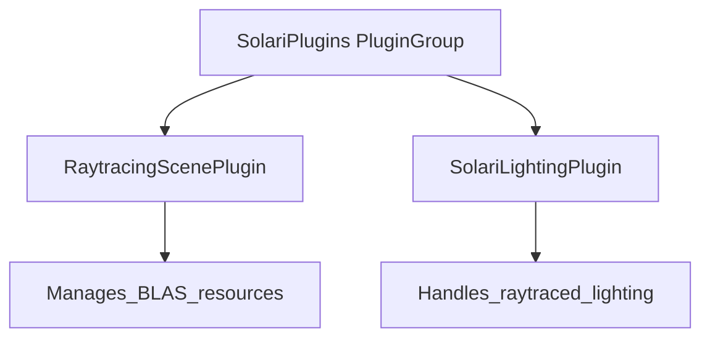

+++
title = "#20044 Use PluginGroup for SolariPlugins"
date = "2025-07-09T00:00:00"
draft = false
template = "pull_request_page.html"
in_search_index = true

[taxonomies]
list_display = ["show"]

[extra]
current_language = "en"
available_languages = {"en" = { name = "English", url = "/pull_request/bevy/2025-07/pr-20044-en-20250709" }, "zh-cn" = { name = "中文", url = "/pull_request/bevy/2025-07/pr-20044-zh-cn-20250709" }}
labels = ["A-Rendering", "C-Usability"]
+++

# Use PluginGroup for SolariPlugins

## Basic Information
- **Title**: Use PluginGroup for SolariPlugins
- **PR Link**: https://github.com/bevyengine/bevy/pull/20044
- **Author**: JMS55
- **Status**: MERGED
- **Labels**: A-Rendering, C-Usability, S-Ready-For-Final-Review
- **Created**: 2025-07-08T20:23:50Z
- **Merged**: 2025-07-09T18:52:28Z
- **Merged By**: alice-i-cecile

## Description Translation
Use PluginGroup for SolariPlugins

## The Story of This Pull Request

### The Problem and Context
The original `SolariPlugin` implementation used Bevy's basic `Plugin` trait to add raytracing functionality. However, this approach had limitations for managing multiple related plugins. The existing implementation bundled `RaytracingScenePlugin` and `SolariLightingPlugin` together using `app.add_plugins((A, B))`, which worked but didn't leverage Bevy's more flexible plugin grouping system. This became problematic as the raytracing system grew more complex with optional components like the `PathtracingPlugin`. The rigid structure made it difficult to selectively enable/disable components or manage initialization order precisely.

### The Solution Approach
The solution migrates from the `Plugin` trait to Bevy's `PluginGroup` system. This provides first-class support for plugin collections with explicit ordering control. Instead of a single plugin that adds multiple others, we now define `SolariPlugins` as a logical group that can be extended or modified. The implementation uses `PluginGroupBuilder` to explicitly add `RaytracingScenePlugin` and `SolariLightingPlugin` in sequence. This maintains the existing functionality while providing better extensibility for future changes.

### The Implementation
The core change replaces `impl Plugin for SolariPlugin` with `impl PluginGroup for SolariPlugins`. The new implementation uses `PluginGroupBuilder` to explicitly add the component plugins:

```rust
impl PluginGroup for SolariPlugins {
    fn build(self) -> PluginGroupBuilder {
        PluginGroupBuilder::start::<Self>()
            .add(RaytracingScenePlugin)
            .add(SolariLightingPlugin)
    }
}
```

This change required updating all references to `SolariPlugin` to `SolariPlugins` throughout the codebase. The wgpu feature check logic was preserved but updated to reference the new struct name:

```rust
if !features.contains(SolariPlugins::required_wgpu_features()) {
    warn!(
        "RaytracingScenePlugin not loaded. GPU lacks support for required features: {:?}.",
        SolariPlugins::required_wgpu_features().difference(features)
    );
    return;
}
```

The example usage was similarly updated from `SolariPlugin` to `SolariPlugins`:

```rust
app.add_plugins((DefaultPlugins, SolariPlugins, CameraControllerPlugin))
```

### Technical Insights
The `PluginGroup` approach provides several advantages:
1. **Explicit ordering**: Plugins are added in defined sequence
2. **Extensibility**: New plugins can be added to the group without breaking existing code
3. **Consistency**: Matches Bevy's own plugin patterns (e.g., `DefaultPlugins`)
4. **Documentation**: Clearly communicates this is a collection of related plugins

The wgpu feature check remains important since raytracing requires specific hardware capabilities. The warning messages now reference `SolariPlugins` but maintain the same validation logic.

### The Impact
This change improves the architecture without altering runtime behavior. The main impact is on code organization and future maintenance:
1. Developers can now selectively enable/disable components of the raytracing system
2. The API better aligns with Bevy's standard practices
3. Adding future plugins (like the validation pathtracer) becomes simpler
4. Users benefit from clearer documentation and more flexible configuration

## Visual Representation



## Key Files Changed

### `crates/bevy_solari/src/lib.rs` (+13/-11)
Converted the main plugin struct to use PluginGroup instead of Plugin.

Before:
```rust
pub struct SolariPlugin;

impl Plugin for SolariPlugin {
    fn build(&self, app: &mut App) {
        app.add_plugins((RaytracingScenePlugin, SolariLightingPlugin));
    }
}
```

After:
```rust
pub struct SolariPlugins;

impl PluginGroup for SolariPlugins {
    fn build(self) -> PluginGroupBuilder {
        PluginGroupBuilder::start::<Self>()
            .add(RaytracingScenePlugin)
            .add(SolariLightingPlugin)
    }
}
```

### `crates/bevy_solari/src/pathtracer/mod.rs` (+3/-3)
Updated wgpu feature check to use SolariPlugins.

Before:
```rust
if !features.contains(SolariPlugin::required_wgpu_features()) {
    warn!(
        "PathtracingPlugin not loaded. GPU lacks support for required features: {:?}.",
        SolariPlugin::required_wgpu_features().difference(features)
    );
```

After:
```rust
if !features.contains(SolariPlugins::required_wgpu_features()) {
    warn!(
        "PathtracingPlugin not loaded. GPU lacks support for required features: {:?}.",
        SolariPlugins::required_wgpu_features().difference(features)
    );
```

### `crates/bevy_solari/src/realtime/mod.rs` (+3/-3)
Same update as pathtracer module.

### `crates/bevy_solari/src/scene/mod.rs` (+3/-3)
Same update as pathtracer module.

### `examples/3d/solari.rs` (+2/-2)
Updated example to use new PluginGroup.

Before:
```rust
app.add_plugins((DefaultPlugins, SolariPlugin, CameraControllerPlugin))
```

After:
```rust
app.add_plugins((DefaultPlugins, SolariPlugins, CameraControllerPlugin))
```

## Further Reading
1. [Bevy Plugin Groups Documentation](https://bevyengine.org/learn/book/getting-started/plugins/#plugin-groups)
2. [PluginGroupBuilder API Reference](https://docs.rs/bevy_app/latest/bevy_app/struct.PluginGroupBuilder.html)
3. [Bevy Plugin System Design Discussion](https://github.com/bevyengine/rfcs/blob/main/rfcs/6-plugin-ergonomics.md)