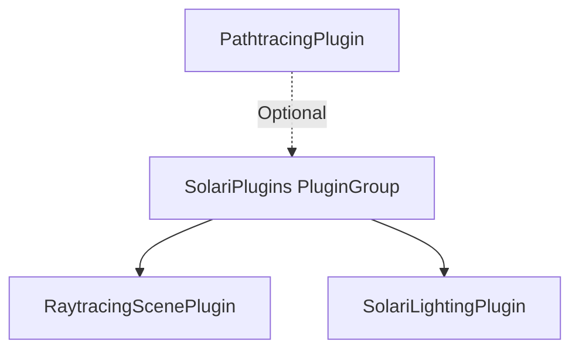

+++
title = "#20044 Use PluginGroup for SolariPlugins"
date = "2025-07-09T00:00:00"
draft = false
template = "pull_request_page.html"
in_search_index = false

[extra]
current_language = "zh-cn"
available_languages = {"en" = { name = "English", url = "/pull_request/bevy/2025-07/pr-20044-en-20250709" }, "zh-cn" = { name = "中文", url = "/pull_request/bevy/2025-07/pr-20044-zh-cn-20250709" }}
labels = ["A-Rendering", "C-Usability"]
+++

## Title
# Use PluginGroup for SolariPlugins

## Basic Information
- **Title**: Use PluginGroup for SolariPlugins
- **PR Link**: https://github.com/bevyengine/bevy/pull/20044
- **Author**: JMS55
- **Status**: MERGED
- **Labels**: A-Rendering, C-Usability, S-Ready-For-Final-Review
- **Created**: 2025-07-08T20:23:50Z
- **Merged**: 2025-07-09T18:52:28Z
- **Merged By**: alice-i-cecile

## Description Translation
这个 PR 将 `SolariPlugin` 改为使用 `PluginGroup`。这允许用户有选择地添加插件，例如，如果他们不想使用实时渲染器，就可以不添加 `SolariLightingPlugin`。同时将 `SolariPlugin` 重命名为 `SolariPlugins` 以匹配复数命名习惯（类似 `DefaultPlugins`）。

## The Story of This Pull Request

### 问题和背景
在 Bevy 引擎中，`SolariPlugin` 负责初始化光线追踪相关的功能。原始实现存在两个主要限制：
1. 它作为一个单一插件 (`Plugin` trait 实现) 存在，内部硬编码了 `RaytracingScenePlugin` 和 `SolariLightingPlugin` 的初始化
2. 用户无法选择性地禁用特定子插件，例如在只需要场景管理功能时排除实时光照系统

这种设计降低了代码灵活性，不符合 Bevy 插件系统的模块化理念。随着功能扩展，这种限制会变得更加明显，特别是当用户需要定制插件组合时。

### 解决方案
核心方案是将 `SolariPlugin` 重构为 `PluginGroup`：
1. 将 `SolariPlugin` 重命名为 `SolariPlugins` (复数形式)，遵循 Bevy 的命名约定（如 `DefaultPlugins`)
2. 实现 `PluginGroup` trait 替代原来的 `Plugin` trait
3. 使用 `PluginGroupBuilder` 管理子插件
4. 更新所有相关模块的引用

```rust
// Before: 单一插件实现
impl Plugin for SolariPlugin {
    fn build(&self, app: &mut App) {
        app.add_plugins((RaytracingScenePlugin, SolariLightingPlugin));
    }
}

// After: 插件组实现
impl PluginGroup for SolariPlugins {
    fn build(self) -> PluginGroupBuilder {
        PluginGroupBuilder::start::<Self>()
            .add(RaytracingScenePlugin)
            .add(SolariLightingPlugin)
    }
}
```

### 实现细节
重构保持功能不变但显著提升灵活性：
1. 用户现在可以通过 `add_plugins(SolariPlugins)` 添加默认插件组
2. 支持选择性禁用组件：`add_plugins(SolariPlugins.build().disable::<SolariLightingPlugin>())`
3. 路径追踪插件 (`PathtracingPlugin`) 保持为可选独立插件
4. 所有功能检查逻辑更新为使用新的 `SolariPlugins::required_wgpu_features()`

```rust
// 所有子模块更新引用
if !features.contains(SolariPlugins::required_wgpu_features()) {
    warn!(
        "Plugin not loaded. GPU lacks support for required features: {:?}.",
        SolariPlugins::required_wgpu_features().difference(features)
    );
}
```

### 技术洞察
关键改进在于利用 Bevy 的插件组系统：
1. **模块化**：解耦核心组件，每个插件保持独立职责
2. **可扩展性**：未来添加/移除插件不影响现有接口
3. **兼容性**：`PluginGroupBuilder` 提供与现有插件系统无缝集成
4. **错误处理**：统一的功能检查逻辑避免代码重复

### 影响
1. **API 改进**：更符合人体工学的设计，与 `DefaultPlugins` 保持一致
2. **灵活配置**：用户可定制插件组合满足特定需求
3. **维护性**：清晰的分层结构降低未来修改成本
4. **文档清晰**：通过重命名更准确反映其插件集合的本质

## Visual Representation


## Key Files Changed

### `crates/bevy_solari/src/lib.rs` (+13/-11)
核心重构文件，实现插件组逻辑：
```rust
// Before:
pub struct SolariPlugin;

impl Plugin for SolariPlugin {
    fn build(&self, app: &mut App) {
        app.add_plugins((RaytracingScenePlugin, SolariLightingPlugin));
    }
}

// After:
pub struct SolariPlugins;

impl PluginGroup for SolariPlugins {
    fn build(self) -> PluginGroupBuilder {
        PluginGroupBuilder::start::<Self>()
            .add(RaytracingScenePlugin)
            .add(SolariLightingPlugin)
    }
}
```

### `crates/bevy_solari/src/pathtracer/mod.rs` (+3/-3)
更新功能检查引用：
```rust
// Before:
if !features.contains(SolariPlugin::required_wgpu_features()) { ... }

// After:
if !features.contains(SolariPlugins::required_wgpu_features()) { ... }
```

### `examples/3d/solari.rs` (+2/-2)
更新示例使用新接口：
```rust
// Before:
app.add_plugins((DefaultPlugins, SolariPlugin, CameraControllerPlugin))

// After:
app.add_plugins((DefaultPlugins, SolariPlugins, CameraControllerPlugin))
```

## Further Reading
1. [Bevy Plugin System Documentation](https://bevyengine.org/learn/book/getting-started/plugins/)
2. [PluginGroup API Reference](https://docs.rs/bevy/latest/bevy/app/trait.PluginGroup.html)
3. [Bevy ECS Scheduling](https://bevyengine.org/learn/book/getting-started/ecs/#ecs-schedule)