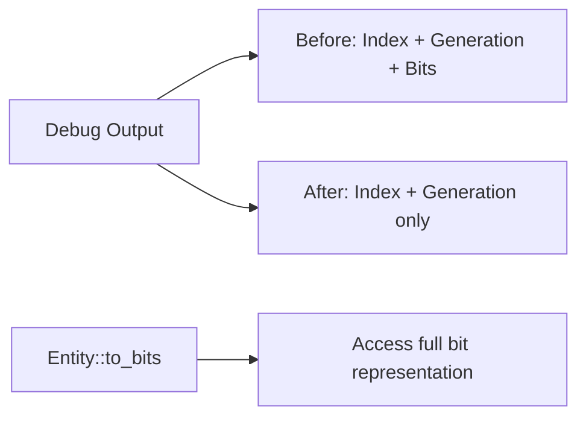

+++
title = "#20045 Friendlier Entity Debug impl"
date = "2025-07-09T00:00:00"
draft = false
template = "pull_request_page.html"
in_search_index = true

[taxonomies]
list_display = ["show"]

[extra]
current_language = "en"
available_languages = {"en" = { name = "English", url = "/pull_request/bevy/2025-07/pr-20045-en-20250709" }, "zh-cn" = { name = "中文", url = "/pull_request/bevy/2025-07/pr-20045-zh-cn-20250709" }}
labels = ["A-ECS", "C-Usability", "X-Blessed"]
+++

## Friendlier Entity Debug impl: A Practical Improvement

### Basic Information
- **Title**: Friendlier Entity Debug impl
- **PR Link**: https://github.com/bevyengine/bevy/pull/20045
- **Author**: cart
- **Status**: MERGED
- **Labels**: A-ECS, C-Usability, S-Ready-For-Final-Review, X-Blessed
- **Created**: 2025-07-08T21:03:47Z
- **Merged**: 2025-07-09T19:36:19Z
- **Merged By**: alice-i-cecile

### Description Translation
# Objective

The current Entity Debug impl prints the bit representation. This is an "overshare". Debug is in many ways the primary interface into Entity, as people derive Debug on their entity-containing types when they want to inspect them. The bits take up too much space in the console and obfuscate the useful information (entity index and generation).

## Solution

Use the Display implementation in Debug as well. Direct people interested in bits to `Entity::to_bits` in the docs.

### The Story of This Pull Request

The problem started with how Bevy's Entity type implemented its Debug trait. When developers printed entities for debugging purposes, they received output like `42v0#4294967253`. While technically complete, this format included the full 64-bit representation of the entity, which was excessive for most debugging scenarios. The bit representation took up significant visual space in console output and logs, making it harder to quickly scan and identify entities during development. Since Debug implementations are commonly used when deriving Debug on entity-containing types, this affected many debugging workflows.

The solution was straightforward: align the Debug implementation with the existing Display implementation instead of maintaining separate formatting logic. The Display implementation already provided a cleaner, more focused representation (`42v0`) that showed only the essential entity index and generation information. By having Debug delegate to Display, we achieve consistency while eliminating visual noise.

This approach required minimal code changes but had significant usability benefits. The implementation simply replaces the custom Debug formatting logic with a call to the Display formatter:

```rust
impl fmt::Debug for Entity {
    fn fmt(&self, f: &mut fmt::Formatter<'_>) -> fmt::Result {
        fmt::Display::fmt(self, f)
    }
}
```

This change maintains the special handling for `Entity::PLACEHOLDER` since the Display implementation already handles it correctly. The documentation was updated to clarify the new behavior and guide users who need the full bit representation to the existing `Entity::to_bits()` method.

The impact is immediately noticeable in debugging sessions. Entity representations are now cleaner and more focused, reducing cognitive load when scanning logs. A test case was updated to reflect the new output format, verifying that entities now display as `42v0` instead of `42v0#4294967253`. This change improves developer experience without any performance cost since it's purely a formatting adjustment.

### Visual Representation



### Key Files Changed

**crates/bevy_ecs/src/entity/mod.rs**  
This file contains the core Entity implementation. The changes simplify the Debug trait implementation and update documentation.

Before:
```rust
impl fmt::Debug for Entity {
    fn fmt(&self, f: &mut fmt::Formatter<'_>) -> fmt::Result {
        if self == &Self::PLACEHOLDER {
            write!(f, "PLACEHOLDER")
        } else {
            write!(
                f,
                "{}v{}#{}",
                self.index(),
                self.generation(),
                self.to_bits()
            )
        }
    }
}
```

After:
```rust
impl fmt::Debug for Entity {
    fn fmt(&self, f: &mut fmt::Formatter<'_>) -> fmt::Result {
        fmt::Display::fmt(self, f)
    }
}
```

The documentation was updated to reflect the new behavior:
```rust
/// Outputs the short entity identifier, including the index and generation.
///
/// This takes the format: `{index}v{generation}`.
///
/// For [`Entity::PLACEHOLDER`], this outputs `PLACEHOLDER`.
///
/// For a unique [`u64`] representation, use [`Entity::to_bits`].
```

### Further Reading
1. [Rust Debug Trait Documentation](https://doc.rust-lang.org/std/fmt/trait.Debug.html)
2. [Bevy ECS Entity Documentation](https://docs.rs/bevy_ecs/latest/bevy_ecs/entity/struct.Entity.html)
3. [API Guidelines: Debug Formatting](https://rust-lang.github.io/api-guidelines/debuggability.html)